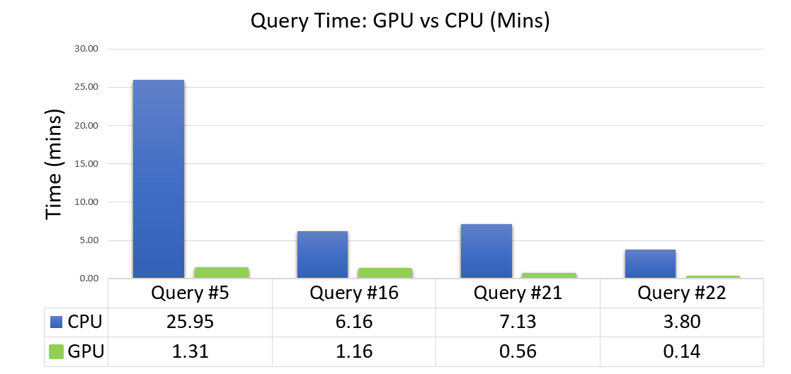

# RAPIDS Accelerator For Apache Spark
NOTE: For the latest stable [README.md](https://github.com/nvidia/spark-rapids/blob/main/README.md) ensure you are on the main branch. The RAPIDS Accelerator for Apache Spark provides a set of plugins for Apache Spark that leverage GPUs to accelerate processing via the RAPIDS libraries and UCX. Documentation on the current release can be found [here](https://nvidia.github.io/spark-rapids/). 

The RAPIDS Accelerator for Apache Spark provides a set of plugins for 
[Apache Spark](https://spark.apache.org) that leverage GPUs to accelerate processing
via the [RAPIDS](https://rapids.ai) libraries and [UCX](https://www.openucx.org/).

The chart above shows results from running ETL queries based off of the 
[TPCxBB benchmark](http://www.tpc.org/tpcx-bb/default.asp). These are **not** official results in
any way. It uses a 10TB Dataset (scale factor 10,000), stored in parquet. The processing happened on
a two node DGX-2 cluster. Each node has 96 CPU cores, 1.5TB host memory, 16 V100 GPUs, and 512 GB
GPU memory.

To get started and try the plugin out use the [getting started guide](./docs/get-started/getting-started.md).

For more information about these benchmarks, see the [benchmark guide](./docs/benchmarks.md).

## Compatibility

The SQL plugin tries to produce results that are bit for bit identical with Apache Spark.
Operator compatibility is documented [here](./docs/compatibility.md)

## Tuning

To get started tuning your job and get the most performance out of it please start with the
[tuning guide](./docs/tuning-guide.md).

## Configuration

The plugin has a set of Spark configs that control its behavior and are documented 
[here](docs/configs.md).

## Issues

We use github issues to track bugs, feature requests, and to try and answer questions. You
may file one [here](https://github.com/NVIDIA/spark-rapids/issues/new/choose).

## Download

The jar files for the most recent release can be retrieved from the [download](docs/download.md)
page. 

## Building From Source

See the [build instructions in the contributing guide](CONTRIBUTING.md#building-from-source).

## Testing 

Tests are described [here](tests/README.md).

## Integration
The RAPIDS Accelerator For Apache Spark does provide some APIs for doing zero copy data
transfer into other GPU enabled applications.  It is described
[here](docs/ml-integration.md).

Currently, we are working with XGBoost to try to provide this integration out of the box. 

You may need to disable RMM caching when exporting data to an ML library as that library
will likely want to use all of the GPU's memory and if it is not aware of RMM it will not have
access to any of the memory that RMM is holding.
