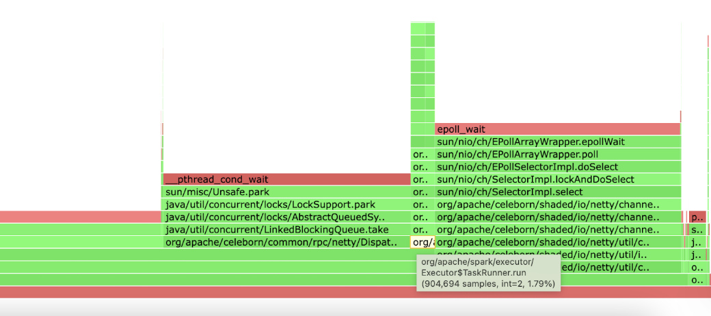

# RAPIDS Per Stage Flame Graph
The RAPIDS Accelerator for Apache Spark provides a way to generate flame graphs for each stage of a Spark job. This can be useful for performance tuning and understanding where time is being spent in your Spark application.

To enable this feature you simply need to set the config called `spark.rapids.flameGraph.pathPrefix`, which plays as a toggle for the Per Stage Flamegraph feature. Besides this config, we also have several other configs:

|                                               | Explanation                                                                                        | Default value                                                                                                              | When do you need to care this config |
|-----------------------------------------------|----------------------------------------------------------------------------------------------------|----------------------------------------------------------------------------------------------------------------------------|--------------------------------------|
| spark.rapids.flameGraph.pathPrefix            | The destination for storing the flame graph file. E.g. /tmp/folder/ or hdfs://namenode:port/folder | Not set (not enabled)                                                                                                      | Always                               |
| spark.rapids.flameGraph.executors             | On what executors to enable async profiler                                                         | *, meaning all executors, you can replace with comma-separated list of executors IDs and hyphenated ranges of executor IDs | Unless necessary                     |
| spark.rapids.flameGraph.asyncProfiler.options | The profiler options                                                                               | jfr,event=cpu,wall=10ms                                                                                                    | Unless necessary                     |


## spark.scheduler.mode
It is strongly recommended to set `spark.scheduler.mode` to `FIFO`, so that the next stage’s task will not start running until tasks from the current stage are finished (even though it is not guaranteed). This tends to create a clearer boundary for stages and then we can get a clean per stage JFR file.

## More Java Options
It’s also recommended to add the following to your Spark session configuration for a more precise flame graph.

```
spark.executor.extraJavaOptions=-XX:+UnlockDiagnosticVMOptions -XX:+DebugNonSafepoints -XX:+PreserveFramePointer
```

## Visualization

Currently the built-in async profiler generates a couple of JFR files in the `spark.rapids.flameGraph.pathPrefix`, one JFR per executor per stage. You can use your IDE to open such files, but it is more recommended to run an additional command (in the root folder of an async profiler 4.0 release: https://github.com/async-profiler/async-profiler/releases ) to convert the JFR file to html file for visualization.


```
hongbin at ws3 in [~/develop/async-profiler-4.0-linux-x64]
16:43:09 › java -cp lib/converter.jar jfr2flame ~/Downloads/spark-kubernetes-executor_var_log_tiger_async-35-11.jfr  117393386_parquetscan_stage_11.html
```` 

Then open the html file in your web browser and you’ll get a nice flame graph. Remember by default we’re collecting a CPU wall clock flame graph, that means even idle thread pools will create a large “sub-flame”. So if you’re only interested in what’s happening in the main task threads, you should find the “sub-flame” rooted in a node called “TaskRunner.run”, click it and get a detailed view of the “sub-flame”.

