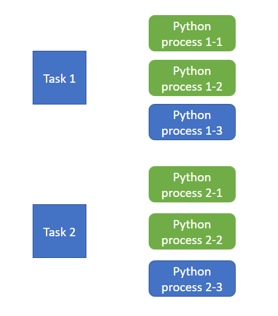

# RAPIDS Accelerated User-Defined Functions

This document describes how UDFs can provide a RAPIDS accelerated
implementation alongside the CPU implementation, enabling the
RAPIDS Accelerator to perform the user-defined operation on the GPU.

Note that there are other potential solutions to performing user-defined
operations on the GPU. See the 
[Frequently Asked Questions entry](https://docs.nvidia.com/spark-rapids/user-guide/latest/faq.html#how-can-i-run-custom-expressions-udfs-on-the-gpu)
on UDFs for more details.

## UDF Obstacles To Query Acceleration

User-defined functions can perform almost arbitrary operations and thus are
very difficult to translate automatically into GPU operations. UDFs can
prevent potentially expensive portions of a query from being automatically
accelerated by the RAPIDS Accelerator due to the inability to perform the
custom operation on the GPU.

One possible solution is the UDF providing a GPU implementation compatible
with the RAPIDS Accelerator. This implementation can then be invoked by the
RAPIDS Accelerator when a corresponding query step using the UDF executes
on the GPU.

## Limitations of RAPIDS Accelerated UDFs

The RAPIDS Accelerator only supports RAPIDS accelerated forms of the
following UDF types:
- Scala UDFs implementing a `Function` interface and registered via `SparkSession.udf.register`
- Java UDFs implementing
  [one of the `org.apache.spark.sql.api.java.UDF` interfaces](https://github.com/apache/spark/tree/branch-3.0/sql/core/src/main/java/org/apache/spark/sql/api/java)
  and registered either via `SparkSession.udf.register` or
  `spark.udf.registerJavaFunction` in PySpark
- [Simple](https://github.com/apache/hive/blob/cb213d88304034393d68cc31a95be24f5aac62b6/ql/src/java/org/apache/hadoop/hive/ql/exec/UDF.java)
  or
  [Generic](https://github.com/apache/hive/blob/cb213d88304034393d68cc31a95be24f5aac62b6/ql/src/java/org/apache/hadoop/hive/ql/udf/generic/GenericUDF.java)
  Hive UDFs
- Scala User-Defined Aggregate Functions ([UserDefinedAggregateFunction](https://github.com/apache/spark/blob/2a5d03a00a0301b1bdc9af347365d94da15825a9/sql/api/src/main/scala/org/apache/spark/sql/expressions/udaf.scala#L38))
- [Aggregator](https://github.com/apache/spark/blob/2a5d03a00a0301b1bdc9af347365d94da15825a9/sql/api/src/main/scala/org/apache/spark/sql/expressions/Aggregator.scala)
- Hive Aggregate Function ([AbstractGenericUDAFResolver](https://github.com/apache/hive/blob/cb213d88304034393d68cc31a95be24f5aac62b6/ql/src/java/org/apache/hadoop/hive/ql/udf/generic/AbstractGenericUDAFResolver.java))

Other forms of Spark UDFs are not supported, such as:
- Hive Tabular Function (UDTF)
- Lambda Functions

## Adding GPU Implementations to UDFs

For supported UDFs, the RAPIDS Accelerator will detect a GPU implementation
if the UDF class implements the
[RapidsUDF](https://github.com/NVIDIA/spark-rapids/blob/main/sql-plugin-api/src/main/java/com/nvidia/spark/RapidsUDF.java)
interface. Unlike the CPU UDF which processes data one row at a time, the
GPU version processes a columnar batch of rows. This reduces invocation
overhead and enables parallel processing of the data by the GPU.

This interface requires implementing the following method:

```java
  ai.rapids.cudf.ColumnVector evaluateColumnar(int numRows, ai.rapids.cudf.ColumnVector... args);
```

The implementation of `evaluateColumnar` must return a column with the
specified number of rows. All input columns will contain the same number
of rows.

### Interpreting Inputs

The RAPIDS Accelerator will pass columnar forms of the same inputs for the
CPU version of the UDF. For example, if the CPU UDF expects two inputs, a
`String` and an `Integer`, then the `evaluateColumnar` method will be invoked
with an array of two cudf `ColumnVector` instances. The first instance will
be a column of type `STRING` and the second a column of type `INT32`. The two
columns will always have the same number of rows, but the UDF implementation
must not make any assumptions on the number of input rows.

#### Scalar Inputs

Passing scalar inputs to a RAPIDS accelerated UDF is supported with
limitations. The scalar value will be replicated into a full column before
being passed to `evaluateColumnar`. Therefore the UDF implementation cannot
easily detect the difference between a scalar input and a columnar input.

### Resource Management for Intermediate Results

GPU memory is a limited resource and can become exhausted when not managed
properly. The UDF is responsible for freeing any intermediate GPU results
computed during the processing of the UDF. The inputs to the UDF will be
closed by the RAPIDS Accelerator, so the UDF only needs to close any
intermediate data generated while producing the final result that is
returned.

### Generating Columnar Output

The `evaluateColumnar` method must return a `ColumnVector` of an appropriate
cudf type to match the result type of the original UDF. The following table
shows the mapping of Spark types to equivalent cudf columnar types.

Spark Type      | RAPIDS cudf Type
--------------- | ----------------
`BooleanType`   | `BOOL8`
`ByteType`      | `INT8`
`ShortType`     | `INT16`
`IntegerType`   | `INT32`
`LongType`      | `INT64`
`FloatType`     | `FLOAT32`
`DoubleType`    | `FLOAT64`
`DecimalType`   | [See the decimal types section](#returning-decimal-types)
`DateType`      | `TIMESTAMP_DAYS`
`TimestampType` | `TIMESTAMP_MICROSECONDS`
`StringType`    | `STRING`
`NullType`      | `INT8`
`ArrayType`     | `LIST` of the underlying element type
`MapType`       | `LIST` of `STRUCT` of the key and value types
`StructType`    | `STRUCT` of all the field types

For example, if the CPU UDF returns the Spark type
`ArrayType(MapType(StringType, StringType))` then `evaluateColumnar` must
return a column of type `LIST(LIST(STRUCT(STRING,STRING)))`.

#### Returning Decimal Types

The RAPIDS cudf equivalent type for a Spark `DecimalType` depends on the precision
of the decimal.

`DecimalType` Precision           | RAPIDS cudf Type
--------------------------------- | ----------------
precision <= 9 digits             | `DECIMAL32`
9 digits < precision <= 18 digits | `DECIMAL64`
18 digits < precision             | Unsupported

Note that RAPIDS cudf decimals use a negative scale relative to Spark `DecimalType`.
For example, Spark `DecimalType(precision=11, scale=2)` would translate to RAPIDS cudf
type `DECIMAL64(scale=-2)`.

## RAPIDS Accelerated UDF Examples

<!-- Note: should update the branch name to tag when releasing-->
Source code for examples of RAPIDS accelerated UDFs is provided in the [udf-examples](https://github.com/NVIDIA/spark-rapids-examples/tree/main/examples/UDF-Examples/RAPIDS-accelerated-UDFs) project.

## RAPIDS Accelerated User-Defined Aggregate Functions (UDAFs)
RAPIDS also supports an accelerated version of UDAFs via the `RapidsUDAF` interface.
Users can choose to implement its APIs as below to get the GPU acceleration.

- ```java
  DataType[] aggBufferTypes();
  ```
  Specify the schema of the intermediate results (aka aggregation buffers) for this aggregation.

- ```java
  Scalar[] getDefaultValue();
  ```
  Provide default values for this aggregation as an array of cuDF Scalar. This is used when a
  reduction has no rows to aggregate. And the values should follow the schema returned from
  `aggBufferTypes()`.

- ```java
  default ColumnVector[] preProcess(int numRows, ColumnVector[] args);
  ```
  Transform the cuDF `ColumnVector`s of input values. By default, it returns the input as-is.

- ```java
  RapidsUDAFGroupByAggregation updateAggregation();
  ```
  Build a `RapidsUDAFGroupByAggregation` to perform initial aggregates on the transformed
  `ColumnVector`s returned from the `preProcess` method.

- ```java
  RapidsUDAFGroupByAggregation mergeAggregation();
  ```
  Build a `RapidsUDAFGroupByAggregation` to merge multiple sets of intermediate results
  produced by the RAPIDS aggregation returned from `updateAggregation()`.

- ```java
  ColumnVector postProcess(int numRows, ColumnVector[] args, DataType outType);
  ```
  Transform the merged intermediate results processed by `mergeAggregation()`
  to produce the final result.

`RapidsUDAFGroupByAggregation` is a base interface for RAPIDS aggregation implementations.
And it provides the contract for different aggregation strategies. So far it has only one
child class named `RapidsSimpleGroupByAggregation`.
Users should extend from this child class to cover both of the reduction and aggregation
cases.

`RapidsSimpleGroupByAggregation` defines the following 4 APIs.

  - ```java
    default ColumnVector[] preStep(int numRows, ColumnVector[] args);
    ```
    Transform the cuDF `ColumnVector`s of intermediate results. This is only used by the
    `RapidsUDAFGroupByAggregation` returned from the `mergeAggregation()`.
    By default, it returns the input as-is.

  - ```java
    Scalar[] reduce(int numRows, ColumnVector[] preStepData);
    ```
    Perform reductions on the transformed `ColumnVector`s from either the `preProcess`
    method for the `updateAggregation()`, or the `preStep` method for the `mergeAggregation()`.

  - ```java
    GroupByAggregationOnColumn[] aggregate(int[] inputIndices);
    ```
    Specify cuDF group-by aggregates on the transformed `ColumnVector`s (provided as column
    indices here) from either the `preProcess` method for the `updateAggregation()`, or the
    `preStep` method for the `mergeAggregation()`.

  - ```java
    default ColumnVector[] postStep(ColumnVector[] aggregatedData);
    ```
    Transform the cuDF `ColumnVector`s produced by the previous `reduce` or `aggregate` operation.
    The output should follow the schema of the intermediate results of this aggregation.
    By default, it returns the input as-is.

Here is the APIs summary of both CPU and GPU UDAF interfaces.
`UserDefinedAggregateFunction`(deprecated) and `Aggregator` are from Spark, while
`GenericUDAFEvaluator` is from Hive.
APIs in the same table row play a similar role during an aggregation.

| RapidsUDAF                          | UserDefinedAggregateFunction | Aggregator      | GenericUDAFEvaluator            |
|:------------------------------------|:-----------------------------|:----------------|:--------------------------------|
| `getDefaultValue`                   | `initialize`                 | `zero`          | `getNewAggregationBuffer`       |
| `preProcess`<br>`updateAggregation` | `update`                     | `reduce`        | `iterate`<br>`terminatePartial` |
| `mergeAggregation`                  | `merge`                      | `merge`         | `merge`                         |
| `postProcess`                       | `evaluate`                   | `finish`        | `terminate`                     |
| `aggBufferTypes`                    | `bufferSchema`               | `bufferEncoder` | `init` (partial mode)           |
| (get from the CPU operator)         | `dataType`                   | `outputEncoder` | `init` (final mode)             |
|                                     | `inputSchema`                |                 |                                 |

## RAPIDS Accelerated UDAF Examples
Source code for examples of RAPIDS UDAFs can be found in the following 3 relevant test suites.

- [ScalaUDAFSuite](../../tests/src/test/scala/com/nvidia/spark/rapids/ScalaUDAFSuite.scala)
- [ScalaAggregatorSuite](../../tests/src/test/scala/com/nvidia/spark/rapids/ScalaAggregatorSuite.scala)
- [IntLongAverageHiveUDAF](../../integration_tests/src/main/java/com/nvidia/spark/rapids/tests/udf/hive/IntLongAverageHiveUDAF.java)

## GPU Support for Pandas UDF

---
**NOTE**

The GPU support for Pandas UDF is an experimental feature, and may change at any point in time.

---

GPU support for Pandas UDF is built on Apache Spark's [Pandas UDF(user defined
function)](https://archive.apache.org/dist/spark/docs/3.2.0/api/python/user_guide/sql/arrow_pandas.html#pandas-udfs-a-k-a-vectorized-udfs),
and has two features:

- **GPU Assignment(Scheduling) in Python Process**: Let the Python process share the same GPU with
Spark executor JVM. Without this feature, in a non-isolated environment, some use cases with
Pandas UDF (an `independent` Python daemon process) can try to use GPUs other than the one we want it to
run on. For example, the user could launch a TensorFlow session inside Pandas UDF and the machine
contains 8 GPUs. Without this GPU sharing feature, TensorFlow will automatically use all 8 GPUs
which will conflict with existing Spark executor JVM processes.

- **Increase Speed**: Speeds up data transfer between JVM process and Python process.


To enable GPU support for Pandas UDF, you need to configure your Spark job with extra settings.

1. Make sure GPU `exclusive` mode is _disabled_. Note that this will not work if you are using
exclusive mode to assign GPUs under Spark. To disable exclusive mode, use
    ```
    nvidia-smi -i 0 -c Default # Set GPU 0 to default mode, run as root.
    ```

2. Currently, the Python files are packed into the RAPIDS Accelerator jar.

    On Yarn, you need to add
    ```shell
    ...
    --py-files ${SPARK_RAPIDS_PLUGIN_JAR} \
    ```

    On Standalone, you need to add
    ```shell
    ...
    --conf spark.executorEnv.PYTHONPATH=${SPARK_RAPIDS_PLUGIN_JAR} \
    --py-files ${SPARK_RAPIDS_PLUGIN_JAR} \
    ```

3. Enable GPU Assignment(Scheduling) for Pandas UDF.

    ```shell
    ...
    --conf spark.rapids.sql.python.gpu.enabled=true \
    ```

Please note: every type of Pandas UDF on Spark is run by a specific Spark execution plan. RAPIDS
Accelerator has a 1-1 mapping support for each of them.

  |Spark Execution Plan|Data Transfer Accelerated|Use Case|
  |----------------------|----------|--------|
  |ArrowEvalPythonExec|yes|[Series to Series](https://archive.apache.org/dist/spark/docs/3.2.0/api/python/user_guide/sql/arrow_pandas.html#series-to-series), [Iterator of Series to Iterator of Series](https://archive.apache.org/dist/spark/docs/3.2.0/api/python/user_guide/sql/arrow_pandas.html#iterator-of-series-to-iterator-of-series) and [Iterator of Multiple Series to Iterator of Series](https://archive.apache.org/dist/spark/docs/3.2.0/api/python/user_guide/sql/arrow_pandas.html#iterator-of-multiple-series-to-iterator-of-series)|
  |MapInPandasExec|yes|[Map](https://archive.apache.org/dist/spark/docs/3.2.0/api/python/user_guide/sql/arrow_pandas.html#map)|
  |WindowInPandasExec|yes|[Window](https://archive.apache.org/dist/spark/docs/3.2.0/api/python/user_guide/sql/arrow_pandas.html#series-to-scalar)|
  |FlatMapGroupsInPandasExec|yes|[Grouped Map](https://archive.apache.org/dist/spark/docs/3.2.0/api/python/user_guide/sql/arrow_pandas.html#grouped-map)|
  |AggregateInPandasExec|yes|[Aggregate](https://archive.apache.org/dist/spark/docs/3.2.0/api/python/user_guide/sql/arrow_pandas.html#series-to-scalar)|
  |FlatMapCoGroupsInPandasExec|yes|[Co-grouped Map](https://archive.apache.org/dist/spark/docs/3.2.0/api/python/user_guide/sql/arrow_pandas.html#co-grouped-map)|


### Other Configuration

The following configuration settings are also relevant for GPU scheduling for Pandas UDF.

1. Memory efficiency

    ```shell
    --conf spark.rapids.python.memory.gpu.pooling.enabled=false \
    --conf spark.rapids.python.memory.gpu.allocFraction=0.1 \
    --conf spark.rapids.python.memory.gpu.maxAllocFraction= 0.2 \
    ```
    Similar to the [RMM pooling for JVM](https://docs.nvidia.com/spark-rapids/user-guide/latest/tuning-guide.html#pinned-memory) settings like
    `spark.rapids.memory.gpu.allocFraction` and `spark.rapids.memory.gpu.maxAllocFraction` except
    these specify the GPU pool size for the _Python processes_. Half of the GPU _available_ memory
    will be used by default if it is not specified.

2. Limit of concurrent Python processes

    ```shell
    --conf spark.rapids.python.concurrentPythonWorkers=2 \
    ```
    This parameter limits the total concurrent running _Python processes_ for a Spark executor.
    It defaults to 0 which means no limit. Note that for certain cases, setting
    this value too small _may result in  a hang for your Spark job_ because a task may contain
    multiple Pandas UDF(`MapInPandas`) instances which result in multiple Python processes.
    Each process will try to acquire the Python GPU process semaphore. This may result in a
    deadlock situation because a Spark job will not proceed until all its tasks are finished.

    For example, in a specific Spark Stage that contains 3 Pandas UDFs, 2 Spark tasks are running
    and each task launches 3 Python processes while we set this
    `spark.rapids.python.concurrentPythonWorkers` to 4.

    ```python
    df_1 = df_0.mapInPandas(udf_1, schema_1)
    df_2 = df_1.mapInPandas(udf_2, schema_2)
    df_3 = df_2.mapInPandas(udf_3, schema_3)
    df_3.explain(True)
    ```
    The RAPIDS Accelerator query explain:
    ```
    ...
      *Exec <MapInPandasExec> could partially run on GPU
        *Exec <MapInPandasExec> could partially run on GPU
          *Exec <MapInPandasExec> could partially run on GPU
    ...
    ```

    

    In this case, each Pandas UDF will launch a Python process. At this moment two Python processes
    in each task(in light green) acquired their semaphore but neither of them are able to proceed
    because both of them are waiting for their third semaphore to start the task.

    Another example is to use `ArrowEvalPythonExec`, with the following code:

    ```python
    import pyspark.sql.functions as F
    ...
    df = df.withColumn("c_1",udf_1(F.col("a"), F.col("b")))
    df = df.withColumn('c_2', F.hash(F.col('c_1')))
    df = df.withColumn("c_3",udf_2(F.col("c_2")))
    ...
    ```
    The physical plan:
    ```
        +- GpuArrowEvalPython
          +- ...
            +- ...
              +- GpuArrowEvalPython
    ```
    This means each Spark task will trigger 2 Python processes. In this case, if we set
    `spark.rapids.python.concurrentPythonWorkers=2`, it will also probably result in a hang as we
    allow 2 tasks running and each of them spawns 2 Python processes. Let's say Task_1_Process_1 and
    Task_2_Process_1 acquired the semaphore, but neither of them are going to proceed becasue both
    of them are waiting for their second semaphore.

To find details on the above Python configuration settings, please see the 
[RAPIDS Accelerator for Apache Spark Configuration Guide](../configs.md). 
Search 'pandas' for a quick navigation jump.


### mapInArrow
[mapInArrow](https://spark.apache.org/docs/latest/api/python/reference/pyspark.sql/api/pyspark.sql.DataFrame.mapInArrow.html#pyspark.sql.DataFrame.mapInArrow) is a PySpark API introduced in Spark 3.3.0.
The RAPIDS Accelerator supports acceleration for `mapInArrow` in the same way as Pandas UDF.
