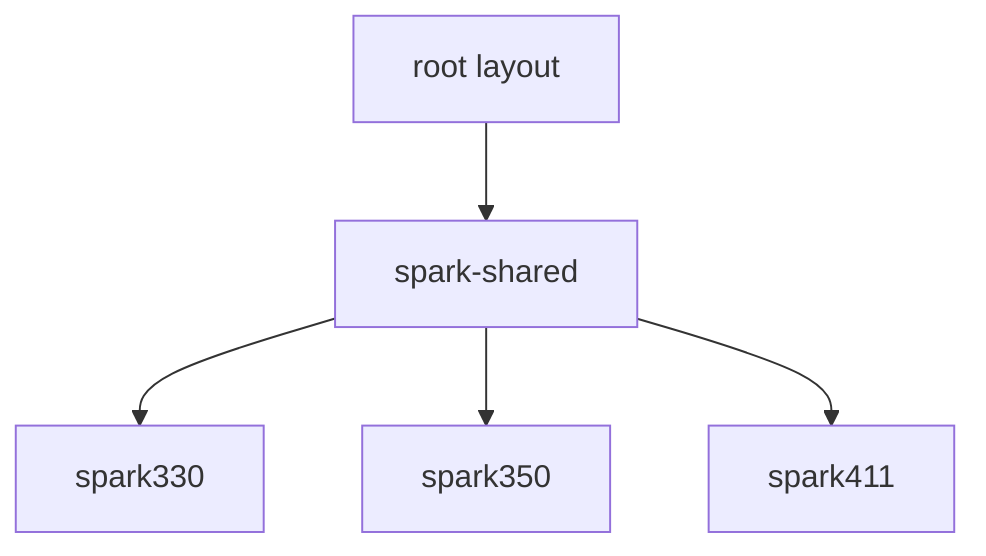
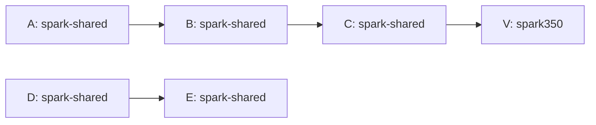
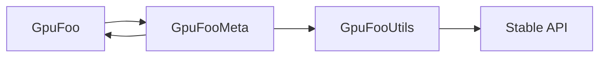
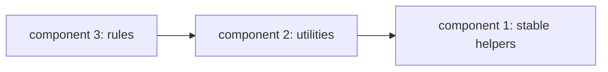

# Parallel World Unshimming Algorithm

This document describes the dependency analysis used to reduce the amount of
RAPIDS Accelerator bytecode that must live in the parallel-world layout of the
dist jar.

The goal is to move classes from `spark-shared` into the conventional root jar
layout when they are safe to load before a Spark shim has been selected. A class
is root-safe only when it has no static dependency path to Spark-version-specific
bytecode. The analysis is bytecode-based and uses strongly connected components
to find migration batches that can be moved together.

See also:

* [Shim Development](shims.md), for shim design patterns and validation commands.
* [Distribution Packaging](../../dist/README.md), for the files that control explicit
  packaging exceptions.
* [`analyze-parallel-world-deps.py`](../../dist/scripts/analyze-parallel-world-deps.py),
  for the implementation.

## Class Layout Model

The dist jar contains three relevant class locations:

1. `root`: the conventional jar layout. These classes are visible before any
   parallel-world Spark version is selected.
2. `spark-shared`: one copy of bytecode that was bitwise-identical across all
   selected Spark shims.
3. `sparkXYZ`: version-specific parallel-world directories such as `spark330`,
   `spark350`, or `spark411`.

The analyzer models a class as a pair:

```text
(class name, location)
```

The location is part of the node identity because the same class name can occur
in multiple places in the assembled dist jar.



An edge means "this class has a static bytecode dependency on that class."
Dependencies are extracted from class-file constant pools, including class
references and type descriptors.

When a dependency name exists in more than one location, the analyzer resolves it
using the same layout precedence that matters for this packaging problem:

1. `root`
2. the source class location
3. `spark-shared`
4. remaining Spark-version-specific locations

This keeps the graph close to the classes that would actually be loaded.

## Version-Specific Nodes

A node is treated as Spark-version-specific when either of these is true:

* its location is a parallel-world directory matching `spark[0-9][0-9a-z]*`;
* its class name contains a classifier package segment such as
  `com.nvidia.spark.rapids.spark330`.

Classifier package classes are usually bootstrap or facade classes. Direct
dependencies on them should stay narrow and intentional.

## Reachability

The first graph question is:

> Which root or `spark-shared` classes can eventually reach Spark-version-specific
> bytecode?

The analyzer answers this by reversing the graph and starting a breadth-first
search from every version-specific node. Every upstream root or `spark-shared`
class reached by that reverse search is contaminated and cannot be considered
root-safe without further refactoring.



In this example, `A`, `B`, and `C` are blocked because they have a path to
`V`. `D` and `E` are root-safe if no other edge reaches a version-specific node.

Shortest blocked paths are useful for refactoring because they explain the first
version-sensitive boundary that needs to be cut. They are not the migration
order.

## Why SCCs

Classes often form dependency cycles. If one class in a cycle moves to the root
layout, the rest of that cycle usually has to move or be refactored with it.
Strongly connected components make that explicit.



`GpuFoo` and `GpuFooMeta` are one SCC because each can reach the other. They are
a single migration unit. `GpuFooUtils` and `Stable API` are separate components.

The analyzer uses Tarjan's algorithm to compute SCCs. It then builds a component
DAG. Since an edge means "source depends on target", component edges are
reversed before Kahn's topological sort so the final order is dependency-first:
dependencies appear before the classes that use them.



The analyzer prints this as:

```text
component 1: stable helpers
component 2: utilities
component 3: rules
```

That is the preferred order for human-sized unshimming batches.

## Candidate Selection

For each run, the analyzer computes:

1. direct classifier-package dependencies;
2. root or `spark-shared` classes with a path to version-specific code;
3. root-safe `spark-shared` SCCs in dependency-first order.

A good migration candidate is a root-safe `spark-shared` SCC. Small SCCs can be
reviewed directly. Large SCCs are usually a sign that a shared utility layer
should be moved first or that a Spark-specific edge needs to be pushed behind a
stable API.

Do not make a class root-safe by replacing typed dependencies with reflection.
Prefer a stable interface in `sql-plugin-api`, a one-way shim descriptor, or a
small Java-only helper module when the code is runtime plumbing that does not
need Scala or shim-specific APIs.

## Packaging Policy

The default packaging flow still requires bitwise identity for classes promoted
from `spark-shared` to the root layout. The SCC analysis answers a different
question: whether the promoted class is safe to load from the root layout.

The relevant packaging files are:

* `dist/keep-in-spark-shared.txt`: class files that must remain in
  `spark-shared` even if they are bitwise-identical.
* `dist/unshimmed-common-from-single-shim.txt`: explicit root-layout files taken
  from one representative shim, mainly resources and special root artifacts.
* `dist/unshimmed-from-each-spark3xx.txt`: per-shim root artifacts such as
  classifier-package service providers.

The intended steady state is:

* new common classes are unshimmed by default when they are bitwise-identical and
  root-safe;
* exceptions are explicit and small;
* reviewers can use the analyzer output to understand why a class stays in
  `spark-shared`.

## Workflow

Build representative two-shim layouts for each Scala line:

```bash
./build/buildall --profile=330,358 --module=dist
python3 dist/scripts/analyze-parallel-world-deps.py \
  dist/target/parallel-world \
  --show-topo \
  --show-reachability

./build/buildall --profile=350,411 --scala213 --module=dist
python3 dist/scripts/analyze-parallel-world-deps.py \
  scala2.13/dist/target/parallel-world \
  --show-topo \
  --show-reachability
```

For repeated local iteration after the per-shim jars have already been built,
use the direct parallel-world assembler:

```bash
python3 dist/scripts/build-unshim-parallel-world.py \
  --mvn-base-dir . \
  --source-dir . \
  --project-version 26.08.0-SNAPSHOT \
  --scala-binary-version 2.12 \
  --buildvers 330,358
```

Then rerun the analyzer on `dist/target/parallel-world`.

Use JSON output for exact counts or scripts:

```bash
python3 dist/scripts/analyze-parallel-world-deps.py \
  dist/target/parallel-world \
  --format=json \
  --limit=50
```

## Reading The Output

`Direct classifier-package dependencies` should stay small. Any unexpected edge
usually means common code is reaching around the shim boundary.

`Nearest version targets from shortest blocked paths` ranks the version-specific
classes that block the most root or `spark-shared` classes. These are often the
best places to add a bridge or descriptor.

`Nearest paths from root/spark-shared code to version-specific code` shows the
concrete dependency chain to inspect.

`Root-safe spark-shared SCCs in dependency-first order` is the review queue. Move
or validate earlier components before later components that depend on them.

## Review Checklist

Before promoting or keeping a batch:

1. Confirm the classes are bitwise-identical across the selected shims.
2. Confirm the SCC has no path to version-specific nodes in both Scala lines.
3. Check for Databricks or vendor-shim siblings separately; they are common
   outliers and should stay in their own review unit when possible.
4. Keep explicit exception lists small and explain each new entry.
5. Validate representative Scala 2.12 and Scala 2.13 builds.
