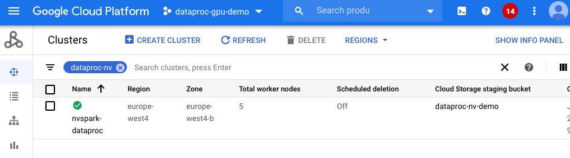

# NVIDIA SPARK RAPIDS on GCP Dataproc

 [RAPIDS](https://rapids.ai/) suite of open source software libraries and APIs gives you the ability to execute end-to-end data science and analytics pipelines accelerated by NVIDIA GPUs. Licensed under Apache 2.0, RAPIDS is incubated by NVIDIA® based on extensive hardware and data science experience.
 
 [The RAPIDS Accelerator for Apache Spark](https://github.com/NVIDIA/spark-rapids) combines the power of the RAPIDS cuDF library and the scale of the Spark distributed computing framework. The RAPIDS Accelerator library also has a built-in accelerated shuffle based on [UCX](https://github.com/openucx/ucx/) that can be configured to leverage GPU-to-GPU communication and RDMA capabilities. [NVIDIA Spark XGBoost4j](https://github.com/NVIDIA/spark-xgboost) is developed based on open sourced [XGBoost](https://github.com/dmlc/xgboost) project and leverage RAPIDS SQL plugin for data IO and Spark for scale out multi-node multi-gpu training.
 
 [Google Cloud Dataproc](https://cloud.google.com/dataproc) is Google Cloud's fully managed Apache Spark and Hadoop service. In this guide, we will walk through ways to run GPU accelerated NVIDIA software on Apache Spark in Dataproc.
 - [x] Pyspark Notebook in Dataproc JupyterLab
 - [x] Scala Notebook in Dataproc Zeppelin
 - [x] Submit spark jobs to Dataproc cluster
 - [x] Dataproc Hub in AI Platform Notebook to Dataproc cluster 
 - [ ] Spark Job to Dataproc on Google Kubernetes Engine
 - [ ] Dataproc Workflow accelerated by NVIDIA GPU
 
 ### Create Dataproc Cluster Accelerated by GPU
 
 You can use [Cloud Shell](https://cloud.google.com/shell) to execute shell commands to create Dataproc cluster. Cloud Shell contains command line tools for interacting with Google Cloud Platform, including gcloud and gsutil. Alternatively, you can install [GCloud SDK](https://cloud.google.com/sdk/install) on your laptop. From the Cloud Shell, you’ll need to enable services within your project. Enable the Compute and Dataproc APIs in order to access Dataproc, and enable the Storage API as you’ll need a Google Cloud Storage bucket to house your data. This may take several minutes:
 ```bash
gcloud services enable compute.googleapis.com
gcloud services enable dataproc.googleapis.com
gcloud services enable storage-api.googleapis.com
``` 

After commandline environment is setup, account is logged in. We will now create a Dataproc cluster with following configuration (configuration matches [notebooks demo](./notebooks) we used, realistically, one can start with 2*2T4 worker nodes):

- [GPU Driver](https://github.com/GoogleCloudDataproc/initialization-actions/tree/master/gpu) and [RAPIDS Spark](https://github.com/GoogleCloudDataproc/initialization-actions/tree/master/rapids) through initialization actions
- One 8-core master node and 5 32-core worker nodes
- Four NVIDIA T4 to each worker nodes
- [Local SSDs](https://cloud.google.com/dataproc/docs/concepts/compute/dataproc-local-ssds) is recommended to improve IO for Spark scratch places  
- Component gateway enabled for accessing Web UIs hosted on the cluster
- Configuration for [GPU scheduling and isolation](./yarn-gpu.md)

```bash
export REGION=[Your Prefer GCP Region]
export GCS_BUCKET=[Your GCS Bucket]
export CLUSTER_NAME=[Your Cluster Name]
export NUM_GPUS=4
export NUM_WORKERS=5

gcloud dataproc clusters create $CLUSTER_NAME  \
    --region $REGION \
    --image-version=preview-ubuntu \
    --master-machine-type n1-standard-16 \
    --num-workers $NUM_WORKERS \
    --worker-accelerator type=nvidia-tesla-t4,count=$NUM_GPUS \
    --worker-machine-type n1-highmem-32\
    --num-worker-local-ssds 4 \
    --initialization-actions gs://dataproc-initialization-actions/gpu/install_gpu_driver.sh,gs://dataproc-initialization-actions/rapids/rapids.sh \
    --optional-components=ANACONDA,JUPYTER,ZEPPELIN \
    --metadata gpu-driver-provider="NVIDIA" \
    --metadata rapids-runtime=SPARK \
    --bucket $GCS_BUCKET \
    --enable-component-gateway \
    --properties="^#^spark:spark.yarn.unmanagedAM.enabled=false#spark:spark.task.resource.gpu.amount=0.125#spark:spark.executor.cores=8#spark:spark.task.cpus=1#spark:spark.executor.memory=8G"
``` 

This may take around 5-15 minutes to complete. You can navigate to the Dataproc clusters tab in the Cloud Console to see its progress.



### Pyspark and Scala Notebook in Dataproc

To use notebooks with Dataproc cluster, click on the cluster name under Dataproc clsuter tab and navigate to the "Web Interfaces" Tab. Under the "Web Interfaces",


Click on JupyterLab or Jupyter link to start to use [Mortgage ETL on GPU Jupyter Notebook](notebooks/Mortgage-ETL-GPU.ipynb) to process full 17 years [Mortgage data](https://rapidsai.github.io/demos/datasets/mortgage-data). The notebook will first transcode CSV files into Parquet Files and run a ETL query to prepare the dataset for Training. We extract 2016 data as evaluation set and the rest as training set, saving to respective GCS location. 

First stage with default configuration in notebook should take ~110 seconds (1/3 of CPU execution time with same config) whereas second stage takes ~170 seconds (1/6 of CPU execution time with same config).

Once data is prepared, we use [Mortgage XGBoost4j Scala Notebook](notebooks/mortgage-xgboost4j-gpu-scala.zpln) in Dataproc Zeppelin service to execute the training job on GPU. Since GITHUB cannot render zeppelin notebook, we prepared a [Jupyter Notebook with Scala code](notebooks/mortgage-xgboost4j-gpu-scala.ipynb) for you to view code content. 

The training time should be around 480 seconds (1/10 of CPU execution time with same config). Which is shown under cell:
```scala
// Start training
println("\n------ Training ------")
val (xgbClassificationModel, _) = benchmark("train") {
  xgbClassifier.fit(trainSet)
}
```

### Submit spark jobs to Dataproc cluster

Similar to spark-submit, Dataproc supports ways to submit spark applicaton job through dataproc job. The mortgage examples we use above is also available as [spark application](https://github.com/NVIDIA/spark-xgboost-examples/tree/spark-3/examples/apps/scala). After [build the jar files](https://github.com/NVIDIA/spark-xgboost-examples/blob/spark-3/getting-started-guides/building-sample-apps/scala.md) through maven `mvn package -Dcuda.classifier=cuda10-2
`. 

Then place the jar file `sample_xgboost_apps-0.2.2.jar` under the `gs://$GCS_BUCKET/scala/` folder by `gsutil cp target/sample_xgboost_apps-0.2.2.jar gs://$GCS_BUCKET/scala/`. To do this you can either drag and drop files from your local machine into the GCP storage browser, or use the gsutil cp as shown before to do this from a command line. In the end, we can thereby submit the jar by:
```bash
export GCS_BUCKET=<bucket_name>
export CLUSTER_NAME=<cluster_name>
export REGION=<region>
export SPARK_NUM_EXECUTORS=20
export SPARK_EXECUTOR_MEMORY=20G
export SPARK_EXECUTOR_MEMORYOVERHEAD=16G
export SPARK_NUM_CORES_PER_EXECUTOR=7
export DATA_PATH=gs://${GCS_BUCKET}/mortgage_full

gcloud dataproc jobs submit spark \
    --cluster=$CLUSTER_NAME \
    --region=$REGION \
    --class=com.nvidia.spark.examples.mortgage.GPUMain \
    --jars=gs://${GCS_BUCKET}/scala/sample_xgboost_apps-0.2.2.jar \
    --properties=spark.executor.cores=${SPARK_NUM_CORES_PER_EXECUTOR},spark.task.cpus=${SPARK_NUM_CORES_PER_EXECUTOR},spark.executor.memory=${SPARK_EXECUTOR_MEMORY},spark.executor.memoryOverhead=${SPARK_EXECUTOR_MEMORYOVERHEAD},spark.executor.resource.gpu.amount=1,spark.task.resource.gpu.amount=1,spark.rapids.sql.hasNans=false,spark.rapids.sql.batchSizeBytes=512M,spark.rapids.sql.reader.batchSizeBytes=768M,spark.rapids.sql.variableFloatAgg.enabled=true,spark.rapids.memory.gpu.pooling.enabled=false \
    -- \
    -dataPath=train::${DATA_PATH}/train \
    -dataPath=trans::${DATA_PATH}/test \
    -format=parquet \
    -numWorkers=${SPARK_NUM_EXECUTORS} \
    -treeMethod=gpu_hist \
    -numRound=100 \
    -maxDepth=8   
``` 

### Dataproc Hub in AI Platform Notebook to Dataproc cluster 
With the integration between AI Platform Notebooks and Dataproc. User can create DataproHub notebook from AI platform will can connect to Dataproc cluster through a yaml configuration.

In future, user will be able to provision a dataproc cluster through DataprocHub notebook. Please use example [pyspark notebooks](notebooks/Mortgage-ETL-GPU.ipynb) to experiment. 