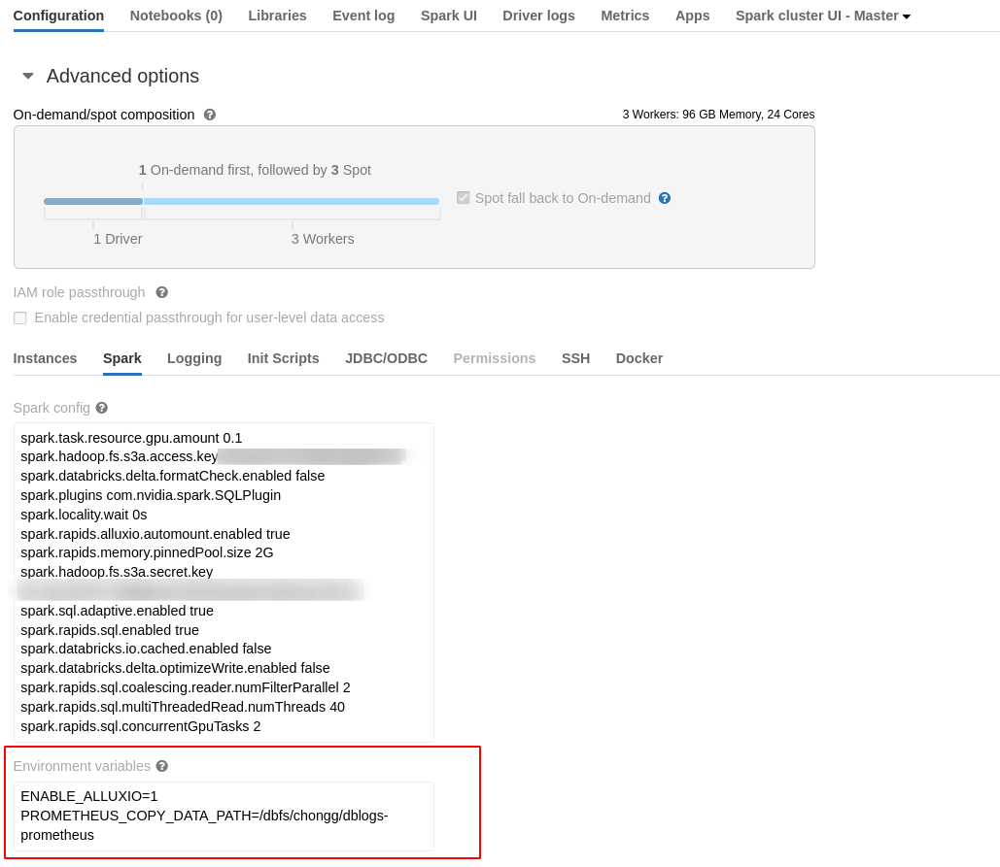
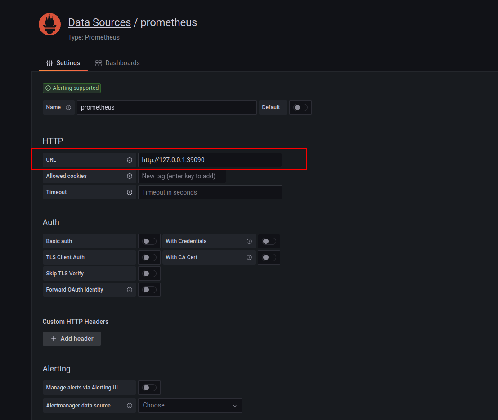

# Getting Started with RAPIDS and Alluxio

The RAPIDS plugin can remarkably accelerate the computing part of a SQL query by leveraging
GPUs, but it’s hard to accelerate the data reading process when the data is in a cloud
filesystem because of network overhead.

[Alluxio](https://www.alluxio.io/) is an open source data orchestration platform that
brings your data closer to compute across clusters, regions, clouds, and countries for
reducing the network overhead. Compute applications talking to Alluxio can transparently
cache frequently accessed data from multiple sources, especially from remote locations.

This guide will go through how to set up the RAPIDS Accelerator for Apache Spark with
Alluxio in an on-premise cluster. This guide sets up Alluxio to handle reads and
by default does not handle file updates in the remote blob store.

## Prerequisites

This guide assumes the user has successfully setup and run the RAPIDS Accelerator in an
on-premise cluster according to [this doc](getting-started-on-prem.md).

This guide will go through deployment of Alluxio in a Yarn cluster with 2 NodeManagers and
1 ResourceManager, It will describe how to configure an S3 compatible filesystem as
Alluxio’s underlying storage system.

We may want to put the Alluxio workers on the NodeManagers so they are on the same nodes as
the Spark tasks will run. The Alluxio master can go anywhere, we pick ResourceManager for
convenience.

Let's assume the hostnames are:

``` console
RM_hostname
NM_hostname_1
NM_hostname_2
```

## Alluxio setup

1. Prerequisites

   - Download Alluxio binary file

      Download the latest Alluxio binary file **alluxio-${LATEST}-bin.tar.gz** from
      [this site](https://www.alluxio.io/download/).

   - Copy `alluxio-${LATEST}-bin.tar.gz` to NodeManagers and ResourceManager

   - Extract `alluxio-${LATEST}-bin.tar.gz` to the directory specified by **ALLUXIO_HOME** in the NodeManagers and ResourceManager

      ``` shell
      # Let's assume we extract alluxio to /opt
      mkdir -p /opt
      tar xvf alluxio-${LATEST}-bin.tar.gz -C /opt
      export ALLUXIO_HOME=/opt/alluxio-${LATEST}
      ```

   For **SSH login wihtout password** and **Alluxio ports** problem, please refer to
   [this site](https://docs.alluxio.io/os/user/stable/en/deploy/Running-Alluxio-On-a-Cluster.html#prerequisites).

2. Configure Alluxio

   - Alluxio master configuration

      On the master node, create `${ALLUXIO_HOME}/conf/alluxio-site.properties` configuration
      file from the template.

      ```console
      cp ${ALLUXIO_HOME}/conf/alluxio-site.properties.template ${ALLUXIO_HOME}/conf/alluxio-site.properties
      ```

      Add the recommended configuration below to `${ALLUXIO_HOME}/conf/alluxio-site.properties` .

      ``` xml
      # set the hostname of the single master node
      alluxio.master.hostname=RM_hostname

      ########################### worker properties  ##############################
      # The maximum number of storage tiers in Alluxio. Currently, Alluxio supports 1,
      # 2, or 3 tiers.
      alluxio.worker.tieredstore.levels=1

      # The alias of top storage tier 0. Currently, there are 3 aliases, MEM, SSD, and HDD.
      alluxio.worker.tieredstore.level0.alias=SSD

      # The paths of storage directories in top storage tier 0, delimited by comma.
      # It is suggested to have one storage directory per hardware device for the
      # SSD and HDD tiers. You need to create YOUR_CACHE_DIR first,
      # For example,
      #       export YOUR_CACHE_DIR=/opt/alluxio/cache
      #       mkdir -p $YOUR_CACHE_DIR
      alluxio.worker.tieredstore.level0.dirs.path=/YOUR_CACHE_DIR

      # The quotas for all storage directories in top storage tier 0
      # For example, set the quota to 100G.
      alluxio.worker.tieredstore.level0.dirs.quota=100G

      # The path to the domain socket. Short-circuit reads make use of a UNIX domain
      # socket when this is set (non-empty). This is a special path in the file system
      # that allows the client and the AlluxioWorker to communicate. You will need to
      # set a path to this socket. The AlluxioWorker needs to be able to create the
      # path. If alluxio.worker.data.server.domain.socket.as.uuid is set, the path
      # should be the home directory for the domain socket. The full path for the domain
      # socket with be {path}/{uuid}.
      # For example,
      #      export YOUR_DOMAIN_SOCKET_PATH=/opt/alluxio/domain_socket
      #      mkdir -p YOUR_DOMAIN_SOCKET_PATH
      alluxio.worker.data.server.domain.socket.address=/YOUR_DOMAIN_SOCKET_PATH
      alluxio.worker.data.server.domain.socket.as.uuid=true

      # Configure async cache manager
      # When large amounts of data are expected to be asynchronously cached concurrently,
      # it may be helpful to increase below async cache configuration to handle a higher
      # workload.

      # The number of asynchronous threads used to finish reading partial blocks.
      alluxio.worker.network.async.cache.manager.threads.max=64

      # The maximum number of outstanding async caching requests to cache blocks in each
      # data server.
      alluxio.worker.network.async.cache.manager.queue.max=2000
      ############################################################################

      ########################### Client properties ##############################
      # When short circuit and domain socket both enabled, prefer to use short circuit.
      alluxio.user.short.circuit.preferred=true
      ############################################################################

      # Running Alluxio locally with S3
      # Optionally, to reduce data latency or visit resources which are separated in
      # different AWS regions, specify a regional endpoint to make AWS requests.
      # An endpoint is a URL that is the entry point for a web service.
      #
      # For example, s3.cn-north-1.amazonaws.com.cn is an entry point for the Amazon S3
      # service in beijing region.
      alluxio.underfs.s3.endpoint=<endpoint_url>

      # Optionally, specify to make all S3 requests path style
      alluxio.underfs.s3.disable.dns.buckets=true
      ```

      For more explanations of each configuration, please refer to
      [Alluxio Configuration](https://docs.alluxio.io/os/user/stable/en/reference/Properties-List.html)
      and [Amazon AWS S3](https://docs.alluxio.io/os/user/stable/en/ufs/S3.html).

      Note, when preparing to mount S3 compatible file system to the root of Alluxio namespace, the user
      needs to add below AWS credentials configuration to `${ALLUXIO_HOME}/conf/alluxio-site.properties`
      in Alluxio master node.

      ``` xml
      alluxio.master.mount.table.root.ufs=s3a://<S3_BUCKET>/<S3_DIRECTORY>
      alluxio.master.mount.table.root.option.aws.accessKeyId=<AWS_ACCESS_KEY_ID>
      alluxio.master.mount.table.root.option.aws.secretKey=<AWS_SECRET_ACCESS_KEY>
      ```

      Instead, this guide demonstrates how to mount the S3 compatible file system with AWS credentials
      to any path of Alluxio namespace, and please refer to [RAPIDS Configuration](#rapids-configuration).
      For more explanations of AWS S3 credentials, please refer to
      [Amazon AWS S3 Credentials setup](https://docs.alluxio.io/os/user/stable/en/ufs/S3.html#advanced-setup).

      Note, this guide demonstrates how to deploy Alluxio cluster in a insecure way, for the Alluxio security,
      please refer to [this site](https://docs.alluxio.io/os/user/stable/en/operation/Security.html)

      - Add Alluxio worker hostnames into `${ALLUXIO_HOME}/conf/workers`

         ``` json
         NM_hostname_1
         NM_hostname_2
         ```

      - Copy configuration from Alluxio master to Alluxio workers

         ``` shell
         ${ALLUXIO_HOME}/bin/alluxio copyDir ${ALLUXIO_HOME}/conf
         ```

         This command will copy the `conf/` directory to all the workers specified in the `conf/workers` file.
         Once this command succeeds, all the Alluxio nodes will be correctly configured.

   - Alluxio worker configuration

      After copying configuration to every Alluxio worker from Alluxio master, User
      needs to add below extra configuration for each Alluxio worker.

      ``` xml
      # the hostname of Alluxio worker
      alluxio.worker.hostname=NM_hostname_X
      # The hostname to use for an Alluxio client
      alluxio.user.hostname=NM_hostname_X
      ```

      Note that Alluxio can manage other storage media (e.g. MEM, HDD) in addition to SSD,
      so local data access speed may vary depending on the local storage media. To learn
      more about this topic, please refer to the
      [tiered storage document](https://docs.alluxio.io/os/user/stable/en/core-services/Caching.html#multiple-tier-storage).
3. Create a link to ALLUXIO_HOME  
    Execute the following commands to create a link `/opt/alluxio` to actual Alluxio Home path:  
    ```bash
    ln -s ${ALLUXIO_HOME} /opt/alluxio
    ```
4. Start Alluxio cluster

   - Format Alluxio

      Before Alluxio can be started **for the first time**, the journal must be formatted. Formatting the journal will delete all metadata
      from Alluxio. However, the data in under storage will be untouched.

      Format the journal for the Alluxio master node with the following command:

      ``` bash
      ${ALLUXIO_HOME}/bin/alluxio formatMasters
      ```

   - Launch Alluxio

      On the master node, start the Alluxio cluster with the following command:

      ``` bash
      ${ALLUXIO_HOME}/bin/alluxio-start.sh all
      ```

   - Verify Alluxio

      To verify that Alluxio is running, visit `http://RM_hostname:19999`
      to see the status page of the Alluxio master.

5. Mount an existing data storage to Alluxio

    - Mount S3 bucket

       ``` bash
       ${ALLUXIO_HOME}/bin/alluxio fs mount \
          --option aws.accessKeyId=<AWS_ACCESS_KEY_ID> \
          --option aws.secretKey=<AWS_SECRET_KEY_ID> \
          alluxio://RM_hostname:19998/s3 s3a://<S3_BUCKET>/<S3_DIRECTORY>
       ```

    - Mount Azure directory

       ``` bash
       ${ALLUXIO_HOME}/bin/alluxio fs mount \
       --option fs.azure.account.key.<AZURE_ACCOUNT>.blob.core.windows.net=<AZURE_ACCESS_KEY> \
       alluxio://master:port/azure wasb://<AZURE_CONTAINER>@<AZURE_ACCOUNT>.blob.core.windows.net/<AZURE_DIRECTORY>/
       ```

   For other filesystems, please refer to [this site](https://www.alluxio.io/).
   We also provide auto mount feature for an easier usage.
   Please refer to [Alluxio auto mount for AWS S3 buckets](#alluxio-auto-mount-for-aws-s3-buckets)

## RAPIDS Configuration

There are two ways to leverage Alluxio in RAPIDS.
We also provide an auto mount way for AWS S3 bucket if you install Alluxio in your Spark cluster.
Please refer to [Alluxio auto mount for AWS S3 buckets](#alluxio-auto-mount-for-aws-s3-buckets)

1. Explicitly specify the Alluxio path

   This may require user to change code. For example, change

   ``` scala
   val df = spark.read.parquet("s3a://<S3_BUCKET>/<S3_DIRECTORY>/foo.parquet")
   ```

   to

   ``` scala
   val df = spark.read.parquet("alluxio://RM_hostname:19998/s3/foo.parquet")
   ```

2. Transparently replace in RAPIDS

   RAPIDS has added a configuration `spark.rapids.alluxio.pathsToReplace` which can allow RAPIDS
   to replace the input file paths to the Alluxio paths transparently at runtime. So there is no
   code change for users.

   Eg, at startup

   ``` shell
   --conf spark.rapids.alluxio.pathsToReplace="s3://foo->alluxio://RM_hostname:19998/foo,gs://bar->alluxio://RM_hostname:19998/bar"
   ```

   This configuration allows RAPIDS to replace any file paths prefixed `s3://foo` with
   `alluxio://RM_hostname:19998/foo` and `gs://bar` with `alluxio://RM_hostname:19998/bar`.

   Note, one side affect of using Alluxio in this way results in the sql function
   **`input_file_name`** printing the `alluxio://` path rather than the original path.
   Below is an example of using input_file_name.

   ``` python
   spark.read.parquet(data_path)
     .filter(f.col('a') > 0)
     .selectExpr('a', 'input_file_name()', 'input_file_block_start()', 'input_file_block_length()')
   ```

3. Submit an application

   Spark driver and tasks will parse `alluxio://` schema and access Alluxio cluster using
   `alluxio-${LATEST}-client.jar`.

   The Alluxio client jar must be in the classpath of all Spark drivers and executors in order
   for Spark applications to access Alluxio.

   We can specify it in the configuration of `spark.driver.extraClassPath` and
   `spark.executor.extraClassPath`, but the Alluxio client jar should be present on the Yarn nodes.

   The other simplest way is copy `alluxio-${LATEST}-client.jar` into spark jars directory.

   ``` shell
   cp ${ALLUXIO_HOME}/client/alluxio-${LATEST}-client.jar ${SPARK_HOME}/jars/
   ```

   ``` shell
   ${SPARK_HOME}/bin/spark-submit \
      ...                          \
      --conf spark.rapids.alluxio.pathsToReplace="REPLACEMENT_RULES" \
      --conf spark.executor.extraJavaOptions="-Dalluxio.conf.dir=${ALLUXIO_HOME}/conf" \
   ```

## Alluxio auto mount for AWS S3 buckets

There's a more user-friendly way to use Alluxio with RAPIDS when accessing S3 buckets.
Suppose that a user has multiple buckets on AWS S3.
To use `spark.rapids.alluxio.pathsToReplace` requires to mount all the buckets beforehand
and put the path replacement one by one into this config. It'll be boring when there're many buckets.

To solve this problem, we add a new feature of Alluxio auto mount, which can mount the S3 buckets
automatically when finding them from the input path in the Spark driver.
This feature requires the node running Spark driver has Alluxio installed,
which means the node is also the master of Alluxio cluster. It will use `alluxio fs mount` command to
mount the buckets in Alluxio. And the uid used to run the Spark application can run Alluxio command.
For example, the uid of Spark application is as same as the uid of Alluxio service
or the uid of Spark application can use `su alluxio_uid` to run Alluxio command.

To enable the Alluxio auto mount feature, the simplest way is only to enable it by below config
without setting `spark.rapids.alluxio.pathsToReplace`, which takes precedence over auto mount feature.
``` shell
--conf spark.rapids.alluxio.automount.enabled=true
```

Additional configs:
``` shell
--conf spark.rapids.alluxio.bucket.regex="^s3a{0,1}://.*"
```
The regex is used to match the s3 URI, to decide which bucket we should auto mount.
The default value is to match all the URIs which start with `s3://` or `s3a://`.
For exmaple, `^s3a{1,1}://foo.*` will match the buckets which start with `foo`.

## Configure whether the disks used by Alluxio are fast
The default value of config `spark.rapids.alluxio.slow.disk` is true, indicating the disks used by Alluxio are slow.   
The true value enables an improvement which reads from S3 directly to get better performance when the files being read are large.   
The config `spark.rapids.alluxio.large.file.threshold`, which defaults to 64MB, controls the file size threshold used to trigger this improvement.   
If the disks are fast, this feature should be disabled by setting it to false as it will be faster to read from Alluxio.   
Typically, if speed of the disks is bigger than 300M/second, set it as false.

## Alluxio Troubleshooting

This section will give some links about how to configure, tune Alluxio and some troubleshooting.

- [Quick Start Guide](https://docs.alluxio.io/os/user/stable/en/overview/Getting-Started.html)
- [Amazon S3 as Alluxio’s under storage system](https://docs.alluxio.io/os/user/stable/en/ufs/S3.html)
- [Alluxio metrics](https://docs.alluxio.io/os/user/stable/en/reference/Metrics-List.html)
- [Alluxio configuration](https://docs.alluxio.io/os/user/stable/en/reference/Properties-List.html)
- [Running Spark on Alluxio](https://docs.alluxio.io/os/user/stable/en/compute/Spark.html)
- [Performance Tuning](https://docs.alluxio.io/os/user/stable/en/operation/Performance-Tuning.html )
- [Alluxio troubleshooting](https://docs.alluxio.io/os/user/stable/en/operation/Troubleshooting.html)

## Alluxio reliability
The properties mentioned in this section can be found in [Alluxio configuration](https://docs.alluxio.io/os/user/stable/en/reference/Properties-List.html)

### Dealing with Client side delays in response from master or workers
If the master is not responding, possibly due to it crashing or GC pause, 
`alluxio.user.rpc.retry.max.duration` will cause the client to retry for 2 minutes. 
This is a very long time and can cause delays in the running job, so we suggest lowering this value to 10 seconds.

If the worker is not responding, possibly due to it crashing or GC pause, 
`alluxio.user.block.read.retry.max.duration` will cause the client to retry for 5 minutes. 
This is a very long time and can cause delays in the running job, so we suggest lowering this value to 1 minute.

See relative configs also:
```
alluxio.user.rpc.retry.max.duration
alluxio.user.rpc.retry.max.sleep	
alluxio.user.rpc.retry.base.sleep	

alluxio.user.block.read.retry.max.duration
alluxio.user.block.read.retry.sleep.max		
alluxio.user.block.read.retry.sleep.base 		
```
Above configurations define the `ExponentialTimeBoundedRetry` retry policies and `max durations`, we can adjust them to appropriate values.  

Set these properties on Spark because Spark invokes Alluxio client.
```
$SPARK_HOME/bin/spark-shell \
......
--conf spark.driver.extraJavaOptions='-Dalluxio.user.rpc.retry.max.duration=10sec -Dalluxio.user.block.read.retry.max.duration=1min' \
--conf spark.executor.extraJavaOptions='-Dalluxio.user.rpc.retry.max.duration=10sec -Dalluxio.user.block.read.retry.max.duration=1min' \
......
```

### Worker server tunings to fail fast
By default, `alluxio.master.worker.timeout` is 5min, this is the timeout between master and worker indicating a lost worker.  
If the worker holding cache is killed but the elapsed time does not exceed the timeout,   
the master still marks the worker as alive. The client will connect this dead worker to pull data, and will fail.  
If the worker holding cache is killed and the elapsed time exceeds the timeout, the master marks the worker as lost.  
In this case, if cluster has one alive worker, the client will query an alive worker  
and the alive worker will pull data from external file system if it is not holding the requested cache.

To avoid failures when master marking an actual dead worker as alive, set the timeout to a reasonable value, like 1 minute.
vi $ALLUXIO_HOME/conf/alluxio-site.properties
```
alluxio.master.worker.timeout=60sec
```

### The logs
By default, the log path is <ALLUXIO_HOME>/logs.
See the master.log and worker.log in this path.

### Auto start Alluxio the master and workers
After installing Alluxio master and workers, it's better to add a systemd service for each process of master and workers.
Systemd service can automatically restart a process if that process is terminated.

## Alluxio limitations
### Alluxio does not sync metadata from UFS(e.g. S3) by default
Alluxio does not sync metadata from S3 by default, so it won't pick up any changed files.   
For example:   
If you update a file in the S3 from 1M size to 10M size and Alluxio already cached the 1M size file,    
Alluxio cluster will always use the 1M file.   
If you want to enable sync it has performance impact which will affect the read performance.   
For details, please search `alluxio.user.file.metadata.sync.interval` in [Alluxio doc](https://docs.alluxio.io/ee/user/stable/en/reference/Properties-List.html).

## Alluxio metrics
The following sections describes 3 methods to view Alluxio metrics GUI:
- Monitor Alluxio live metrics based on Alluxio Master Web:   
  When the Alluxio cluster is running, users can monitor current metrics based on Alluxio Master Web.
- Monitor Alluxio live metrics based on Grafana with Prometheus:   
  When the Alluxio cluster is running, users can monitor current metrics based on Grafana with Prometheus.
- View Alluxio historic metrics based on Grafana with Prometheus:   
  When the Alluxio cluster is shutdown, users can restore the saved historic metrics and view them locally.
### Monitor Alluxio live metrics based on Alluxio Master Web
Users can view the Alluxio metrics in the Web interface of Alluxio leading master:       
http://<leading_master_host>:19999/metrics   
For more details, please refer to section 3.1 of Alluxio doc: [Master Web UI Metrics](https://docs.alluxio.io/os/user/stable/en/operation/Metrics-System.html#default-http-json-sink)      
The Alluxio Web UI is not available by default on Databricks,   
the following provides a method to view the Web UI by SSH tunnel via jump server.   
First forward the Alluxio port 19999 to a new port on a jump server,   
then forward the new port on the jump server to a local port,   
finally access the local port in the browser.   
For example:
- Forward the Alluxio server 19999 port to the port 29999 on jump server.    
  ssh user@jump-server   // login to jump server   
  ssh -L 29999:localhost:19999 alluxio_master_user@alluxio_master_host -p 2200 -i <private_key_file_path>
- Forward the port 29999 on jump server to local port 39999 on your own machine.    
  ssh -L 39999:localhost:29999 user@jump-server
- Finally open http://localhost:39999/metrics on your own machine.

### Monitor Alluxio live metrics based on Grafana with Prometheus

#### Config Prometheus when creating Databricks cluster
When creating a Databricks cluster via the Docker container for Databricks,   
Set Environment variable ENABLE_ALLUXIO and PROMETHEUS_COPY_DATA_PATH, for example:
```
ENABLE_ALLUXIO=1
PROMETHEUS_COPY_DATA_PATH=/dbfs/user1/dblogs-prometheus
``` 
   
The cluster will install Prometheus, configure Prometheus to collect the metrics into its own storage,    
and also save Prometheus-format metrics into the path specified for back up purpose.    
Note: If not set `ENABLE_ALLUXIO`, `PROMETHEUS_COPY_DATA_PATH` will not take effect.   
For more details, refer to [spark-rapids-Databricks-container](https://github.com/NVIDIA/spark-rapids-container/tree/dev/Databricks)

#### Install and start Grafana locally
For example: local machine is Ubuntu.
```bash
sudo apt-get install -y adduser libfontconfig1   
wget https://dl.grafana.com/enterprise/release/grafana-enterprise_9.2.6_amd64.deb   
sudo dpkg -i grafana-enterprise_9.2.6_amd64.deb   
sudo systemctl start grafana-server   
sudo systemctl enable grafana-server
```   
For more details, refer to [doc](https://grafana.com/grafana/download)

#### Forward the Prometheus port 9090 to local port
In order to access Prometheus-typed metrics on Databricks cluster by local Grafana,   
users may need to create an SSH tunnel to access the Databricks internal port.
- Forward the Alluxio server 9090 port to the port 29090 on jump server.   
  ssh user@jump-server   // login to jump server   
  ssh -L 29090:localhost:9090 alluxio_master_user@alluxio_master_host -p 2200 -i <private_key_file_path>
- Forward the port 29090 on jump server to local port 39090 on your own machine.    
  ssh -L 39090:localhost:29090 user@jump-server

It's similar to the tunnel method described in [the previous section](#Monitor Alluxio live metrics based on Alluxio Master Web).

#### Config local Grafana to monitor the live metrics
The main flows are:
1. Create a Prometheus datasource in Grafana,   
   the URL of Prometheus datasource is: http://localhost:39090, note: the SSH tunnel port.   
   Refer to the [tutorial](https://grafana.com/docs/grafana/latest/datasources/add-a-data-source/#add-a-data-source) for help on importing a dashboard.   
   
2. [Download](https://grafana.com/grafana/dashboards/13467) the Grafana template JSON file for Alluxio.
3. Import the template JSON file to create a dashboard. See this [example](https://grafana.com/docs/grafana/latest/dashboards/export-import/#importing-a-dashboard) for importing a dashboard.
4. Add the Prometheus data source to Grafana.
5. Modify the variables in the dashboard/settings with instructions here and save your dashboard.
- alluxio_datasource: Your prometheus datasource name used in step 1.
- masters: Alluxio master. It's the Master ‘job_name’ configured in prometheus.yml on Databricks cluster.
- workers: Currently, it's no use, the Databricks does not collect worker metrics.
- alluxio_user: ubuntu. The user used to start up Alluxio.   
  

For more details, refer to section 3.2 of Alluxio doc: [Grafana Web UI with Prometheus](https://docs.alluxio.io/os/user/stable/en/operation/Metrics-System.html#default-http-json-sink)

#### View a specific live Alluxio metrics in Prometheus Web UI
The graph in the previous may not show all the metrics users care about,   
the following describes how to view a specific historic Alluxio metric as you want:   
Open Prometheus Web UI: http://localhost:39090/graph   
Click the `Open metrics explorer` button.   

Then a list is shown:  

Select a metric and then click Graph Tab, then a graph is shown:   


### View Alluxio historic metrics based on Grafana with Prometheus
This section is similar to [the previous section](#Monitor Alluxio live metrics based on Grafana with Prometheus)   
After the Databricks cluster is shutdown, the Web UI on Databricks can not be accessed again,    
this section describes how to view historic metrics.   
The differences are:
- View historic metrics when Databricks cluster is shutdown
- Install and start Prometheus locally
- Restore the Prometheus data into local Prometheus

The steps are as following:

#### [Save Alluxio historic Prometheus-format metrics](#Config Prometheus when creating Databricks cluster)

#### [Install and start Grafana locally](#Install and start Grafana locally)

#### Install and start Prometheus locally
For example: local machine is Ubuntu.
```bash
wget https://github.com/prometheus/prometheus/releases/download/v2.37.3/prometheus-2.37.3.linux-amd64.tar.gz   
tar xvfz prometheus-*.tar.gz   
cd prometheus-*   
```
For more details, refer to [doc](https://prometheus.io/docs/prometheus/latest/installation)

#### Restore historic metrics into Prometheus
Copy the saved data in `PROMETHEUS_COPY_DATA_PATH` into Prometheus data path.
```
cd <prometheus-root-dir>
mkdir data   
# Copy the saved files into `data` directory.
cp -r $PROMETHEUS_COPY_DATA_PATH/some/sub/path/* /path/to/prometheus-root-dir/data
`ls /path/to/prometheus-root-dir/data` will show files like:   
`chunks_head  lock  queries.active  wal`
```

#### Start Prometheus
cd <prometheus-root-path>   
./prometheus

#### View Alluxio historic metrics based on Grafana
Refer to [Config local Grafana to monitor the live metrics](#Config local Grafana to monitor the live metrics)   
The difference is:   
The prometheus datasource is local(http://localhost:9090) instead of the remote prometheus on Databricks cluster.


#### View a specific historic Alluxio metrics in Prometheus Web UI
Refer to [the section](#View a specific live Alluxio metrics in Prometheus Web UI)   
The difference is:   
The prometheus datasource is local instead of the remote prometheus on Databricks cluster.   
Open Prometheus Web UI: http://localhost:9090/graph.   
