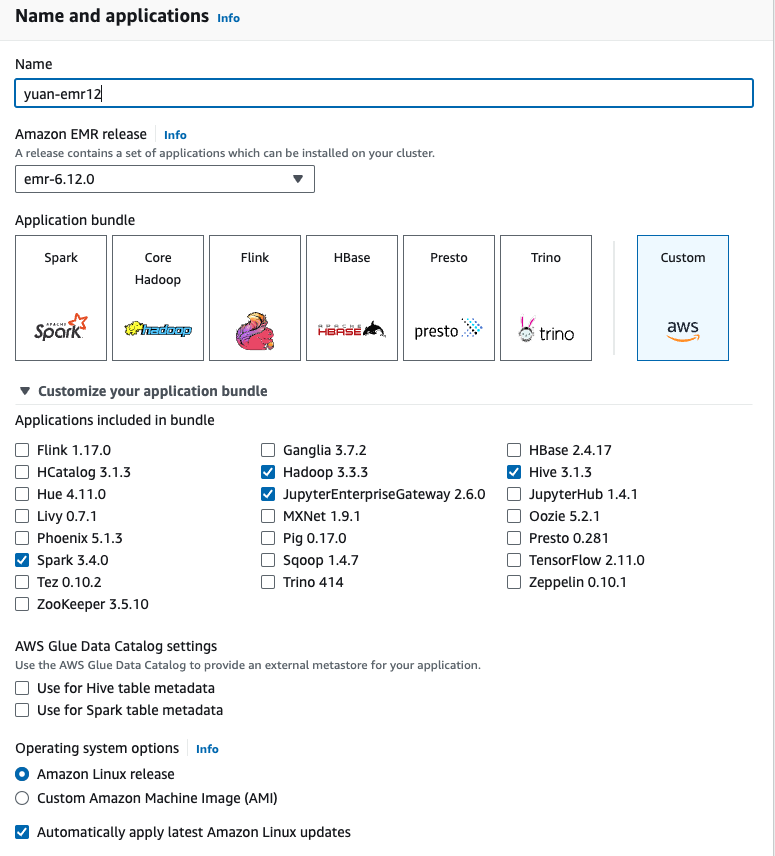
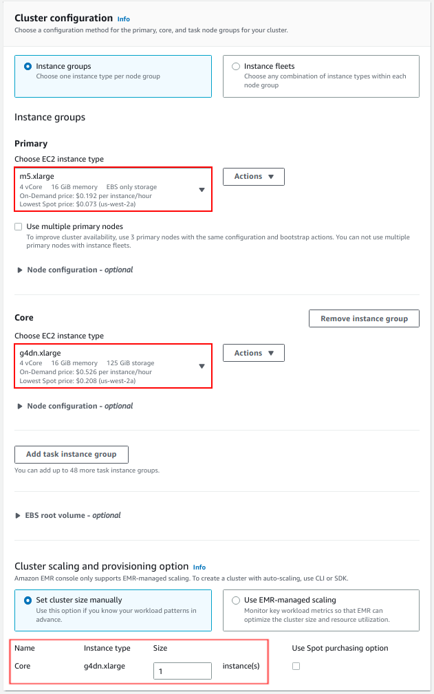
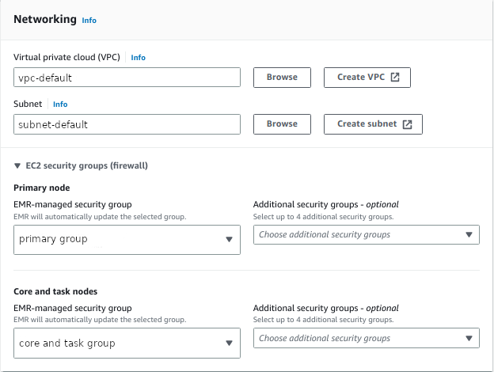
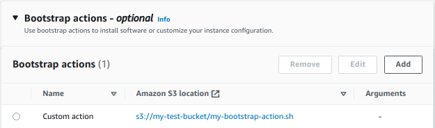
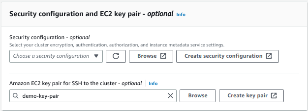
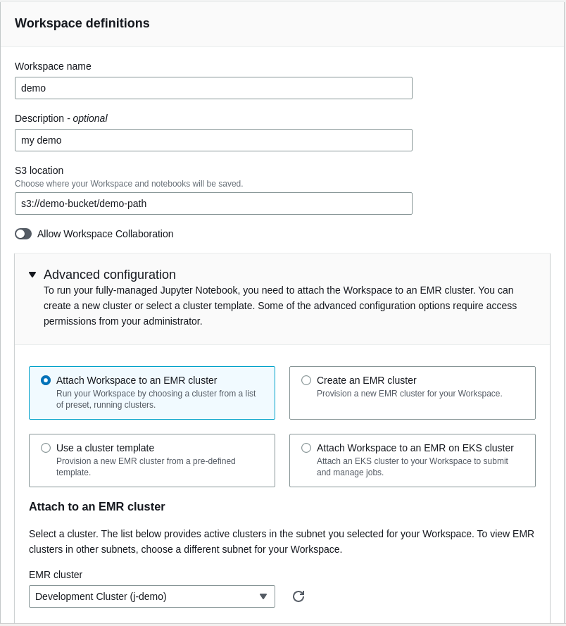

# Get Started with RAPIDS on AWS EMR

This is a getting started guide for the RAPIDS Accelerator for Apache Spark on AWS EMR. At the end
of this guide, the user will be able to run a sample Apache Spark application on NVIDIA GPUs on AWS EMR.

Different versions of EMR ship with different versions of Spark, RAPIDS Accelerator, cuDF and xgboost4j-spark:

| EMR | Spark | RAPIDS Accelerator jar | cuDF jar | xgboost4j-spark jar
| --- | --- | --- | ---| --- |
| 6.10 | 3.3.1 | rapids-4-spark_2.12-22.12.0.jar | Bundled with rapids-4-spark | xgboost4j-spark_3.0-1.4.2-0.3.0.jar |
| 6.9 | 3.3.0 | rapids-4-spark_2.12-22.08.0.jar | Bundled with rapids-4-spark | xgboost4j-spark_3.0-1.4.2-0.3.0.jar |
| 6.8 | 3.3.0 | rapids-4-spark_2.12-22.06.0.jar | Bundled with rapids-4-spark | xgboost4j-spark_3.0-1.4.2-0.3.0.jar |
| 6.7 | 3.2.1 | rapids-4-spark_2.12-22.02.0.jar | cudf-22.02.0-cuda11.jar | xgboost4j-spark_3.0-1.2.0-0.1.0.jar |
| 6.6 | 3.2.0 | rapids-4-spark_2.12-22.02.0.jar | cudf-22.02.0-cuda11.jar | xgboost4j-spark_3.0-1.2.0-0.1.0.jar |
| 6.5 | 3.1.2 | rapids-4-spark_2.12-0.4.1.jar | cudf-0.18.1-cuda10-1.jar | xgboost4j-spark_3.0-1.2.0-0.1.0.jar |
| 6.4 | 3.1.2 | rapids-4-spark_2.12-0.4.1.jar | cudf-0.18.1-cuda10-1.jar | xgboost4j-spark_3.0-1.2.0-0.1.0.jar |
| 6.3 | 3.1.1 | rapids-4-spark_2.12-0.4.1.jar | cudf-0.18.1-cuda10-1.jar | xgboost4j-spark_3.0-1.2.0-0.1.0.jar |
| 6.2 | 3.0.1 | rapids-4-spark_2.12-0.2.0.jar | cudf-0.15-cuda10-1.jar | xgboost4j-spark_3.0-1.0.0-0.2.0.jar |

For more details about each EMR release, please see the [EMR release
notes](https://docs.aws.amazon.com/emr/latest/ReleaseGuide/emr-release-6x.html).

For more information on AWS EMR, please see the [AWS
documentation](https://docs.aws.amazon.com/emr/latest/ManagementGuide/emr-what-is-emr.html).

## Leveraging Spark RAPIDS User Tools for Qualification and Bootstrap

To use the qualification and bootstrap tools for EMR, you will want to install the Spark RAPIDS user tools package.
Instructions for installing and setting up the Spark RAPIDS user tools package for EMR can be found here:
[link](https://github.com/NVIDIA/spark-rapids-tools/blob/main/user_tools/docs/user-tools-aws-emr.md).

## Qualify CPU Workloads for GPU Acceleration

The [qualification tool](https://nvidia.github.io/spark-rapids/docs/spark-qualification-tool.html) is launched to analyze CPU applications
that have already run. The tool will output the applications recommended for acceleration along with estimated speed-up
and cost saving metrics.  Additionally, it will provide information on how to launch a GPU-accelerated cluster to take
advantage of the speed-up and cost savings.

Usage: `spark_rapids_user_tools emr qualification --eventlogs <s3-log-path> --cpu_cluster <cluster-name>`

Help (to see all options available): `spark_rapids_user_tools emr qualification --help`

Example output:
```
+----+------------+--------------------------------+----------------------+-----------------+-----------------+---------------+-----------------+
|    | App Name   | App ID                         | Recommendation       |   Estimated GPU |   Estimated GPU |           App |   Estimated GPU |
|    |            |                                |                      |         Speedup |     Duration(s) |   Duration(s) |      Savings(%) |
|----+------------+--------------------------------+----------------------+-----------------+-----------------+---------------+-----------------|
|  0 | query24    | application_1664888311321_0011 | Strongly Recommended |            3.49 |          257.18 |        897.68 |           59.70 |
|  1 | query78    | application_1664888311321_0009 | Strongly Recommended |            3.35 |          113.89 |        382.35 |           58.10 |
|  2 | query23    | application_1664888311321_0010 | Strongly Recommended |            3.08 |          325.77 |       1004.28 |           54.37 |
|  3 | query64    | application_1664888311321_0008 | Strongly Recommended |            2.91 |          150.81 |        440.30 |           51.82 |
|  4 | query50    | application_1664888311321_0003 | Recommended          |            2.47 |          101.54 |        250.95 |           43.08 |
|  5 | query16    | application_1664888311321_0005 | Recommended          |            2.36 |          106.33 |        251.95 |           40.63 |
|  6 | query38    | application_1664888311321_0004 | Recommended          |            2.29 |           67.37 |        154.33 |           38.59 |
|  7 | query87    | application_1664888311321_0006 | Recommended          |            2.25 |           75.67 |        170.69 |           37.64 |
|  8 | query51    | application_1664888311321_0002 | Recommended          |            1.53 |           53.94 |         82.63 |            8.18 |
+----+------------+--------------------------------+----------------------+-----------------+-----------------+---------------+-----------------+

Instance types conversions:
-----------  --  ------------
m5d.8xlarge  to  g4dn.8xlarge
-----------  --  ------------
To support acceleration with T4 GPUs, switch the worker node instance types
```

## Configure and Launch AWS EMR with GPU Nodes

Please follow AWS EMR document ["Using the NVIDIA Spark-RAPIDS Accelerator
for Spark"](https://docs.aws.amazon.com/emr/latest/ReleaseGuide/emr-spark-rapids.html).
Below is an example.

###  Launch an EMR Cluster using AWS Console (GUI)

Go to the AWS Management Console and select the `EMR` service from the "Analytics" section. Choose
the region you want to launch your cluster in, e.g. US West (Oregon), using the dropdown menu in the
top right corner. Click `Create cluster`, which will bring up a detailed cluster configuration page.

#### Step 1: EMR Release and Application Bundle Selection

Enter a custom "Cluster name" for your cluster.

Select **emr-6.10.0** for the release and pick "Custom" for the "Application bundle". Unncheck all the 
software options, and then check **Hadoop 3.3.3**, **Spark 3.3.1**, **Livy 0.7.1** and 
**JupyterEnterpriseGateway 2.6.0**.

Optionally pick Amazon Linux Release or configure a "Custom AMI".



#### Step 2: Hardware

Keep the default "Primary" node instance type of **m5.xlarge**.

Change the "Core" node "Instance type" to **g4dn.xlarge**, **g4dn.2xlarge**, or
**p3.2xlarge**

An optional step is to have "Task" nodes. These nodes can run a Spark executor but they do not run 
the HDFS Data Node service. You can click on "Remove instance group" if you would like to only run 
"Core" nodes with the Data Node and Spark executors. If you want to add extra "Task" nodes, make sure
that that instance type matches what you selected for "Core".

Under "Cluster scaling and provisioning potion", verify that the instance count for the "Core" instance group
is at least 1.



Under "Networking", select the desired VPC and subnet. You can also create a new VPC and subnet for the cluster.

*Optionally* set custom security groups in the "EC2 security groups" tab.

In the "EC2 security groups" section, confirm that the security group chosen for the "Primary" node
allows for SSH access. Follow these instructions to [allow inbound SSH
traffic](https://docs.aws.amazon.com/AWSEC2/latest/UserGuide/authorizing-access-to-an-instance.html)
if the security group does not allow it yet.



#### Step 3:  General Cluster Settings

Add a custom bootstrap action under "Bootstrap Actions" to allow cgroup permissions to YARN on your cluster.  
An example bootstrap script is as follows:
```bash
#!/bin/bash
 
set -ex
 
sudo chmod a+rwx -R /sys/fs/cgroup/cpu,cpuacct
sudo chmod a+rwx -R /sys/fs/cgroup/devices
```



#### Step 4: Edit Software Configuration

In the "Software settings" field, copy and paste the configuration from the [EMR
document](https://docs.aws.amazon.com/emr/latest/ReleaseGuide/emr-spark-rapids.html) in the textbox provided
under "Enter configuration". You can also create a JSON file on you own S3 bucket when selecting 
"Load JSON from Amazon S3".

For clusters with 2x g4dn.2xlarge GPU instances as worker nodes, we recommend the following
default settings:
```json
[
	{
		"Classification":"spark",
		"Properties":{
			"enableSparkRapids":"true"
		}
	},
	{
		"Classification":"yarn-site",
		"Properties":{
			"yarn.nodemanager.resource-plugins":"yarn.io/gpu",
			"yarn.resource-types":"yarn.io/gpu",
			"yarn.nodemanager.resource-plugins.gpu.allowed-gpu-devices":"auto",
			"yarn.nodemanager.resource-plugins.gpu.path-to-discovery-executables":"/usr/bin",
			"yarn.nodemanager.linux-container-executor.cgroups.mount":"true",
			"yarn.nodemanager.linux-container-executor.cgroups.mount-path":"/sys/fs/cgroup",
			"yarn.nodemanager.linux-container-executor.cgroups.hierarchy":"yarn",
			"yarn.nodemanager.container-executor.class":"org.apache.hadoop.yarn.server.nodemanager.LinuxContainerExecutor"
		}
	},
	{
		"Classification":"container-executor",
		"Properties":{
			
		},
		"Configurations":[
			{
				"Classification":"gpu",
				"Properties":{
					"module.enabled":"true"
				}
			},
			{
				"Classification":"cgroups",
				"Properties":{
					"root":"/sys/fs/cgroup",
					"yarn-hierarchy":"yarn"
				}
			}
		]
	},
	{
        "Classification":"spark-defaults",
        "Properties":{
        "spark.plugins":"com.nvidia.spark.SQLPlugin",
        "spark.sql.sources.useV1SourceList":"",
        "spark.executor.resource.gpu.discoveryScript":"/usr/lib/spark/scripts/gpu/getGpusResources.sh",
        "spark.submit.pyFiles":"/usr/lib/spark/jars/xgboost4j-spark_3.0-1.4.2-0.3.0.jar",
        "spark.executor.extraLibraryPath":"/usr/local/cuda/targets/x86_64-linux/lib:/usr/local/cuda/extras/CUPTI/lib64:/usr/local/cuda/compat/lib:/usr/local/cuda/lib:/usr/local/cuda/lib64:/usr/lib/hadoop/lib/native:/usr/lib/hadoop-lzo/lib/native:/docker/usr/lib/hadoop/lib/native:/docker/usr/lib/hadoop-lzo/lib/native",
        "spark.rapids.sql.concurrentGpuTasks":"2",
        "spark.executor.resource.gpu.amount":"1",
        "spark.executor.cores":"8",
        "spark.task.cpus ":"1",
        "spark.task.resource.gpu.amount":"0.125",
        "spark.rapids.memory.pinnedPool.size":"2G",
        "spark.executor.memoryOverhead":"2G",
        "spark.sql.files.maxPartitionBytes":"256m",
        "spark.sql.adaptive.enabled":"false"
        }
	},
	{
		"Classification":"capacity-scheduler",
		"Properties":{
			"yarn.scheduler.capacity.resource-calculator":"org.apache.hadoop.yarn.util.resource.DominantResourceCalculator"
		}
	}
]

```
Adjust the settings as appropriate for your cluster.  For example, setting the appropriate
number of cores based on the node type.  The `spark.task.resource.gpu.amount` should be set to
1/(number of cores per executor) which will allow multiple tasks to run in parallel on the GPU.

For example, for clusters with 2x g4dn.12xlarge as core nodes, use the following:

```json
        "spark.executor.cores":"12",
        "spark.task.resource.gpu.amount":"0.0833",
```

More configuration details can be found in the [configuration](../configs.md) documentation.

####  Step 5: Security

Select an existing "EC2 key pair" that will be used to authenticate SSH access to the cluster's
nodes. If you do not have access to an EC2 key pair, follow these instructions to [create an EC2 key
pair](https://docs.aws.amazon.com/AWSEC2/latest/UserGuide/ec2-key-pairs.html#having-ec2-create-your-key-pair).



#### Finish Cluster Configuration

The EMR cluster management page displays the status of multiple clusters or detailed information
about a chosen cluster. In the detailed cluster view, the "Instances" and "Monitoring" tabs can be used
to monitor the status of the various cluster nodes.

When the cluster is ready, a green-dot will appear next to the cluster name and the "Status" column
will display **Waiting, cluster ready**.

In the cluster's "Summary" tab, find the "Primary node public DNS" field and click on 
"Connect to the Primary Node using SSH". Follow the instructions to SSH to the new cluster's primary node.

###  Launch an EMR Cluster using AWS CLI

In this example, we will use the AWS CLI to launch a cluster with one Primary node (m5.xlarge) and two 
g4dn.2xlarge nodes.

You will need:
- an SSH key-pair already registered in the AWS console
- a subnet and VPC configuration (default or a custom configuration)

```bash
aws emr create-cluster \
--release-label emr-6.10.0 \
--applications Name=Hadoop Name=Spark Name=Livy Name=JupyterEnterpriseGateway \
--service-role DemoServiceRole \
--ec2-attributes KeyName=demo-key-pair,SubnetId=demo-subnet,InstanceProfile=DemoInstanceProfile \
--instance-groups InstanceGroupType=MASTER,InstanceCount=1,InstanceType=m4.4xlarge \
                  InstanceGroupType=CORE,InstanceCount=1,InstanceType=g4dn.2xlarge
--configurations file://config.json \
--bootstrap-actions Name='Setup cgroups bootstrap',Path=s3://demo-bucket/cgroup-bootstrap-action.sh
```

Please fill with actual value for `KeyName`, `SubnetId`, `service-role`, and `InstanceProfile`.
The service role and instance profile are AWS IAM roles associated with your cluster, which allow
the EMR cluster to access services provided by AWS.

The `config.json` installs the spark-rapids plugin on your cluster, configures YARN to use
GPUs, configures Spark to use RAPIDS, and configures the YARN capacity scheduler.  An [example JSON
configuration](#step-4--edit-software-configuration) can be found in the section on 
launching in the GUI above. 

The `cgroup-boostrap-action.sh` script referenced in the above script opens cgroup permissions to YARN
on your cluster.  You can find an example of 
the [cgroup bootstrap action](#step-3--general-cluster-settings) above.

### Running the Spark RAPIDS User Tools Bootstrap for Optimal Cluster Spark Settings

The bootstrap tool will generate optimized settings for the RAPIDS Accelerator on Apache Spark on a
GPU cluster for EMR.  The tool will fetch the characteristics of the cluster -- including
number of workers, worker cores, worker memory, and GPU accelerator type and count.  It will use
the cluster properties to then determine the optimal settings for running GPU-accelerated Spark
applications.

Usage: `spark_rapids_user_tools emr bootstrap --cluster <cluster-name>`

Help (to see all options available): `spark_rapids_user_tools emr bootstrap --help`

Example output:
```
##### BEGIN : RAPIDS bootstrap settings for gpu-cluster
spark.executor.cores=16
spark.executor.memory=32768m
spark.executor.memoryOverhead=7372m
spark.rapids.sql.concurrentGpuTasks=2
spark.rapids.memory.pinnedPool.size=4096m
spark.sql.files.maxPartitionBytes=512m
spark.task.resource.gpu.amount=0.0625
##### END : RAPIDS bootstrap settings for gpu-cluster
```

A detailed description for bootstrap settings with usage information is available in the [RAPIDS Accelerator for Apache Spark Configuration](https://nvidia.github.io/spark-rapids/docs/configs.html) and [Spark Configuration](https://spark.apache.org/docs/latest/configuration.html) page.

### Running an Example Join Operation Using Spark Shell 

Please follow EMR doc [Connect to the primary node using
SSH](https://docs.aws.amazon.com/emr/latest/ManagementGuide/emr-connect-master-node-ssh.html) to ssh
to the EMR cluster's primary node. And then get into sparks shell and run the sql join example to verify
GPU operation.

Note: Use `hadoop` user for SSH and below command.

```bash
spark-shell
```

Running following Scala code in Spark Shell

```scala
val data = 1 to 10000
val df1 = sc.parallelize(data).toDF()
val df2 = sc.parallelize(data).toDF()
val out = df1.as("df1").join(df2.as("df2"), $"df1.value" === $"df2.value")
out.count()
out.explain()
```

### Submit Spark jobs to a EMR Cluster Accelerated by GPUs

Similar to spark-submit for on-prem clusters, AWS EMR supports a Spark application job to be
submitted. The mortgage examples we use are also available as a spark application.  You can also use
**spark shell** to run the scala code or **pyspark** to run the python code on the primary node through
CLI.

### Running GPU Accelerated Mortgage ETL Example using EMR Notebook

An EMR Notebook is a "serverless" Jupyter notebook. Unlike a traditional notebook, the contents of
an EMR Notebook itself—the equations, visualizations, queries, models, code, and narrative text—are
saved in Amazon S3 separately from the cluster that runs the code. This provides an EMR Notebook
with durable storage, efficient access, and flexibility.

You can use the following step-by-step guide to run the example mortgage dataset using RAPIDS on
Amazon EMR GPU clusters. For more examples, please refer to [NVIDIA/spark-rapids for
ETL](https://github.com/NVIDIA/spark-rapids/tree/main/docs/demo)


#### Create EMR Notebook and Connect to EMR GPU Cluster 

Go to the Amazon EMR page and select "Studios" under "EMR Studios". You can create a Studio if
you haven't already.

Create a notebook by clicking on "Workspaces (Notebooks)" on the left column and then clicking
on the "Create Workspace" button. Select the studio you selected in the prior step.

Enter a Workspace name, descritiption and a location (which should be set by default to the studio
S3 path). Under "Advanced configuration", you can pick an EMR cluster that you have already
launched. 



#### Run Mortgage ETL PySpark Notebook on EMR GPU Cluster 

Download [the Mortgate ETL PySpark Notebook](../demo/AWS-EMR/Mortgage-ETL-GPU-EMR.ipynb). Make sure
to use PySpark as kernel. This example use 1 year (year 2000) data for a two node g4dn GPU
cluster. You can adjust settings in the notebook for full mortgage dataset ETL.

When executing the ETL code, you can also see the Spark Job Progress within the notebook and the
code will also display how long it takes to run the query


