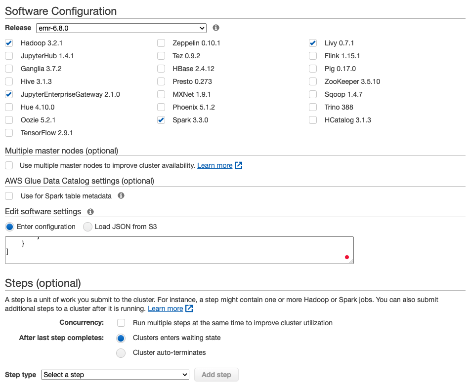
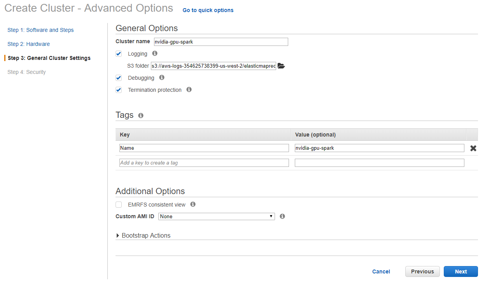
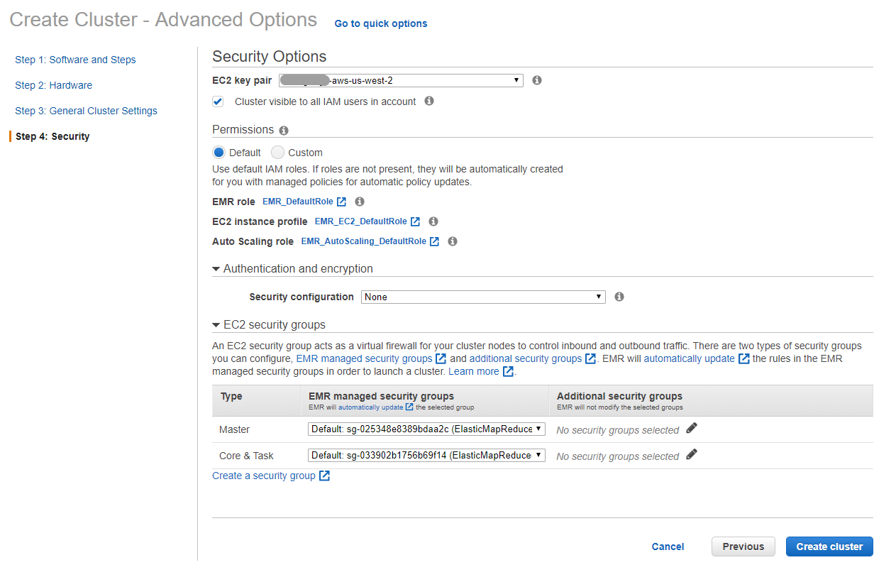
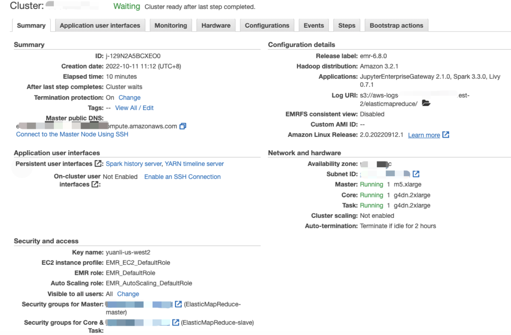
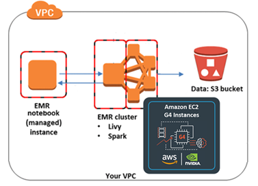
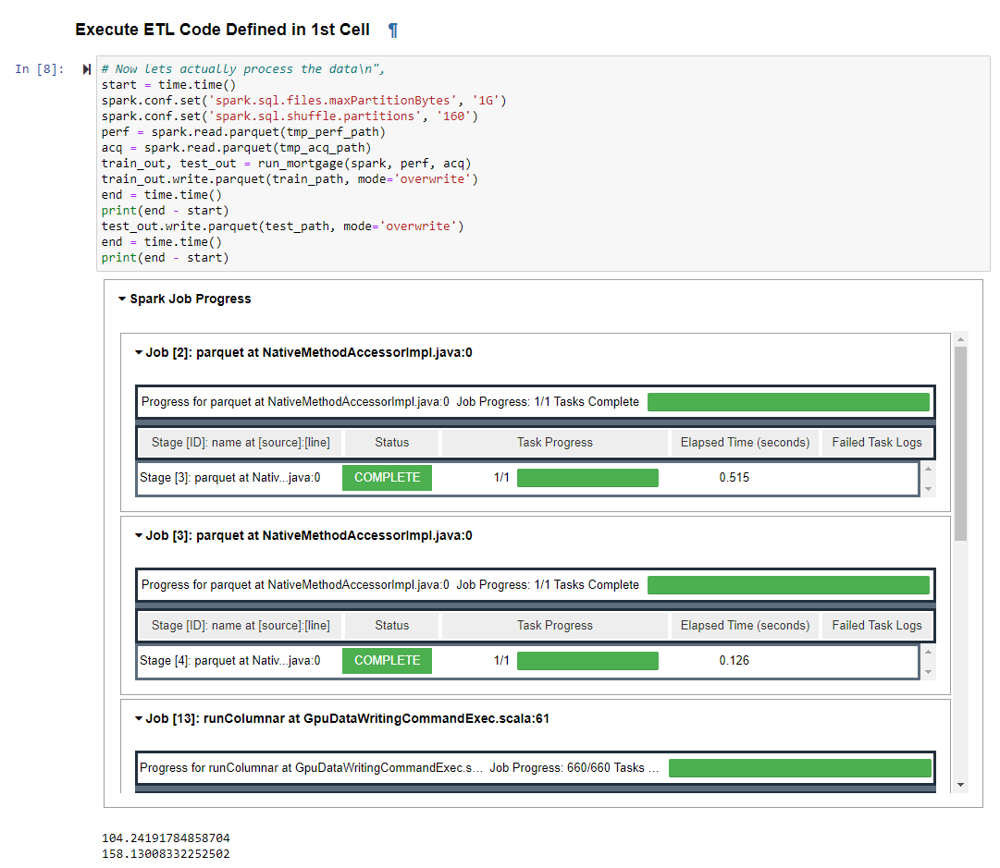

# Get Started with RAPIDS on AWS EMR

This is a getting started guide for the RAPIDS Accelerator for Apache Spark on AWS EMR. At the end
of this guide, the user will be able to run a sample Apache Spark application that runs on NVIDIA
GPUs on AWS EMR.

Different versions of EMR ship with different versions of Spark, RAPIDS Accelerator, cuDF and xgboost4j-spark:

| EMR | Spark | RAPIDS Accelerator jar | cuDF jar | xgboost4j-spark jar
| --- | --- | --- | ---| --- |
| 6.3 | 3.1.1 | rapids-4-spark_2.12-0.4.1.jar | cudf-0.18.1-cuda10-1.jar | xgboost4j-spark_3.0-1.2.0-0.1.0.jar |
| 6.2 | 3.0.1 | rapids-4-spark_2.12-0.2.0.jar | cudf-0.15-cuda10-1.jar | xgboost4j-spark_3.0-1.0.0-0.2.0.jar |

For more details of supported applications, please see the [EMR release
notes](https://docs.aws.amazon.com/emr/latest/ReleaseGuide/emr-release-6x.html).

For more information on AWS EMR, please see the [AWS
documentation](https://docs.aws.amazon.com/emr/latest/ManagementGuide/emr-what-is-emr.html).

## Configure and Launch AWS EMR with GPU Nodes

The following steps are based on the AWS EMR document ["Using the Nvidia Spark-RAPIDS Accelerator
for Spark"](https://docs.aws.amazon.com/emr/latest/ReleaseGuide/emr-spark-rapids.html)

###  Launch an EMR Cluster using AWS CLI

You can use the AWS CLI to launch a cluster with one Master node (m5.xlarge) and two 
g4dn.2xlarge nodes: 

```
aws emr create-cluster \
--release-label emr-6.3.0 \
--applications Name=Hadoop Name=Spark Name=Livy Name=JupyterEnterpriseGateway \
--service-role EMR_DefaultRole \
--ec2-attributes KeyName=my-key-pair,InstanceProfile=EMR_EC2_DefaultRole \
--instance-groups InstanceGroupType=MASTER,InstanceCount=1,InstanceType=m4.4xlarge \
                  InstanceGroupType=CORE,InstanceCount=1,InstanceType=g4dn.2xlarge \
                  InstanceGroupType=TASK,InstanceCount=1,InstanceType=g4dn.2xlarge \
--configurations file:///my-configurations.json \
--bootstrap-actions Name='My Spark Rapids Bootstrap action',Path=s3://my-bucket/my-bootstrap-action.sh
```

Please fill with actual value for `KeyName` and file paths. You can further customize SubnetId,
EmrManagedSlaveSecurityGroup, EmrManagedMasterSecurityGroup, name and region etc. 

The `my-configurations.json` installs the spark-rapids plugin on your cluster, configures YARN to use

GPUs, configures Spark to use RAPIDS, and configures the YARN capacity scheduler.  An example JSON

configuration can be found in the section on launching in the GUI below. 

The `my-boostrap-action.sh` script referenced in the above script opens cgroup permissions to YARN
on your cluster.  This is required for YARN to use GPUs.  An example script is as follows: 
```bash
#!/bin/bash
 
set -ex
 
sudo chmod a+rwx -R /sys/fs/cgroup/cpu,cpuacct
sudo chmod a+rwx -R /sys/fs/cgroup/devices
```

###  Launch an EMR Cluster using AWS Console (GUI)

Go to the AWS Management Console and select the `EMR` service from the "Analytics" section. Choose
the region you want to launch your cluster in, e.g. US West (Oregon), using the dropdown menu in the
top right corner. Click `Create cluster` and select `Go to advanced options`, which will bring up a
detailed cluster configuration page.

#### Step 1:  Software Configuration and Steps

Select **emr-6.3.0** for the release, uncheck all the software options, and then check **Hadoop
3.2.1**, **Spark 3.1.1**, **Livy 0.7.0** and **JupyterEnterpriseGateway 2.1.0**.

In the "Edit software settings" field, copy and paste the configuration from the [EMR
document](https://docs.aws.amazon.com/emr/latest/ReleaseGuide/emr-spark-rapids.html). You can also
create a JSON file on you own S3 bucket. 

For clusters with 2x g4dn.2xlarge GPU instances as worker nodes, we recommend the following
default settings: 
```json
[
	{
		"Classification":"spark",
		"Properties":{
			"enableSparkRapids":"true"
		}
	},
	{
		"Classification":"yarn-site",
		"Properties":{
			"yarn.nodemanager.resource-plugins":"yarn.io/gpu",
			"yarn.resource-types":"yarn.io/gpu",
			"yarn.nodemanager.resource-plugins.gpu.allowed-gpu-devices":"auto",
			"yarn.nodemanager.resource-plugins.gpu.path-to-discovery-executables":"/usr/bin",
			"yarn.nodemanager.linux-container-executor.cgroups.mount":"true",
			"yarn.nodemanager.linux-container-executor.cgroups.mount-path":"/sys/fs/cgroup",
			"yarn.nodemanager.linux-container-executor.cgroups.hierarchy":"yarn",
			"yarn.nodemanager.container-executor.class":"org.apache.hadoop.yarn.server.nodemanager.LinuxContainerExecutor"
		}
	},
	{
		"Classification":"container-executor",
		"Properties":{
			
		},
		"Configurations":[
			{
				"Classification":"gpu",
				"Properties":{
					"module.enabled":"true"
				}
			},
			{
				"Classification":"cgroups",
				"Properties":{
					"root":"/sys/fs/cgroup",
					"yarn-hierarchy":"yarn"
				}
			}
		]
	},
	{
        "Classification":"spark-defaults",
        "Properties":{
        "spark.plugins":"com.nvidia.spark.SQLPlugin",
        "spark.sql.sources.useV1SourceList":"",
        "spark.executor.resource.gpu.discoveryScript":"/usr/lib/spark/scripts/gpu/getGpusResources.sh",
        "spark.submit.pyFiles":"/usr/lib/spark/jars/xgboost4j-spark_3.0-1.2.0-0.1.0.jar",
        "spark.executor.extraLibraryPath":"/usr/local/cuda/targets/x86_64-linux/lib:/usr/local/cuda/extras/CUPTI/lib64:/usr/local/cuda/compat/lib:/usr/local/cuda/lib:/usr/local/cuda/lib64:/usr/lib/hadoop/lib/native:/usr/lib/hadoop-lzo/lib/native:/docker/usr/lib/hadoop/lib/native:/docker/usr/lib/hadoop-lzo/lib/native",
        "spark.rapids.sql.concurrentGpuTasks":"2",
        "spark.executor.resource.gpu.amount":"1",
        "spark.executor.cores":"8",
        "spark.task.cpus ":"1",
        "spark.task.resource.gpu.amount":"0.125",
        "spark.rapids.memory.pinnedPool.size":"2G",
        "spark.executor.memoryOverhead":"2G",
        "spark.locality.wait":"0s",
        "spark.sql.files.maxPartitionBytes":"256m",
        "spark.sql.adaptive.enabled":"false"
        }
	},
	{
		"Classification":"capacity-scheduler",
		"Properties":{
			"yarn.scheduler.capacity.resource-calculator":"org.apache.hadoop.yarn.util.resource.DominantResourceCalculator"
		}
	}
]

```
Adjust the settings as appropriate for your cluster.  For example, setting the appropriate
number of cores based on the node type.  The `spark.task.resource.gpu.amount` should be set to
1/(number of cores per executor) which will allow multiple tasks to run in parallel on the GPU. 

For example, for clusters with 2x g4dn.12xlarge as core nodes, use the following: 

```json
        "spark.executor.cores":"12",
        "spark.task.resource.gpu.amount":"0.0833",
```

More configuration details can be found in the [configuration](../configs.md) documentation. 



#### Step 2: Hardware

Select the desired VPC and availability zone in the "Network" and "EC2 Subnet" fields
respectively. (Default network and subnet are ok)

In the "Core" node row, change the "Instance type" to **g4dn.xlarge**, **g4dn.2xlarge**, or
**p3.2xlarge** and ensure "Instance count" is set to **1** or any higher number. Keep the default
"Master" node instance type of **m5.xlarge**.


#### Step 3:  General Cluster Settings

Enter a custom "Cluster name" and make a note of the s3 folder that cluster logs will be written to.

Add a custom "Bootstrap Actions" to allow cgroup permissions to YARN on your cluster.  An example
bootstrap script is as follows: 
```bash
#!/bin/bash
 
set -ex
 
sudo chmod a+rwx -R /sys/fs/cgroup/cpu,cpuacct
sudo chmod a+rwx -R /sys/fs/cgroup/devices
```

*Optionally* add key-value "Tags", configure a "Custom AMI" for the EMR cluster on this page.



####  Step 4: Security

Select an existing "EC2 key pair" that will be used to authenticate SSH access to the cluster's
nodes. If you do not have access to an EC2 key pair, follow these instructions to [create an EC2 key
pair](https://docs.aws.amazon.com/AWSEC2/latest/UserGuide/ec2-key-pairs.html#having-ec2-create-your-key-pair).

*Optionally* set custom security groups in the "EC2 security groups" tab.

In the "EC2 security groups" tab, confirm that the security group chosen for the "Master" node
allows for SSH access. Follow these instructions to [allow inbound SSH
traffic](https://docs.aws.amazon.com/AWSEC2/latest/UserGuide/authorizing-access-to-an-instance.html)
if the security group does not allow it yet.



#### Finish Cluster Configuration

The EMR cluster management page displays the status of multiple clusters or detailed information
about a chosen cluster. In the detailed cluster view, the "Summary" and "Hardware" tabs can be used
to monitor the status of master and core nodes as they provision and initialize.

When the cluster is ready, a green-dot will appear next to the cluster name and the "Status" column
will display **Waiting, cluster ready**.

In the cluster's "Summary" tab, find the "Master public DNS" field and click the `SSH`
button. Follow the instructions to SSH to the new cluster's master node.




### Running an example joint operation using Spark Shell

SSH to the EMR cluster's master node, get into sparks shell and run the sql join example to verify
GPU operation.

```bash
spark-shell
```

Running following Scala code in Spark Shell

```scala
val data = 1 to 10000
val df1 = sc.parallelize(data).toDF()
val df2 = sc.parallelize(data).toDF()
val out = df1.as("df1").join(df2.as("df2"), $"df1.value" === $"df2.value")
out.count()
out.explain()
```

### Submit Spark jobs to a EMR Cluster Accelerated by GPUs

Similar to spark-submit for on-prem clusters, AWS EMR supports a Spark application job to be
submitted. The mortgage examples we use are also available as a spark application.  You can also use
**spark shell** to run the scala code or **pyspark** to run the python code on master node through
CLI.

### Running GPU Accelerated Mortgage ETL and XGBoost Example using EMR Notebook

An EMR Notebook is a "serverless" Jupyter notebook. Unlike a traditional notebook, the contents of
an EMR Notebook itself—the equations, visualizations, queries, models, code, and narrative text—are
saved in Amazon S3 separately from the cluster that runs the code. This provides an EMR Notebook
with durable storage, efficient access, and flexibility.

You can use the following step-by-step guide to run the example mortgage dataset using RAPIDS on
Amazon EMR GPU clusters. For more examples, please refer to [NVIDIA/spark-rapids for
ETL](https://github.com/NVIDIA/spark-rapids/tree/main/docs/demo) and [NVIDIA/spark-rapids for
XGBoost](https://github.com/NVIDIA/spark-xgboost-examples/tree/spark-3/examples)



#### Create EMR Notebook and Connect to EMR GPU Cluster 

Go to the AWS Management Console and select Notebooks on the left column. Click the Create notebook
button. You can then click "Choose an existing cluster" and pick the right cluster after click
Choose button. Once the instance is ready, launch the Jupyter from EMR Notebook instance.


#### Run Mortgage ETL PySpark Notebook on EMR GPU Cluster 

Download [the Mortgate ETL PySpark Notebook](../demo/AWS-EMR/Mortgage-ETL-GPU-EMR.ipynb). Make sure
to use PySpark as kernel. This example use 1 year (year 2000) data for a two node g4dn GPU
cluster. You can adjust settings in the notebook for full mortgage dataset ETL.

When executing the ETL code, you can also saw the Spark Job Progress within the notebook and the
code will also display how long it takes to run the query



#### Run Mortgage XGBoost Scala Notebook on EMR GPU Cluster 

Please refer to this [quick start
guide](https://github.com/NVIDIA/spark-xgboost-examples/blob/spark-2/getting-started-guides/csp/aws/Using_EMR_Notebook.md)
to running GPU accelerated XGBoost on EMR Spark Cluster.
