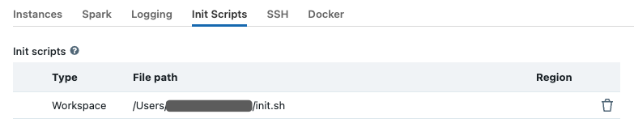
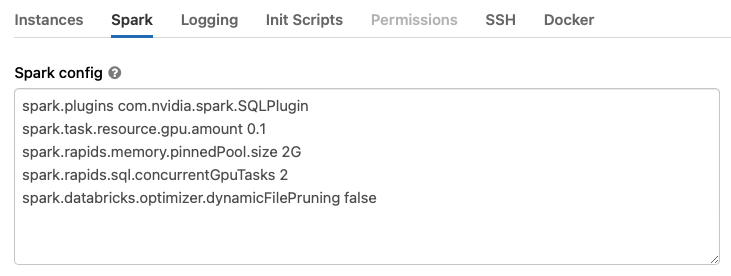

# Getting started with RAPIDS Accelerator on Databricks
This guide will run through how to set up the RAPIDS Accelerator for Apache Spark 3.x on Databricks.
At the end of this guide, the reader will be able to run a sample Apache Spark application that runs
on NVIDIA GPUs on Databricks.

## Prerequisites
    * Apache Spark 3.x running in Databricks Runtime 7.3 ML or 8.2 ML with GPU
    * AWS: 7.3 LTS ML (GPU, Scala 2.12, Spark 3.0.1) or 8.2 ML (GPU, Scala 2.12, Spark 3.1.1)
    * Azure: 7.3 LTS ML (GPU, Scala 2.12, Spark 3.0.1) or 8.2 ML (GPU, Scala 2.12, Spark 3.1.1)

Databricks may do [maintenance
releases](https://docs.databricks.com/release-notes/runtime/maintenance-updates.html) for their
runtimes which may impact the behavior of the plugin. 

The number of GPUs per node dictates the number of Spark executors that can run in that node.

## Start a Databricks Cluster
Create a Databricks cluster by going to Clusters, then clicking `+ Create Cluster`.  Ensure the
cluster meets the prerequisites above by configuring it as follows:
1. Select the Databricks Runtime Version from one of the supported runtimes specified in the
   Prerequisites section.
2. Under Autopilot Options, disable autoscaling.
3. Choose the number of workers that matches the number of GPUs you want to use.
4. Select a worker type.  On AWS, use nodes with 1 GPU each such as `p3.2xlarge` or `g4dn.xlarge`.
   p2 nodes do not meet the architecture requirements (Pascal or higher) for the Spark worker
   (although they can be used for the driver node).  For Azure, choose GPU nodes such as
   Standard_NC6s_v3.  For GCP, choose N1 or A2 instance types with GPUs. 
5. Select the driver type. Generally this can be set to be the same as the worker.
6. Start the cluster.

## Advanced Cluster Configuration

We will need to create an initialization script for the cluster that installs the RAPIDS jars to the
cluster.

1. To create the initialization script, import the initialization script notebook from the repo to
   your workspace.  See [Managing
   Notebooks](https://docs.databricks.com/notebooks/notebooks-manage.html#id2) for instructions on
   how to import a notebook.  
   Select the initialization script based on the Databricks runtime
   version:
    - [Databricks 7.3 LTS
ML](https://docs.databricks.com/release-notes/runtime/7.3ml.html#system-environment) runs CUDA 10.1
Update 2. Users wishing to try 21.06 on Databricks 7.3 LTS ML will need to install the CUDA
11.0 toolkit on the cluster.  This can be done with the [generate-init-script-cuda11.ipynb
](../demo/Databricks/generate-init-script-cuda11.ipynb) init script, which installs both the RAPIDS
Spark plugin and the CUDA 11 toolkit. 
    - [Databricks 8.2
    ML](https://docs.databricks.com/release-notes/runtime/8.2ml.html#system-environment) has CUDA 11
    installed.  In this case use
    [generate-init-script.ipynb](../demo/Databricks/generate-init-script.ipynb) which will install
    the RAPIDS Spark plugin.
2. Once you are in the notebook, click the “Run All” button.
3. Ensure that the newly created init.sh script is present in the output from cell 2 and that the
   contents of the script are correct.
4. Go back and edit your cluster to configure it to use the init script.  To do this, click the
   “Clusters” button on the left panel, then select your cluster.
5. Click the “Edit” button, then navigate down to the “Advanced Options” section.  Select the “Init
   Scripts” tab in the advanced options section, and paste the initialization script:
   `dbfs:/databricks/init_scripts/init.sh`, then click “Add”.

    

6. Now select the “Spark” tab, and paste the following config options into the Spark Config section.
   Change the config values based on the workers you choose.  See Apache Spark
   [configuration](https://spark.apache.org/docs/latest/configuration.html) and RAPIDS Accelerator
   for Apache Spark [descriptions](../configs.md) for each config.

    The
    [`spark.task.resource.gpu.amount`](https://spark.apache.org/docs/latest/configuration.html#scheduling)
    configuration is defaulted to 1 by Databricks. That means that only 1 task can run on an
    executor with 1 GPU, which is limiting, especially on the reads and writes from Parquet.  Set
    this to 1/(number of cores per executor) which will allow multiple tasks to run in parallel just
    like the CPU side.  Having the value smaller is fine as well.

	There is an incompatibility between the Databricks specific implementation of adaptive query
    execution (AQE) and the spark-rapids plugin.  In order to mitigate this,
    `spark.sql.adaptive.enabled` should be set to false.  In addition, the plugin does not work with
    the Databricks `spark.databricks.delta.optimizeWrite` option.

    ```bash
    spark.plugins com.nvidia.spark.SQLPlugin
    spark.task.resource.gpu.amount 0.1
    spark.rapids.memory.pinnedPool.size 2G
    spark.locality.wait 0s
    spark.databricks.delta.optimizeWrite.enabled false
    spark.sql.adaptive.enabled false
    spark.rapids.sql.concurrentGpuTasks 2
    ```

    

   If running Pandas UDFs with GPU support from the plugin, at least three additional options
    as below are required. The `spark.python.daemon.module` option is to choose the right daemon module
    of python for Databricks. On Databricks, the python runtime requires different parameters than the
    Spark one, so a dedicated python deamon module `rapids.daemon_databricks` is created and should
    be specified here. Set the config
    [`spark.rapids.sql.python.gpu.enabled`](../configs.md#sql.python.gpu.enabled) to `true` to
    enable GPU support for python. Add the path of the plugin jar (supposing it is placed under
    `/databricks/jars/`) to the `spark.executorEnv.PYTHONPATH` option. For more details please go to
    [GPU Scheduling For Pandas UDF](../additional-functionality/rapids-udfs.md#gpu-scheduling-for-pandas-udf)

    ```bash
    spark.rapids.sql.python.gpu.enabled true
    spark.python.daemon.module rapids.daemon_databricks
    spark.executorEnv.PYTHONPATH /databricks/jars/rapids-4-spark_2.12-21.06.0.jar:/databricks/spark/python
    ```

7. Once you’ve added the Spark config, click “Confirm and Restart”.
8. Once the cluster comes back up, it is now enabled for GPU-accelerated Spark with RAPIDS and cuDF.

## Import the GPU Mortgage Example Notebook
Import the example [notebook](../demo/gpu-mortgage_accelerated.ipynb) from the repo into your
workspace, then open the notebook.  Modify the first cell to point to your workspace, and download a
larger dataset if needed. You can find the links to the datasets at
[docs.rapids.ai](https://docs.rapids.ai/datasets/mortgage-data).

```bash
%sh

USER_ID=<your_user_id>
 
wget http://rapidsai-data.s3-website.us-east-2.amazonaws.com/notebook-mortgage-data/mortgage_2000.tgz -P /Users/${USER_ID}/
 
mkdir -p /dbfs/FileStore/tables/mortgage
mkdir -p /dbfs/FileStore/tables/mortgage_parquet_gpu/perf
mkdir /dbfs/FileStore/tables/mortgage_parquet_gpu/acq
mkdir /dbfs/FileStore/tables/mortgage_parquet_gpu/output
 
tar xfvz /Users/${USER_ID}/mortgage_2000.tgz --directory /dbfs/FileStore/tables/mortgage
```

In Cell 3, update the data paths if necessary. The example notebook merges the columns and prepares
the data for XGBoost training. The temp and final output results are written back to the dbfs.

```bash
orig_perf_path='dbfs:///FileStore/tables/mortgage/perf/*'
orig_acq_path='dbfs:///FileStore/tables/mortgage/acq/*'
tmp_perf_path='dbfs:///FileStore/tables/mortgage_parquet_gpu/perf/'
tmp_acq_path='dbfs:///FileStore/tables/mortgage_parquet_gpu/acq/'
output_path='dbfs:///FileStore/tables/mortgage_parquet_gpu/output/'
```
Run the notebook by clicking “Run All”. 

## Hints
Spark logs in Databricks are removed upon cluster shutdown.  It is possible to save logs in a cloud
storage location using Databricks [cluster log
delivery](https://docs.databricks.com/clusters/configure.html#cluster-log-delivery-1).  Enable this
option before starting the cluster to capture the logs.

