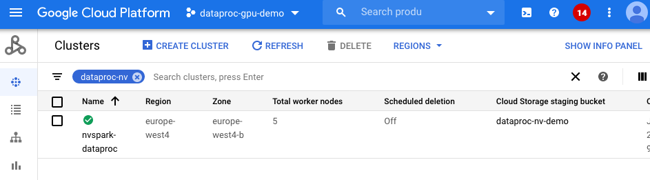
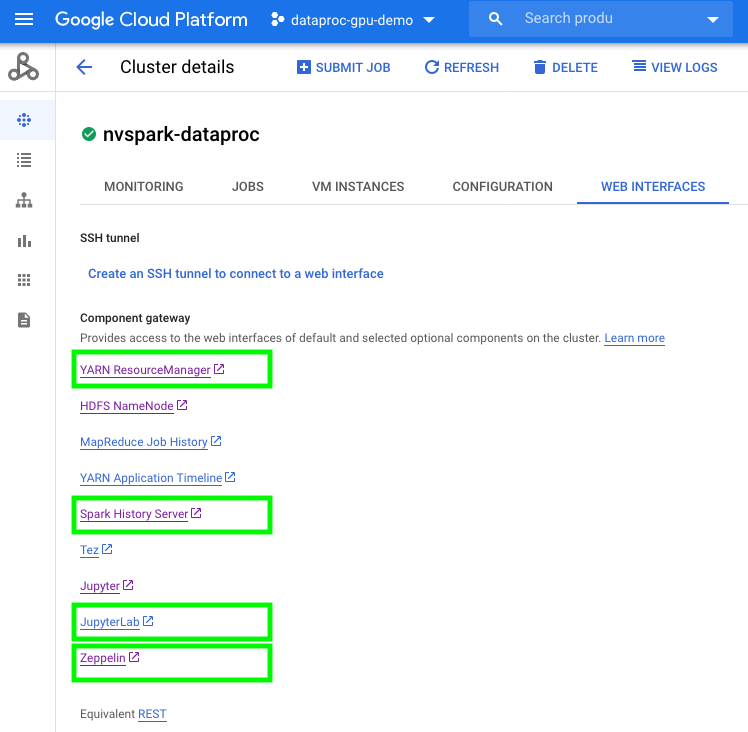

# Getting started with RAPIDS Accelerator on GCP Dataproc
 [Google Cloud Dataproc](https://cloud.google.com/dataproc) is Google Cloud's fully managed Apache Spark and Hadoop service.  This guide will walk through the steps to:

* [Spin up a Dataproc Cluster Accelerated by GPUs](getting-started-gcp#spin-up-a-dataproc-cluster-accelerated-by-gpus)
* [Run a sample Pyspark or Scala ETL and XGBoost training Notebook on a Dataproc Cluster Accelerated by GPUs](getting-started-gcp#run-pyspark-and-scala-notebook-a-dataproc-cluster-accelerated-by-gpus)
* [Submit the same sample ETL application as a Spark job to a Dataproc Cluster Accelerated by GPUs](getting-started-gcp#submit-spark-jobs-to-a-dataproc-cluster-accelerated-by-gpus)

## Spin up a Dataproc Cluster Accelerated by GPUs
 
 You can use [Cloud Shell](https://cloud.google.com/shell) to execute shell commands that will create a Dataproc cluster.  Cloud Shell contains command line tools for interacting with Google Cloud Platform, including gcloud and gsutil.  Alternatively, you can install [GCloud SDK](https://cloud.google.com/sdk/install) on your laptop.  From the Cloud Shell, users will need to enable services within your project.  Enable the Compute and Dataproc APIs in order to access Dataproc, and enable the Storage API as you’ll need a Google Cloud Storage bucket to house your data.  This may take several minutes.
```bash
gcloud services enable compute.googleapis.com
gcloud services enable dataproc.googleapis.com
gcloud services enable storage-api.googleapis.com
``` 

After the command line environment is setup, log in to your GCP account.  You can now create a Dataproc cluster with the configuration shown below.
The configuration will allow users to run any of the [notebook demos](https://github.com/NVIDIA/spark-rapids/tree/branch-0.2/docs/demo/GCP) on GCP.  Alternatively, users can also start 2*2T4 worker nodes.

The script below will initialize with the following: 

* [GPU Driver](https://github.com/GoogleCloudDataproc/initialization-actions/tree/master/gpu) and [RAPIDS Acclerator for Apache Spark](https://github.com/GoogleCloudDataproc/initialization-actions/tree/master/rapids) through initialization actions (the init action is only available in US region public buckets as of 2020-07-16)
* One 8-core master node and 5 32-core worker nodes
* Four NVIDIA T4 for each worker node
* [Local SSD](https://cloud.google.com/dataproc/docs/concepts/compute/dataproc-local-ssds) is recommended for Spark scratch space to improve IO 
* Component gateway enabled for accessing Web UIs hosted on the cluster
* Configuration for [GPU scheduling and isolation](/get-started/yarn-gpu.html)


```bash
    export REGION=[Your Preferred GCP Region]
    export GCS_BUCKET=[Your GCS Bucket]
    export CLUSTER_NAME=[Your Cluster Name]
    export NUM_GPUS=4
    export NUM_WORKERS=5

gcloud dataproc clusters create $CLUSTER_NAME  \
    --region $REGION \
    --image-version=preview-ubuntu \
    --master-machine-type n1-standard-16 \
    --num-workers $NUM_WORKERS \
    --worker-accelerator type=nvidia-tesla-t4,count=$NUM_GPUS \
    --worker-machine-type n1-highmem-32\
    --num-worker-local-ssds 4 \
    --initialization-actions gs://goog-dataproc-initialization-actions-${REGION}/gpu/install_gpu_driver.sh,gs://goog-dataproc-initialization-actions-${REGION}/rapids/rapids.sh \
    --optional-components=ANACONDA,JUPYTER,ZEPPELIN \
    --metadata gpu-driver-provider="NVIDIA" \
    --metadata rapids-runtime=SPARK \
    --bucket $GCS_BUCKET \
    --enable-component-gateway \
    --properties="^#^spark:spark.yarn.unmanagedAM.enabled=false"
``` 
This may take around 5-15 minutes to complete.  You can navigate to the Dataproc clusters tab in the Google Cloud Console to see the progress.



## Run Pyspark and Scala Notebook a Dataproc Cluster Accelerated by GPUs
To use notebooks with a Dataproc cluster, click on the cluster name under the Dataproc cluster tab and navigate to the "Web Interfaces" tab.  Under "Web Interfaces", click on the JupyterLab or Jupyter link to start to use sample [Mortgage ETL on GPU Jupyter Notebook](../demo/GCP/Mortgage-ETL-GPU.ipynb) to process full 17 years [Mortgage data](https://rapidsai.github.io/demos/datasets/mortgage-data). 



The notebook will first transcode CSV files into Parquet files and then run an ETL query to prepare the dataset for training.  In the sample notebook, we use 2016 data as the evaluation set and the rest as a training set, saving to respective GCS locations.  Using the default notebook configuration the first stage should take ~110 seconds (1/3 of CPU execution time with same config) and the second stage takes ~170 seconds (1/7 of CPU execution time with same config).  The notebook depends on the pre-compiled [Spark RAPIDS SQL plugin](https://mvnrepository.com/artifact/com.nvidia/rapids-4-spark) and [cuDF](https://mvnrepository.com/artifact/ai.rapids/cudf/0.15), which are pre-downloaded by the GCP Dataproc [RAPIDS init script](https://github.com/GoogleCloudDataproc/initialization-actions/tree/master/rapids).

Once data is prepared, we use the [Mortgage XGBoost4j Scala Notebook](../demo/GCP/mortgage-xgboost4j-gpu-scala.zpln) in Dataproc's Zeppelin service to execute the training job on the GPU.  NVIDIA also ships [Spark XGBoost4j](https://github.com/NVIDIA/spark-xgboost) which is based on [DMLC xgboost](https://github.com/dmlc/xgboost).  Precompiled [XGBoost4j](https://repo1.maven.org/maven2/com/nvidia/xgboost4j_3.0/) and [XGBoost4j Spark](https://repo1.maven.org/maven2/com/nvidia/xgboost4j-spark_3.0/1.0.0-0.1.0/) libraries can be downloaded from maven.  They are pre-downloaded by the GCP [RAPIDS init action](https://github.com/GoogleCloudDataproc/initialization-actions/tree/master/rapids).  Since github cannot render a Zeppelin notebook, we prepared a [Jupyter Notebook with Scala code](../demo/GCP/mortgage-xgboost4j-gpu-scala.ipynb) for you to view the code content. 

The training time should be around 480 seconds (1/10 of CPU execution time with same config).  This is shown under cell:
```scala
// Start training
println("\n------ Training ------")
val (xgbClassificationModel, _) = benchmark("train") {
  xgbClassifier.fit(trainSet)
}
```

## Submit Spark jobs to a Dataproc Cluster Accelerated by GPUs
Similar to spark-submit for on-prem clusters, Dataproc supports a Spark applicaton job to be submitted as a Dataproc job.  The mortgage examples we use above are also available as a [spark application](https://github.com/NVIDIA/spark-xgboost-examples/tree/spark-3/examples/apps/scala).  After [building the jar files](https://github.com/NVIDIA/spark-xgboost-examples/blob/spark-3/getting-started-guides/building-sample-apps/scala.md) they are available through maven `mvn package -Dcuda.classifier=cuda10-2`. 

Place the jar file `sample_xgboost_apps-0.2.2.jar` under the `gs://$GCS_BUCKET/scala/` folder by running `gsutil cp target/sample_xgboost_apps-0.2.2.jar gs://$GCS_BUCKET/scala/`.  To do this you can either drag and drop files from your local machine into the GCP storage browser, or use the gsutil cp as shown before to do this from a command line.  We can thereby submit the jar by:

```bash
export GCS_BUCKET=<bucket_name>
export CLUSTER_NAME=<cluster_name>
export REGION=<region>
export SPARK_NUM_EXECUTORS=20
export SPARK_EXECUTOR_MEMORY=20G
export SPARK_EXECUTOR_MEMORYOVERHEAD=16G
export SPARK_NUM_CORES_PER_EXECUTOR=7
export DATA_PATH=gs://${GCS_BUCKET}/mortgage_full

gcloud dataproc jobs submit spark \
    --cluster=$CLUSTER_NAME \
    --region=$REGION \
    --class=com.nvidia.spark.examples.mortgage.GPUMain \
    --jars=gs://${GCS_BUCKET}/scala/sample_xgboost_apps-0.2.2.jar \
    --properties=spark.executor.cores=${SPARK_NUM_CORES_PER_EXECUTOR},spark.task.cpus=${SPARK_NUM_CORES_PER_EXECUTOR},spark.executor.memory=${SPARK_EXECUTOR_MEMORY},spark.executor.memoryOverhead=${SPARK_EXECUTOR_MEMORYOVERHEAD},spark.executor.resource.gpu.amount=1,spark.task.resource.gpu.amount=1,spark.rapids.sql.hasNans=false,spark.rapids.sql.batchSizeBytes=512M,spark.rapids.sql.reader.batchSizeBytes=768M,spark.rapids.sql.variableFloatAgg.enabled=true,spark.rapids.memory.gpu.pooling.enabled=false \
    -- \
    -dataPath=train::${DATA_PATH}/train \
    -dataPath=trans::${DATA_PATH}/test \
    -format=parquet \
    -numWorkers=${SPARK_NUM_EXECUTORS} \
    -treeMethod=gpu_hist \
    -numRound=100 \
    -maxDepth=8   
``` 

## Dataproc Hub in AI Platform Notebook to Dataproc cluster 
With the integration between AI Platform Notebooks and Dataproc, users can create a [Dataproc Hub notebook](https://cloud.google.com/blog/products/data-analytics/administering-jupyter-notebooks-for-spark-workloads-on-dataproc).  The AI platform will connect to a Dataproc cluster through a yaml configuration.

In the future, users will be able to provision a Dataproc cluster through DataprocHub notebook.  You can use example [pyspark notebooks](../demo/GCP/Mortgage-ETL-GPU.ipynb) to experiment. 
