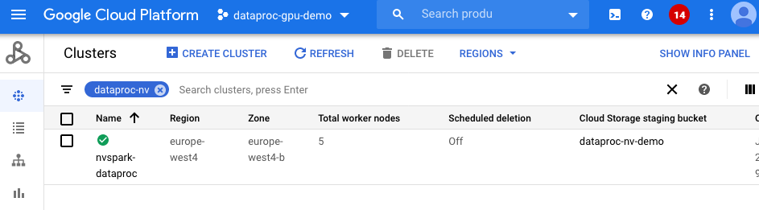

# Getting started with RAPIDS Accelerator on GCP Dataproc
 [Google Cloud Dataproc](https://cloud.google.com/dataproc) is Google Cloud's fully managed Apache
 Spark and Hadoop service.  This guide will walk through the steps to:

* [Spin up a Dataproc Cluster Accelerated by GPUs](#spin-up-a-dataproc-cluster-accelerated-by-gpus)
* [Run Pyspark or Scala ETL and XGBoost training Notebook on a Dataproc Cluster Accelerated by
  GPUs](#run-pyspark-or-scala-notebook-on-a-dataproc-cluster-accelerated-by-gpus)
* [Submit the same sample ETL application as a Spark job to a Dataproc Cluster Accelerated by
  GPUs](#submit-spark-jobs-to-a-dataproc-cluster-accelerated-by-gpus)
* [Build custom Dataproc image to accelerate cluster initialization time](#build-custom-dataproc-image-to-accelerate-cluster-init-time)

## Spin up a Dataproc Cluster Accelerated by GPUs
 
 You can use [Cloud Shell](https://cloud.google.com/shell) to execute shell commands that will
 create a Dataproc cluster.  Cloud Shell contains command line tools for interacting with Google
 Cloud Platform, including gcloud and gsutil.  Alternatively, you can install [GCloud
 SDK](https://cloud.google.com/sdk/install) on your machine.  From the Cloud Shell, users will need
 to enable services within your project.  Enable the Compute and Dataproc APIs in order to access
 Dataproc, and enable the Storage API as you’ll need a Google Cloud Storage bucket to house your
 data.  This may take several minutes.

```bash
gcloud services enable compute.googleapis.com
gcloud services enable dataproc.googleapis.com
gcloud services enable storage-api.googleapis.com
``` 

After the command line environment is setup, log in to your GCP account.  You can now create a
Dataproc cluster with the configuration shown below.  The configuration will allow users to run any
of the [notebook demos](https://github.com/NVIDIA/spark-rapids/tree/main/docs/demo/GCP) on
GCP.  Alternatively, users can also start 2*2T4 worker nodes.

The script below will initialize with the following: 

* [GPU Driver](https://github.com/GoogleCloudDataproc/initialization-actions/tree/master/gpu) and
  [RAPIDS Acclerator for Apache
  Spark](https://github.com/GoogleCloudDataproc/initialization-actions/tree/master/rapids) through
  initialization actions (the init action is only available in US region public buckets as of
  2020-07-16)
* One 8-core master node and 5 32-core worker nodes
* Four NVIDIA T4 for each worker node
* [Local SSD](https://cloud.google.com/dataproc/docs/concepts/compute/dataproc-local-ssds) is
  recommended for Spark scratch space to improve IO
* Component gateway enabled for accessing Web UIs hosted on the cluster
* Configuration for [GPU scheduling and isolation](yarn-gpu.md)


```bash
    export REGION=[Your Preferred GCP Region]
    export GCS_BUCKET=[Your GCS Bucket]
    export CLUSTER_NAME=[Your Cluster Name]
    export NUM_GPUS=4
    export NUM_WORKERS=5

gcloud dataproc clusters create $CLUSTER_NAME  \
    --region $REGION \
    --image-version=2.0-ubuntu18 \
    --master-machine-type n1-standard-16 \
    --num-workers $NUM_WORKERS \
    --worker-accelerator type=nvidia-tesla-t4,count=$NUM_GPUS \
    --worker-machine-type n1-highmem-32\
    --num-worker-local-ssds 4 \
    --initialization-actions gs://goog-dataproc-initialization-actions-${REGION}/gpu/install_gpu_driver.sh,gs://goog-dataproc-initialization-actions-${REGION}/rapids/rapids.sh \
    --optional-components=JUPYTER,ZEPPELIN \
    --metadata gpu-driver-provider="NVIDIA" \
    --metadata rapids-runtime=SPARK \
    --bucket $GCS_BUCKET \
    --enable-component-gateway \
``` 

This may take around 10-15 minutes to complete.  You can navigate to the Dataproc clusters tab in the
Google Cloud Console to see the progress.



If you'd like to further accelerate init time to 4-5 minutes, create a custom Dataproc image using
[this](#build-custom-dataproc-image-to-accelerate-cluster-init-time) guide. 

## Run PySpark or Scala Notebook on a Dataproc Cluster Accelerated by GPUs
To use notebooks with a Dataproc cluster, click on the cluster name under the Dataproc cluster tab
and navigate to the "Web Interfaces" tab.  Under "Web Interfaces", click on the JupyterLab or
Jupyter link to start to use sample [Mortgage ETL on GPU Jupyter
Notebook](../demo/GCP/Mortgage-ETL-GPU.ipynb) to process full 17 years [Mortgage
data](https://rapidsai.github.io/demos/datasets/mortgage-data).


The notebook will first transcode CSV files into Parquet files and then run an ETL query to prepare
the dataset for training.  In the sample notebook, we use 2016 data as the evaluation set and the
rest as a training set, saving to respective GCS locations.  Using the default notebook
configuration the first stage should take ~110 seconds (1/3 of CPU execution time with same config)
and the second stage takes ~170 seconds (1/7 of CPU execution time with same config).  The notebook
depends on the pre-compiled [Spark RAPIDS SQL
plugin](https://mvnrepository.com/artifact/com.nvidia/rapids-4-spark) and
[cuDF](https://mvnrepository.com/artifact/ai.rapids/cudf), which are pre-downloaded by the GCP
Dataproc [RAPIDS init
script](https://github.com/GoogleCloudDataproc/initialization-actions/tree/master/rapids).

Once data is prepared, we use the [Mortgage XGBoost4j Scala
Notebook](../demo/GCP/mortgage-xgboost4j-gpu-scala.zpln) in Dataproc's Zeppelin service to execute
the training job on the GPU.  NVIDIA also ships [Spark
XGBoost4j](https://github.com/NVIDIA/spark-xgboost) which is based on [DMLC
xgboost](https://github.com/dmlc/xgboost).  Precompiled
[XGBoost4j](https://repo1.maven.org/maven2/com/nvidia/xgboost4j_3.0/) and [XGBoost4j
Spark](https://repo1.maven.org/maven2/com/nvidia/xgboost4j-spark_3.0/1.0.0-0.1.0/) libraries can be
downloaded from maven.  They are pre-downloaded by the GCP [RAPIDS init
action](https://github.com/GoogleCloudDataproc/initialization-actions/tree/master/rapids).  Since
github cannot render a Zeppelin notebook, we prepared a [Jupyter Notebook with Scala
code](../demo/GCP/mortgage-xgboost4j-gpu-scala.ipynb) for you to view the code content.

The training time should be around 480 seconds (1/10 of CPU execution time with same config).  This
is shown under cell:

```scala
// Start training
println("\n------ Training ------")
val (xgbClassificationModel, _) = benchmark("train") {
  xgbClassifier.fit(trainSet)
}
```

## Submit Spark jobs to a Dataproc Cluster Accelerated by GPUs
Similar to spark-submit for on-prem clusters, Dataproc supports a Spark applicaton job to be
submitted as a Dataproc job.  The mortgage examples we use above are also available as a [spark
application](https://github.com/NVIDIA/spark-xgboost-examples/tree/spark-3/examples/apps/scala).
After [building the jar
files](https://github.com/NVIDIA/spark-xgboost-examples/blob/spark-3/getting-started-guides/building-sample-apps/scala.md)
they are available through maven `mvn package -Dcuda.classifier=cuda10-2`.

Place the jar file `sample_xgboost_apps-0.2.2.jar` under the `gs://$GCS_BUCKET/scala/` folder by
running `gsutil cp target/sample_xgboost_apps-0.2.2.jar gs://$GCS_BUCKET/scala/`.  To do this you
can either drag and drop files from your local machine into the GCP storage browser, or use the
gsutil cp as shown before to do this from a command line.  We can thereby submit the jar by:

```bash
export REGION=[Your Preferred GCP Region]
export GCS_BUCKET=[Your GCS Bucket]
export CLUSTER_NAME=[Your Cluster Name]
export SPARK_NUM_EXECUTORS=20
export SPARK_EXECUTOR_MEMORY=20G
export SPARK_EXECUTOR_MEMORYOVERHEAD=16G
export SPARK_NUM_CORES_PER_EXECUTOR=7
export DATA_PATH=gs://${GCS_BUCKET}/mortgage_full

gcloud dataproc jobs submit spark \
    --cluster=$CLUSTER_NAME \
    --region=$REGION \
    --class=com.nvidia.spark.examples.mortgage.GPUMain \
    --jars=gs://${GCS_BUCKET}/scala/sample_xgboost_apps-0.2.2.jar \
    --properties=spark.executor.cores=${SPARK_NUM_CORES_PER_EXECUTOR},spark.task.cpus=${SPARK_NUM_CORES_PER_EXECUTOR},spark.executor.memory=${SPARK_EXECUTOR_MEMORY},spark.executor.memoryOverhead=${SPARK_EXECUTOR_MEMORYOVERHEAD},spark.executor.resource.gpu.amount=1,spark.task.resource.gpu.amount=1,spark.rapids.sql.hasNans=false,spark.rapids.sql.batchSizeBytes=512M,spark.rapids.sql.reader.batchSizeBytes=768M,spark.rapids.sql.variableFloatAgg.enabled=true,spark.rapids.memory.gpu.pooling.enabled=false \
    -- \
    -dataPath=train::${DATA_PATH}/train \
    -dataPath=trans::${DATA_PATH}/test \
    -format=parquet \
    -numWorkers=${SPARK_NUM_EXECUTORS} \
    -treeMethod=gpu_hist \
    -numRound=100 \
    -maxDepth=8   
``` 

## Dataproc Hub in AI Platform Notebook to Dataproc cluster 
With the integration between AI Platform Notebooks and Dataproc, users can create a [Dataproc Hub
notebook](https://cloud.google.com/blog/products/data-analytics/administering-jupyter-notebooks-for-spark-workloads-on-dataproc).
The AI platform will connect to a Dataproc cluster through a yaml configuration.

In the future, users will be able to provision a Dataproc cluster through DataprocHub notebook.  You
can use example [pyspark notebooks](../demo/GCP/Mortgage-ETL-GPU.ipynb) to experiment.

## Build custom dataproc image to accelerate cluster init time
In order to accelerate cluster init time to 4-5 minutes, we need to build a custom Dataproc image
that already has NVIDIA drivers and CUDA toolkit installed. In this section, we will be using [these
instructions from GCP](https://cloud.google.com/dataproc/docs/guides/dataproc-images) to create a
custom image. 

Currently, the [GPU Driver](https://github.com/GoogleCloudDataproc/initialization-actions/tree/master/gpu) initialization actions:
1. Configure YARN, the YARN node manager, GPU isolation and GPU exclusive mode.
2. Install GPU drivers.

While step #1 is required at the time of cluster creation, step #2 can be done in advance. Let's
write a script to do that. `gpu_dataproc_packages.sh` will be used to create the Dataproc image:

```bash
#!/bin/bash

OS_NAME=$(lsb_release -is | tr '[:upper:]' '[:lower:]')
readonly OS_NAME
OS_DIST=$(lsb_release -cs)
readonly OS_DIST
CUDA_VERSION='10.2'
readonly CUDA_VERSION

readonly DEFAULT_NVIDIA_DEBIAN_GPU_DRIVER_VERSION='460.56'
readonly DEFAULT_NVIDIA_DEBIAN_GPU_DRIVER_URL="https://us.download.nvidia.com/XFree86/Linux-x86_64/${DEFAULT_NVIDIA_DEBIAN_GPU_DRIVER_VERSION}/NVIDIA-Linux-x86_64-${DEFAULT_NVIDIA_DEBIAN_GPU_DRIVER_VERSION}.run"

readonly NVIDIA_BASE_DL_URL='https://developer.download.nvidia.com/compute'

# Parameters for NVIDIA-provided Ubuntu GPU driver
readonly NVIDIA_UBUNTU_REPOSITORY_URL="${NVIDIA_BASE_DL_URL}/cuda/repos/ubuntu1804/x86_64"
readonly NVIDIA_UBUNTU_REPOSITORY_KEY="${NVIDIA_UBUNTU_REPOSITORY_URL}/7fa2af80.pub"
readonly NVIDIA_UBUNTU_REPOSITORY_CUDA_PIN="${NVIDIA_UBUNTU_REPOSITORY_URL}/cuda-ubuntu1804.pin"

function execute_with_retries() {
  local -r cmd=$1
  for ((i = 0; i < 10; i++)); do
    if eval "$cmd"; then
      return 0
    fi
    sleep 5
  done
  return 1
}

function install_nvidia_gpu_driver() {
  curl -fsSL --retry-connrefused --retry 10 --retry-max-time 30 \
    "${NVIDIA_UBUNTU_REPOSITORY_KEY}" | apt-key add -

  curl -fsSL --retry-connrefused --retry 10 --retry-max-time 30 \
    "${NVIDIA_UBUNTU_REPOSITORY_CUDA_PIN}" -o /etc/apt/preferences.d/cuda-repository-pin-600

  add-apt-repository "deb ${NVIDIA_UBUNTU_REPOSITORY_URL} /"
  execute_with_retries "apt-get update"

  if [[ -n "${CUDA_VERSION}" ]]; then
    local -r cuda_package=cuda-${CUDA_VERSION//./-}
  else
    local -r cuda_package=cuda
  fi
  # Without --no-install-recommends this takes a very long time.
  execute_with_retries "apt-get install -y -q --no-install-recommends ${cuda_package}"

  echo "NVIDIA GPU driver provided by NVIDIA was installed successfully"
}

function main() {

    # updates
    export DEBIAN_FRONTEND=noninteractive
    execute_with_retries "apt-get update"
    execute_with_retries "apt-get install -y -q pciutils"

    execute_with_retries "apt-get install -y -q 'linux-headers-$(uname -r)'"

    install_nvidia_gpu_driver
}

main
```

Google provides a `generate_custom_image.py` script that:
- Launches a temporary Compute Engine VM instance with the specified Dataproc base image.
- Then runs the customization script inside the VM instance to install custom packages and/or update
  configurations.
- After the customization script finishes, it shuts down the VM instance and creates a Dataproc
  custom image from the disk of the VM instance.
- The temporary VM is deleted after the custom image is created. 
- The custom image is saved and can be used to create Dataproc clusters.

Copy the customization script below to a file called `gpu_dataproc_packages.sh`.  The script uses
Google's `generate_custom_image.py` script.  This step may take 20-25 minutes to complete.

```bash
git clone https://github.com/GoogleCloudDataproc/custom-images
cd custom-images

export CUSTOMIZATION_SCRIPT=/path/to/gpu_dataproc_packages.sh
export ZONE=[Your Preferred GCP Zone]
export GCS_BUCKET=[Your GCS Bucket]
export IMAGE_NAME=a207-ubuntu18-gpu-t4
export DATAPROC_VERSION=2.0.7-ubuntu18
export GPU_NAME=nvidia-tesla-t4
export GPU_COUNT=2

python generate_custom_image.py \
    --image-name $IMAGE_NAME \
    --dataproc-version $DATAPROC_VERSION \
    --customization-script $CUSTOMIZATION_SCRIPT \
    --zone $ZONE \
    --gcs-bucket $GCS_BUCKET \
    --machine-type n1-highmem-32 \
    --accelerator type=$GPU_NAME,count=$GPU_COUNT \
    --disk-size 40
```

See [here](https://cloud.google.com/dataproc/docs/guides/dataproc-images#running_the_code) for more
details on `generate_custom_image.py` script arguments and 
[here](https://cloud.google.com/dataproc/docs/concepts/versioning/dataproc-versions) for dataproc version description.

The image `sample-207-ubuntu18-gpu-t4` is now ready and can be viewed in the GCP console under
`Compute Engine > Storage > Images`. The next step is to launch the cluster using this new image and
new initialization actions (that do not install NVIDIA drivers since we are already past that step).

Here is the new custom GPU initialization action that only configures YARN, the YARN node manager,
GPU isolation and GPU exclusive mode:

```bash
#!/bin/bash

# Dataproc configurations
readonly HADOOP_CONF_DIR='/etc/hadoop/conf'
readonly HIVE_CONF_DIR='/etc/hive/conf'
readonly SPARK_CONF_DIR='/etc/spark/conf'

function execute_with_retries() {
  local -r cmd=$1
  for ((i = 0; i < 10; i++)); do
    if eval "$cmd"; then
      return 0
    fi
    sleep 5
  done
  return 1
}

function set_hadoop_property() {
  local -r config_file=$1
  local -r property=$2
  local -r value=$3
  bdconfig set_property \
    --configuration_file "${HADOOP_CONF_DIR}/${config_file}" \
    --name "${property}" --value "${value}" \
    --clobber
}

function configure_yarn() {
  if [[ ! -f ${HADOOP_CONF_DIR}/resource-types.xml ]]; then
    printf '<?xml version="1.0" ?>\n<configuration/>' >"${HADOOP_CONF_DIR}/resource-types.xml"
  fi
  set_hadoop_property 'resource-types.xml' 'yarn.resource-types' 'yarn.io/gpu'

  set_hadoop_property 'capacity-scheduler.xml' \
    'yarn.scheduler.capacity.resource-calculator' \
    'org.apache.hadoop.yarn.util.resource.DominantResourceCalculator'

  set_hadoop_property 'yarn-site.xml' 'yarn.resource-types' 'yarn.io/gpu'
}

function configure_yarn_nodemanager() {
  set_hadoop_property 'yarn-site.xml' 'yarn.nodemanager.resource-plugins' 'yarn.io/gpu'
  set_hadoop_property 'yarn-site.xml' \
    'yarn.nodemanager.resource-plugins.gpu.allowed-gpu-devices' 'auto'
  set_hadoop_property 'yarn-site.xml' \
    'yarn.nodemanager.resource-plugins.gpu.path-to-discovery-executables' '/usr/bin'
  set_hadoop_property 'yarn-site.xml' \
    'yarn.nodemanager.linux-container-executor.cgroups.mount' 'true'
  set_hadoop_property 'yarn-site.xml' \
    'yarn.nodemanager.linux-container-executor.cgroups.mount-path' '/sys/fs/cgroup'
  set_hadoop_property 'yarn-site.xml' \
    'yarn.nodemanager.linux-container-executor.cgroups.hierarchy' 'yarn'
  set_hadoop_property 'yarn-site.xml' \
    'yarn.nodemanager.container-executor.class' \
    'org.apache.hadoop.yarn.server.nodemanager.LinuxContainerExecutor'
  set_hadoop_property 'yarn-site.xml' 'yarn.nodemanager.linux-container-executor.group' 'yarn'

  # Fix local dirs access permissions
  local yarn_local_dirs=()
  readarray -d ',' yarn_local_dirs < <(bdconfig get_property_value \
    --configuration_file "${HADOOP_CONF_DIR}/yarn-site.xml" \
    --name "yarn.nodemanager.local-dirs" 2>/dev/null | tr -d '\n')
  chown yarn:yarn -R "${yarn_local_dirs[@]/,/}"
}

function configure_gpu_exclusive_mode() {
  # check if running spark 3, if not, enable GPU exclusive mode
  local spark_version
  spark_version=$(spark-submit --version 2>&1 | sed -n 's/.*version[[:blank:]]\+\([0-9]\+\.[0-9]\).*/\1/p' | head -n1)
  if [[ ${spark_version} != 3.* ]]; then
    # include exclusive mode on GPU
    nvidia-smi -c EXCLUSIVE_PROCESS
  fi
}

function configure_gpu_isolation() {
  # Download GPU discovery script
  local -r spark_gpu_script_dir='/usr/lib/spark/scripts/gpu'
  mkdir -p ${spark_gpu_script_dir}
  local -r gpu_resources_url=https://raw.githubusercontent.com/apache/spark/master/examples/src/main/scripts/getGpusResources.sh
  curl -fsSL --retry-connrefused --retry 10 --retry-max-time 30 \
    "${gpu_resources_url}" -o ${spark_gpu_script_dir}/getGpusResources.sh
  chmod a+rwx -R ${spark_gpu_script_dir}

  # enable GPU isolation
  sed -i "s/yarn.nodemanager\.linux\-container\-executor\.group\=/yarn\.nodemanager\.linux\-container\-executor\.group\=yarn/g" "${HADOOP_CONF_DIR}/container-executor.cfg"
  printf '\n[gpu]\nmodule.enabled=true\n[cgroups]\nroot=/sys/fs/cgroup\nyarn-hierarchy=yarn\n' >>"${HADOOP_CONF_DIR}/container-executor.cfg"

  chmod a+rwx -R /sys/fs/cgroup/cpu,cpuacct
  chmod a+rwx -R /sys/fs/cgroup/devices
}

function main() {

    # This configuration should run on all nodes regardless of attached GPUs
    configure_yarn

    configure_yarn_nodemanager

    configure_gpu_isolation

    configure_gpu_exclusive_mode

}

main
```

Move this to your own bucket. Lets launch the cluster:

```bash 
export REGION=[Your Preferred GCP Region]
export GCS_BUCKET=[Your GCS Bucket]
export CLUSTER_NAME=[Your Cluster Name]
export NUM_GPUS=2
export NUM_WORKERS=2

gcloud dataproc clusters create $CLUSTER_NAME  \
    --region $REGION \
    --image=sample-207-ubuntu18-gpu-t4 \
    --master-machine-type n1-highmem-32 \
    --master-accelerator type=nvidia-tesla-t4,count=$NUM_GPUS \
    --num-workers $NUM_WORKERS \
    --worker-accelerator type=nvidia-tesla-t4,count=$NUM_GPUS \
    --worker-machine-type n1-highmem-32\
    --num-worker-local-ssds 4 \
    --initialization-actions gs://$GCS_BUCKET/custom_gpu_init_actions.sh,gs://goog-dataproc-initialization-actions-${REGION}/rapids/rapids.sh \
    --optional-components=JUPYTER,ZEPPELIN \
    --metadata gpu-driver-provider="NVIDIA" \
    --metadata rapids-runtime=SPARK \
    --bucket $GCS_BUCKET \
    --enable-component-gateway \
```

The new cluster should be up and running within 4-5 minutes!
