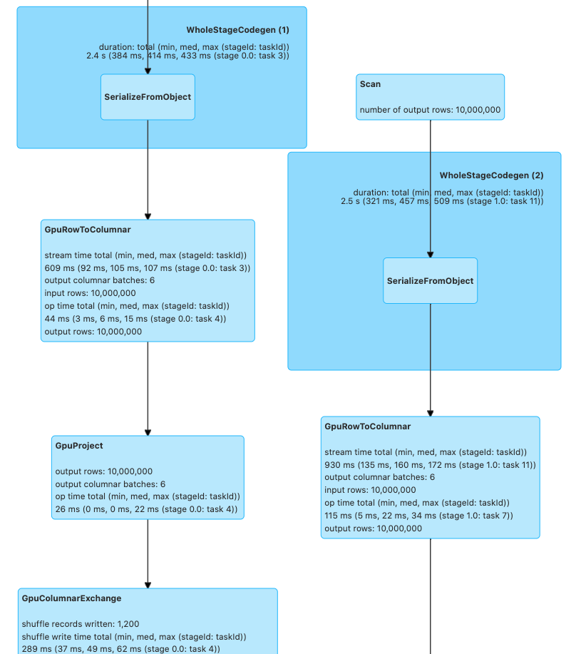
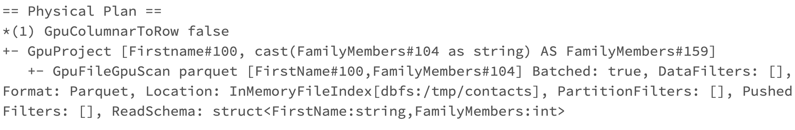

# Getting Started with RAPIDS Accelerator with on premise cluster or local mode
## Spark Deployment Methods
The way you decide to deploy Spark affects the steps you must take to install and setup Spark and
the RAPIDS Accelerator for Apache Spark. The primary methods of deploy Spark are:
- Local mode - this is for dev/testing only, not for production
- Standalone Mode
- On a YARN cluster
- On a Kubernetes cluster

## Apache Spark Setup for GPU
Each GPU node where you are running Spark needs to have the following installed. If you are running
with Docker on Kubernetes then skip these as you will do this as part of the docker build.
- Install Java 8 - note jdk11 is supported by Spark, but we have been building and testing with
  jdk8, so we suggest using that for now.
  - Ubuntu: `sudo apt install openjdk-8-jdk-headless`
- Install the GPU driver and CUDA toolkit. Instructions for Ubuntu 18.04 with CUDA 10.1 are below.
  - [Download](https://developer.nvidia.com/cuda-10.1-download-archive-base) and install
    GPU drivers and the CUDA Toolkit. Installing these packages will require a node reboot after
    installation.
  - `wget https://developer.download.nvidia.com/compute/cuda/repos/ubuntu1804/x86_64/cuda-ubuntu1804.pin`
  - `sudo mv cuda-ubuntu1804.pin /etc/apt/preferences.d/cuda-repository-pin-600`
  - `wget http://developer.download.nvidia.com/compute/cuda/10.1/Prod/local_installers/cuda-repo-ubuntu1804-10-1-local-10.1.243-418.87.00_1.0-1_amd64.deb`
  - `sudo dpkg -i cuda-repo-ubuntu1804-10-1-local-10.1.243-418.87.00_1.0-1_amd64.deb`
  - `sudo apt-key add /var/cuda-repo-10-1-local-10.1.243-418.87.00/7fa2af80.pub`
  - `sudo apt-get update`
  - `sudo apt-get -y install cuda`

Below are sections on installing Spark and the RAPIDS Accelerator on a single node.  You may want
to read the deployment method sections before doing any installations.

## Install Spark
To install Apache Spark please follow the official 
[instructions](https://spark.apache.org/docs/latest/#launching-on-a-cluster). Supported versions of
Spark are listed on the [download](../download.md) page.  Please note that only
scala version 2.12 is currently supported by the accelerator. 

## Download the RAPIDS jars
The [accelerator](https://mvnrepository.com/artifact/com.nvidia/rapids-4-spark_2.12) and 
[cudf](https://mvnrepository.com/artifact/ai.rapids/cudf) jars are available in the 
[download](../download.md) section.

Download the RAPIDS Accelerator for Apache Spark plugin jar. Then download the version of the cudf
jar that your version of the accelerator depends on. Each cudf jar is for a specific version of
CUDA and will not run on other versions. The jars use a maven classifier to keep them separate.

- CUDA 11.0/11.1/11.2 => classifier cuda11

For example, here is a sample version of the jars and cudf with CUDA 11.0 support:
- cudf-21.06.0-SNAPSHOT-cuda11.jar
- rapids-4-spark_2.12-21.06.0-SNAPSHOT.jar
jar that your version of the accelerator depends on.


For simplicity export the location to these jars. This example assumes the sample jars above have
been placed in the `/opt/sparkRapidsPlugin` directory:
```shell 
export SPARK_RAPIDS_DIR=/opt/sparkRapidsPlugin
export SPARK_CUDF_JAR=${SPARK_RAPIDS_DIR}/cudf-21.06.0-SNAPSHOT-cuda11.jar
export SPARK_RAPIDS_PLUGIN_JAR=${SPARK_RAPIDS_DIR}/rapids-4-spark_2.12-21.06.0-SNAPSHOT.jar
```

## Install the GPU Discovery Script
If you are using Apache Spark's GPU scheduling feature please be sure to follow what your cluster
administrator recommends.  Often this will involve downloading a GPU discovery script and this
example will assume as such.
Download the
[getGpusResource.sh](https://github.com/apache/spark/blob/master/examples/src/main/scripts/getGpusResources.sh)
script and install it on all the nodes. Put it into a local folder.  You may put it in the same
directory as the plugin jars (`/opt/sparkRapidsPlugin` in the example).

## Local Mode
This is for testing/dev setup only.  It is not to be used in production.  In this mode Spark runs
everything in a single process on a single node.
- [Install Spark](#install-spark)
- [Install the RAPIDS jars](#download-the-rapids-jars)
- Launch your Spark shell session. 

Default configs usually work fine in local mode.  The required changes are setting the config 
`spark.plugins` to `com.nvidia.spark.SQLPlugin` and including the jars as a dependency. All of the
other config settings and command line parameters are to try and better configure spark for GPU
execution.
 
```shell 
$SPARK_HOME/bin/spark-shell \
       --master local \
       --num-executors 1 \
       --conf spark.executor.cores=1 \
       --conf spark.rapids.sql.concurrentGpuTasks=1 \
       --driver-memory 10g \
       --conf spark.rapids.memory.pinnedPool.size=2G \
       --conf spark.locality.wait=0s \
       --conf spark.sql.files.maxPartitionBytes=512m \
       --conf spark.plugins=com.nvidia.spark.SQLPlugin \
       --jars ${SPARK_CUDF_JAR},${SPARK_RAPIDS_PLUGIN_JAR}
```
You can run one of the examples below such as the [Example Join Operation](#example-join-operation)

## Spark Standalone Cluster
For reference, the Spark documentation is
[here](http://spark.apache.org/docs/latest/spark-standalone.html).

Spark Standalone mode requires starting the Spark master and worker(s). You can run it on a single
machine or multiple machines for distributed setup.

The first step is to [Install Spark](#install-spark), the 
[RAPIDS Accelerator for Spark jars](#download-the-rapids-jars), and the 
[GPU discovery script](#install-the-gpu-discovery-script) on all the nodes you want to use.
See the note at the end of this section if using Spark 3.1.1 or above.
After that choose one of the nodes to be your master node and start the master.  Note that the
master process does **not** need a GPU to function properly.

On the master node:
  - Make sure `SPARK_HOME` is exported
  - run `$SPARK_HOME/sbin/start-master.sh`
    - This script will print a message saying starting Master and have a path to a log file.
      Examine the log file to make sure there are no errors starting the Spark Master process.
  - `export MASTER_HOST=`[_the hostname of the master_]
  - Go to the Spark Master UI to verify it has started.  The UI should be accessible at
     `http://${MASTER_HOST}:8080`
  - Find the Spark URL for the Spark Master. This can be found in the Spark Master logs or from
    the Spark Master UI. It will likely be: `spark://${MASTER_HOST}:7077`. You will need this URL
    for starting the workers and submitting applications.
    
Now for each worker node:
- Setup worker configs on each node
  - `cp $SPARK_HOME/conf/spark-env.sh.template $SPARK_HOME/conf/spark-env.sh`
  - Edit `$SPARK_HOME/conf/spark-env.sh` and add any worker options. The example below sets the
    number of GPUs per worker to 4 and points to the discovery script.  Change this for your setup.
    - `SPARK_WORKER_OPTS="-Dspark.worker.resource.gpu.amount=4 -Dspark.worker.resource.gpu.discoveryScript=/opt/sparkRapidsPlugin/getGpusResources.sh"`
- Start the worker(s)
  - For multiple workers:
    - You can add each hostname to the file `$SPARK_HOME/conf/slaves` and use the scripts provided
      by Spark to start all of them. This requires password-less ssh to be setup. If you do not
      have a password-less setup, you can set the environment variable `SPARK_SSH_FOREGROUND` and
      serially provide a password for each worker.
    - Run `$SPARK_HOME/sbin/start-slaves.sh`
- For a single worker:
  - `$SPARK_HOME/sbin/start-slave.sh spark://${MASTER_HOST}:7077`
  
Now you can go to the master UI at `http://${MASTER_HOST}:8080` and verify all the workers have
started.

Submitting a Spark application to a standalone mode cluster requires a few configs to be set. These
configs can be placed in the Spark default confs if you want all jobs to use the GPU. The plugin
requires its jars to be in the executor classpath.  GPU scheduling also requires the Spark job to 
ask for GPUs.  The plugin cannot utilize more than one GPU per executor. 

In this case we are asking for 1 GPU per executor (the plugin cannot utilize more than one), and 4 
CPU tasks per executor (but only one task will be on the GPU at a time).  This allows for 
overlapping I/O and computation. 

```shell 
$SPARK_HOME/bin/spark-shell \
       --master spark://${MASTER_HOST}:7077 \
       --conf spark.executor.extraClassPath=${SPARK_CUDF_JAR}:${SPARK_RAPIDS_PLUGIN_JAR} \
       --conf spark.driver.extraClassPath=${SPARK_CUDF_JAR}:${SPARK_RAPIDS_PLUGIN_JAR} \
       --conf spark.rapids.sql.concurrentGpuTasks=1 \
       --driver-memory 2G \
       --conf spark.executor.memory=4G \
       --conf spark.executor.cores=4 \
       --conf spark.task.cpus=1 \
       --conf spark.executor.resource.gpu.amount=1 \
       --conf spark.task.resource.gpu.amount=0.25 \
       --conf spark.rapids.memory.pinnedPool.size=2G \
       --conf spark.locality.wait=0s \
       --conf spark.sql.files.maxPartitionBytes=512m \
       --conf spark.plugins=com.nvidia.spark.SQLPlugin
```

Please note that if you are using Spark 3.1.1 or higher, the RAPIDS Accelerator for Apache Spark plugin jar
and CUDF jar do not need to be installed on all the nodes and the configs
`spark.executor.extraClassPath` and `spark.driver.extraClassPath` can be replaced in the above
command with `--jars ${SPARK_CUDF_JAR},${SPARK_RAPIDS_PLUGIN_JAR}`.
This will automatically distribute the jars to the nodes for you.

## Running on YARN

YARN requires you to [Install Spark](#install-spark), the
[RAPIDS Accelerator for Spark jars](#download-the-rapids-jars), and the
[GPU discovery script](#install-the-gpu-discovery-script) on a launcher node. YARN handles
shipping them to the cluster nodes as needed. If you want to use the GPU scheduling feature in
Spark it requires YARN version >= 2.10 or >= 3.1.1 and ideally you would use >= 3.1.3 in order to
get support for nvidia-docker version 2.

It is recommended to run your YARN cluster with Docker, cgroup isolation and GPU
scheduling enabled. This way your Spark containers run isolated and can only see the GPUs that
were requested.  If you do not run in an isolated environment then you need to ensure you run on
hosts that have GPUs and there is a mechanism that allows you to allocate GPUs when the GPUs are
in process-exclusive mode. See the `nvidia-smi` documentation for more details on setting up
process-exclusive mode. If you have a pre-existing method for allocating GPUs and dealing with
multiple applications you could write your own custom discovery class to deal with that.

This assumes you have YARN already installed and set up. Setting up a YARN cluster is not covered
in these instructions. Spark must have been built specifically for the Hadoop/YARN version you
use - either 3.x or 2.x.

### YARN 3.1.3 with Isolation and GPU Scheduling Enabled
- Configure YARN to support
  [GPU scheduling and isolation](https://hadoop.apache.org/docs/r3.1.3/hadoop-yarn/hadoop-yarn-site/UsingGpus.html).
- Install [Spark](#install-spark), the
  [RAPIDS Accelerator for Spark jars](#download-the-rapids-jars), and the
  [GPU discovery script](#install-the-gpu-discovery-script) on the node from which you are
  launching your Spark application.
- Use the following configuration settings when running Spark on YARN, changing the values as
  necessary:
```shell 
$SPARK_HOME/bin/spark-shell \
       --master yarn \
       --conf spark.rapids.sql.concurrentGpuTasks=1 \
       --driver-memory 2G \
       --conf spark.executor.memory=4G \
       --conf spark.executor.cores=4 \
       --conf spark.executor.resource.gpu.amount=1 \
       --conf spark.task.cpus=1 \
       --conf spark.task.resource.gpu.amount=0.25 \
       --conf spark.rapids.memory.pinnedPool.size=2G \
       --conf spark.locality.wait=0s \
       --conf spark.sql.files.maxPartitionBytes=512m \
       --conf spark.plugins=com.nvidia.spark.SQLPlugin \
       --conf spark.executor.resource.gpu.discoveryScript=./getGpusResources.sh \
       --files ${SPARK_RAPIDS_DIR}/getGpusResources.sh \
       --jars ${SPARK_CUDF_JAR},${SPARK_RAPIDS_PLUGIN_JAR}
```  

### YARN 2.10 with Isolation and GPU Scheduling Enabled
- Configure YARN to support
 [GPU scheduling and isolation](https://hadoop.apache.org/docs/r2.10.0/hadoop-yarn/hadoop-yarn-site/ResourceProfiles.html)
- Install [Spark](#install-spark), the
  [RAPIDS Accelerator for Spark jars](#download-the-rapids-jars), and the
  [GPU discovery script](#install-the-gpu-discovery-script) on the node from which you are
  launching your Spark application.
- Use the following configs when running Spark on YARN, changing the values as necessary:
```shell 
$SPARK_HOME/bin/spark-shell \
       --master yarn \
       --conf spark.rapids.sql.concurrentGpuTasks=1 \
       --driver-memory 2G \
       --conf spark.executor.memory=4G \
       --conf spark.executor.cores=4 \
       --conf spark.task.cpus=1 \
       --conf spark.task.resource.gpu.amount=0.25 \
       --conf spark.rapids.memory.pinnedPool.size=2G \
       --conf spark.locality.wait=0s \
       --conf spark.sql.files.maxPartitionBytes=512m \
       --conf spark.plugins=com.nvidia.spark.SQLPlugin \
       --conf spark.executor.resource.gpu.amount=1 \
       --conf spark.executor.resource.gpu.discoveryScript=./getGpusResources.sh \
       --files ${SPARK_RAPIDS_DIR}/getGpusResources.sh \
       --jars ${SPARK_CUDF_JAR},${SPARK_RAPIDS_PLUGIN_JAR}
``` 

### YARN without Isolation
If you run YARN without isolation then you can run the RAPIDS Accelerator for Spark as long as you
run your Spark application on nodes with GPUs and the GPUs are configured in `EXCLUSIVE_PROCESS`
mode. Without this, there would need to be a mechanism to ensure that only one executor is
accessing a GPU at once. Note it does not matter if GPU scheduling support is enabled.
- On all your YARN nodes, ensure the GPUs are in `EXCLUSIVE_PROCESS` mode:
  - Run `nvidia-smi` to see how many GPUs and get the indexes of the GPUs
  - Foreach GPU index set it to `EXCLUSIVE_PROCESS` mode:
    - `nvidia-smi -c EXCLUSIVE_PROCESS -i $index`
- Install [Spark](#install-spark), the
  [RAPIDS Accelerator for Spark jars](#download-the-rapids-jars), and the
  [GPU discovery script](#install-the-gpu-discovery-script) on the node from which you are
  launching your Spark application.
- Use the following configs when running Spark on YARN. Note that we are configuring a resource
discovery plugin. Spark will first try to discover the GPUs using this plugin and then fall back
to the discovery script if this doesn’t work. This plugin knows how to atomically acquire a GPU in
process exclusive mode and expose it to the tasks. 

```shell 
$SPARK_HOME/bin/spark-shell \
       --master yarn \
       --conf spark.rapids.sql.concurrentGpuTasks=1 \
       --driver-memory 2G \
       --conf spark.executor.memory=4G \
       --conf spark.executor.cores=4 \
       --conf spark.task.cpus=1 \
       --conf spark.task.resource.gpu.amount=0.25 \
       --conf spark.rapids.memory.pinnedPool.size=2G \
       --conf spark.locality.wait=0s \
       --conf spark.sql.files.maxPartitionBytes=512m \
       --conf spark.plugins=com.nvidia.spark.SQLPlugin \
       --conf spark.resources.discoveryPlugin=com.nvidia.spark.ExclusiveModeGpuDiscoveryPlugin \
       --conf spark.executor.resource.gpu.amount=1 \
       --conf spark.executor.resource.gpu.discoveryScript=./getGpusResources.sh \
       --files ${SPARK_RAPIDS_DIR}/getGpusResources.sh \
       --jars ${SPARK_CUDF_JAR},${SPARK_RAPIDS_PLUGIN_JAR}
```  

## Running on Kubernetes
Please refer to [Getting Started with RAPIDS and Kubernetes](./getting-started-kubernetes.md).

## RAPIDS Accelerator Configuration and Tuning
Most of what you need you can get from [tuning guide](../tuning-guide.md).

The following configs will help you to get started but must be configured based on your cluster
and application.

1. If you are using the KryoSerializer with Spark, e.g.:
   `--conf spark.serializer=org.apache.spark.serializer.KryoSerializer`, you will have to register
   the GpuKryoRegistrator class, e.g.:
   `--conf spark.kryo.registrator=com.nvidia.spark.rapids.GpuKryoRegistrator`.
1. Configure the amount of executor memory like you would for a normal Spark application.  If most
   of the job will run on the GPU then often you can run with less executor heap memory than would
   be needed for the corresponding Spark job on the CPU.

### Example Command Running on YARN
```shell 
$SPARK_HOME/bin/spark-shell --master yarn \
  --num-executors 1 \
  --conf spark.plugins=com.nvidia.spark.SQLPlugin \
  --conf spark.executor.cores=6 \
  --conf spark.rapids.sql.concurrentGpuTasks=2 \
  --executor-memory 20g \
  --conf spark.executor.memoryOverhead=10g \
  --conf spark.rapids.memory.pinnedPool.size=8G \
  --conf spark.locality.wait=0s \
  --conf spark.sql.files.maxPartitionBytes=512m \
  --conf spark.executor.resource.gpu.discoveryScript=./getGpusResources.sh \
  --conf spark.task.resource.gpu.amount=0.166 \
  --conf spark.executor.resource.gpu.amount=1 \
  --files $SPARK_RAPIDS_DIR/getGpusResources.sh
  --jars ${SPARK_CUDF_JAR},${SPARK_RAPIDS_PLUGIN_JAR}
```

## Example Join Operation
Once you have started your Spark shell you can run the following commands to do a basic join and
look at the UI to see that it runs on the GPU.
```scala
val df = sc.makeRDD(1 to 10000000, 6).toDF
val df2 = sc.makeRDD(1 to 10000000, 6).toDF
df.select( $"value" as "a").join(df2.select($"value" as "b"), $"a" === $"b").count
```
Go to the Spark UI and click on the application you ran and on the “SQL” tab. If you click the
operation “count at ...”, you should see the graph of Spark Execs and some of those should have
the label Gpu...  For instance, in the screenshot below you will see `GpuRowToColumn`, `GpuFilter`,
and `GpuColumnarExchange`.  Those correspond to operations that run on the GPU.



## Enabling RAPIDS Shuffle Manager

The _RAPIDS Shuffle Manager_ is an implementation of the `ShuffleManager` interface in Apache Spark
that allows custom mechanisms to exchange shuffle data, enabling _Remote Direct Memory 
Access (RDMA)_ and peer-to-peer communication between GPUs (NVLink/PCIe), by 
leveraging [Unified Communication X (UCX)](https://www.openucx.org/).

You can find out how to enable the accelerated shuffle in the 
[RAPIDS Shuffle Manager documentation](../additional-functionality/rapids-shuffle.md).


## Advanced Configuration

See the [RAPIDS Accelerator for Apache Spark Configuration Guide](../configs.md) for details on all
of the configuration settings specific to the RAPIDS Accelerator for Apache Spark.

## Monitoring
Since the plugin runs without any API changes, the easiest way to see what is running on the GPU
is to look at the "SQL" tab in the Spark web UI. The SQL tab only shows up after you have actually
executed a query. Go to the SQL tab in the UI, click on the query you are interested in and it
shows a DAG picture with details. You can also scroll down and twisty the "Details" section to see
the text representation.

If you want to look at the Spark plan via the code you can use the `explain()` function call.
For example: if `query` is the resulting DataFrame from the query then `query.explain()` will
print the physical plan from Spark.  From the query's physical plan you can see what nodes were
replaced with GPU calls.

The following is an example of a physical plan with operators running on the GPU: 




## Debugging
For now, the best way to debug is how you would normally do it on Spark. Look at the UI and log
files to see what failed. If you got a segmentation fault from the GPU find the hs_err_pid.log
file. To make sure your hs_err_pid.log file goes into the YARN application log dir you can add in
the config: `--conf spark.executor.extraJavaOptions="-XX:ErrorFile=<LOG_DIR>/hs_err_pid_%p.log"`

If you want to see why an operation did not run on the GPU you can turn on the configuration:
[`--conf spark.rapids.sql.explain=NOT_ON_GPU`](../configs.md#sql.explain). A log message will then
be emitted to the driver log as to why a Spark operation is not able to run on the GPU.

## Out of GPU Memory
GPU out of memory errors can show up in multiple ways.  You can see an error that it out of memory
or it can also manifest as crashes.  Generally this means your partition size is too big.  In that
case go back to the [Configuration section](#rapids-accelerator-configuration-and-tuning) for the
partition size and/or the number of partitions. Possibly reduce the number of concurrent GPU tasks
to 1. The Spark UI may give you a hint at the size of the data. Look at either the input data or
the shuffle data size for the stage that failed.
