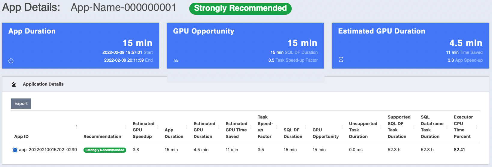
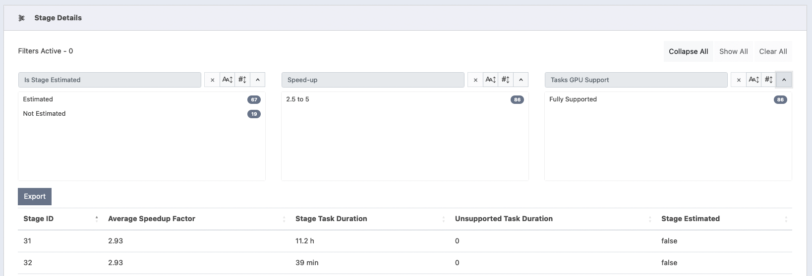
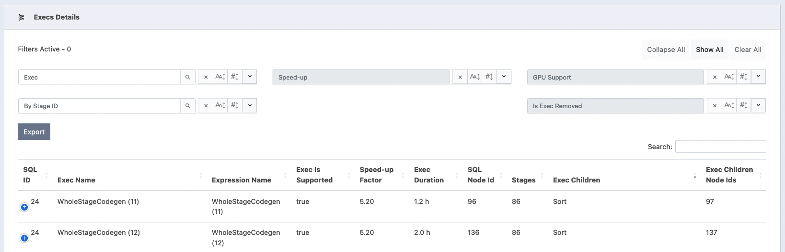

# Qualification Tool

The Qualification tool analyzes Spark events generated from CPU based Spark applications to help quantify
the expected acceleration of migrating a Spark application to GPU.

The tool first analyzes the CPU event log and determine which operators are likely to run on the GPU.
The tool then uses estimates from historical queries and benchmarks to estimate a speed-up at an individual operator
level to calculate how much a specific operator would accelerate on GPU for the specific application.
It calculates an _"Estimated GPU App Duration"_ by adding up the accelerated operator durations along with durations
that could not run on GPU because they are unsupported operators or not SQL/Dataframe.

This tool is intended to give the users a starting point and does not guarantee the
applications with the highest _recommendation_ will actually be accelerated the most. Currently,
it reports by looking at the amount of time spent in tasks of SQL Dataframe operations.

> **Disclaimer!**  
> Estimates provided by the Qualification tool are based on the currently supported "_SparkPlan_" or "_Executor Nodes_"
> used in the application. It currently does not look at the expressions or datatypes used.
> Please refer to the [Supported Operators](./supported_ops.md) guide to check the types and expressions you are using
> are supported.

This document covers below topics:

* TOC
{:toc}

## How to use the Qualification tool

The Qualification tool can be run in two different ways. One is to run it as a standalone tool on the
Spark event logs after the application(s) have run and other is to be integrated into a running Spark
application.

## Running the Qualification tool standalone on Spark event logs

### Prerequisites
- Java 8 or above, Spark 3.0.1+ jars.
- Spark event log(s) from Spark 2.0 or above version. Supports both rolled and compressed event logs
  with `.lz4`, `.lzf`, `.snappy` and `.zstd` suffixes as well as Databricks-specific rolled and compressed(.gz) event logs.
- The tool does not support nested directories.
  Event log files or event log directories should be at the top level when specifying a directory.

Note: Spark event logs can be downloaded from Spark UI using a "Download" button on the right side,
or can be found in the location specified by `spark.eventLog.dir`. See the
[Apache Spark Monitoring](http://spark.apache.org/docs/latest/monitoring.html) documentation for
more information.

### Step 1 Download the tools jar and Apache Spark 3 Distribution

The Qualification tool require the Spark 3.x jars to be able to run but do not need an Apache Spark run time.
If you do not already have Spark 3.x installed, you can download the Spark distribution to
any machine and include the jars in the classpath.
- Download the jar file from [Maven repository](https://repo1.maven.org/maven2/com/nvidia/rapids-4-spark-tools_2.12/22.06.0/)
- [Download Apache Spark 3.x](http://spark.apache.org/downloads.html) - Spark 3.1.1 for Apache Hadoop is recommended

### Step 2 Run the Qualification tool

1. The Qualification tool reads the log files and process them in-memory. So the heap memory should be increased when
   processing large volume of events. It is recommended to pass VM options `-Xmx10g` and adjust according to the
   number-of-apps / size-of-logs being processed.
   ```
    export QUALIFICATION_HEAP=-Xmx10g
   ```

2. Event logs stored on a local machine:
    - Extract the Spark distribution into a local directory if necessary.
    - Either set SPARK_HOME to point to that directory or just put the path inside of the classpath
       `java -cp toolsJar:pathToSparkJars/*:...` when you run the Qualification tool.

    This tool parses the Spark CPU event log(s) and creates an output report. Acceptable inputs are either individual or
    multiple event logs files or directories containing spark event logs in the local filesystem, HDFS, S3 or mixed.

    ```bash
    Usage: java ${QUALIFICATION_HEAP}
             -cp rapids-4-spark-tools_2.12-<version>.jar:$SPARK_HOME/jars/* \
             com.nvidia.spark.rapids.tool.qualification.QualificationMain [options]
             <eventlogs | eventlog directories ...>
    ```

    ```bash
    Sample: java ${QUALIFICATION_HEAP} \
              -cp rapids-4-spark-tools_2.12-<version>.jar:$SPARK_HOME/jars/*
              com.nvidia.spark.rapids.tool.qualification.QualificationMain /usr/logs/app-name1
    ```

3. Event logs stored on an on-premises HDFS cluster:

    Example running on files in HDFS: (include `$HADOOP_CONF_DIR` in classpath)

    ```bash
    Usage: java ${QUALIFICATION_HEAP} \
             -cp ~/rapids-4-spark-tools_2.12-<version>.jar:$SPARK_HOME/jars/*:$HADOOP_CONF_DIR/ \
             com.nvidia.spark.rapids.tool.qualification.QualificationMain  /eventlogDir
    ```

    Note, on an HDFS cluster, the default filesystem is likely HDFS for both the input and output
    so if you want to point to the local filesystem be sure to include file: in the path.

### Qualification tool options
  Note: `--help` should be before the trailing event logs.

```bash
java -cp ~/rapids-4-spark-tools_2.12-<version>.jar:$SPARK_HOME/jars/*:$HADOOP_CONF_DIR/ \
 com.nvidia.spark.rapids.tool.qualification.QualificationMain --help

RAPIDS Accelerator Qualification tool for Apache Spark

Usage: java -cp rapids-4-spark-tools_2.12-<version>.jar:$SPARK_HOME/jars/*
       com.nvidia.spark.rapids.tool.qualification.QualificationMain [options]
       <eventlogs | eventlog directories ...>

      --all                        Apply multiple event log filtering criteria
                                   and process only logs for which all
                                   conditions are satisfied.Example: <Filter1>
                                   <Filter2> <Filter3> --all -> result is
                                   <Filter1> AND <Filter2> AND <Filter3>.
                                   Default is all=true
      --any                        Apply multiple event log filtering criteria
                                   and process only logs for which any condition
                                   is satisfied.Example: <Filter1> <Filter2>
                                   <Filter3> --any -> result is <Filter1> OR
                                   <Filter2> OR <Filter3>
  -a, --application-name  <arg>    Filter event logs by application name. The
                                   string specified can be a regular expression,
                                   substring, or exact match. For filtering
                                   based on complement of application name, use
                                   ~APPLICATION_NAME. i.e Select all event logs
                                   except the ones which have application name
                                   as the input string.
  -f, --filter-criteria  <arg>     Filter newest or oldest N eventlogs based on
                                   application start timestamp, unique
                                   application name or filesystem timestamp.
                                   Filesystem based filtering happens before any
                                   application based filtering.For application
                                   based filtering, the order in which filters
                                   areapplied is: application-name,
                                   start-app-time, filter-criteria.Application
                                   based filter-criteria are:100-newest (for
                                   processing newest 100 event logs based on
                                   timestamp insidethe eventlog) i.e application
                                   start time)  100-oldest (for processing
                                   oldest 100 event logs based on timestamp
                                   insidethe eventlog) i.e application start
                                   time)  100-newest-per-app-name (select at
                                   most 100 newest log files for each unique
                                   application name) 100-oldest-per-app-name
                                   (select at most 100 oldest log files for each
                                   unique application name)Filesystem based
                                   filter criteria are:100-newest-filesystem
                                   (for processing newest 100 event logs based
                                   on filesystem timestamp).
                                   100-oldest-filesystem (for processing oldest
                                   100 event logsbased on filesystem timestamp).
  -h, --html-report                Default is to generate an HTML report.
      --no-html-report             Disables generating the HTML report.
  -m, --match-event-logs  <arg>    Filter event logs whose filenames contain the
                                   input string. Filesystem based filtering
                                   happens before any application based
                                   filtering.
  -n, --num-output-rows  <arg>     Number of output rows in the summary report.
                                   Default is 1000.
      --num-threads  <arg>         Number of thread to use for parallel
                                   processing. The default is the number of
                                   cores on host divided by 4.
      --order  <arg>               Specify the sort order of the report. desc or
                                   asc, desc is the default. desc (descending)
                                   would report applications most likely to be
                                   accelerated at the top and asc (ascending)
                                   would show the least likely to be accelerated
                                   at the top.
  -o, --output-directory  <arg>    Base output directory. Default is current
                                   directory for the default filesystem. The
                                   final output will go into a subdirectory
                                   called rapids_4_spark_qualification_output.
                                   It will overwrite any existing directory with
                                   the same name.
  -r, --report-read-schema         Whether to output the read formats and
                                   datatypes to the CSV file. This can be very
                                   long. Default is false.
      --spark-property  <arg>...   Filter applications based on certain Spark
                                   properties that were set during launch of the
                                   application. It can filter based on key:value
                                   pair or just based on keys. Multiple configs
                                   can be provided where the filtering is done
                                   if any of theconfig is present in the
                                   eventlog. filter on specific configuration:
                                   --spark-property=spark.eventLog.enabled:truefilter
                                   all eventlogs which has config:
                                   --spark-property=spark.driver.portMultiple
                                   configs:
                                   --spark-property=spark.eventLog.enabled:true
                                   --spark-property=spark.driver.port
  -s, --start-app-time  <arg>      Filter event logs whose application start
                                   occurred within the past specified time
                                   period. Valid time periods are
                                   min(minute),h(hours),d(days),w(weeks),m(months).
                                   If a period is not specified it defaults to
                                   days.
  -t, --timeout  <arg>             Maximum time in seconds to wait for the event
                                   logs to be processed. Default is 24 hours
                                   (86400 seconds) and must be greater than 3
                                   seconds. If it times out, it will report what
                                   it was able to process up until the timeout.
  -u, --user-name  <arg>           Applications which a particular user has
                                   submitted.
      --help                       Show help message

 trailing arguments:
  eventlog (required)   Event log filenames(space separated) or directories
                        containing event logs. eg: s3a://<BUCKET>/eventlog1
                        /path/to/eventlog2
```

Example commands:
- Process the 10 newest logs, and only output the top 3 in the output:

```bash
java ${QUALIFICATION_HEAP} \
  -cp ~/rapids-4-spark-tools_2.12-<version>.jar:$SPARK_HOME/jars/*:$HADOOP_CONF_DIR/ \
  com.nvidia.spark.rapids.tool.qualification.QualificationMain -f 10-newest -n 3 /eventlogDir
```

- Process last 100 days' logs:

```bash
java ${QUALIFICATION_HEAP} \
  -cp ~/rapids-4-spark-tools_2.12-<version>.jar:$SPARK_HOME/jars/*:$HADOOP_CONF_DIR/ \
  com.nvidia.spark.rapids.tool.qualification.QualificationMain -s 100d /eventlogDir
```

- Process only the newest log with the same application name:

```bash
java ${QUALIFICATION_HEAP} \
  -cp ~/rapids-4-spark-tools_2.12-<version>.jar:$SPARK_HOME/jars/*:$HADOOP_CONF_DIR/ \
  com.nvidia.spark.rapids.tool.qualification.QualificationMain -f 1-newest-per-app-name /eventlogDir
```

Note: the “regular expression” used by `-a` option is based on
[java.util.regex.Pattern](https://docs.oracle.com/javase/8/docs/api/java/util/regex/Pattern.html).

### The Qualification tool output

After the above command is executed, the summary report goes to STDOUT and by default it outputs
log/CSV files under `./rapids_4_spark_qualification_output/` that contain the processed applications.
The output will go into your default filesystem and it supports both local filesystem and HDFS.
Note that if you are on an HDFS cluster the default filesystem is likely HDFS for both the input and output.
If you want to point to the local filesystem be sure to include `file:` in the path.

The Qualification tool generates a brief summary on the STDOUT, which also gets saved as a text file.
The detailed report of the processed apps is saved as a set of CSV files that can be used for post-processing.
The CSV reports include the estimated performance if the app is run on the GPU for each of the following:
_app execution_; _stages_; and _execs_.

Starting with release "_22.06_", the default is to generate the report into two different formats:
text files; and HTML.

The tree structure of the output directory `${OUTPUT_FOLDER}/rapids_4_spark_qualification_output` is as follows:

```bash
    rapids_4_spark_qualification_output
    ├── rapids_4_spark_qualification_output.csv
    ├── rapids_4_spark_qualification_output.log
    ├── rapids_4_spark_qualification_output_execs.csv
    ├── rapids_4_spark_qualification_output_stages.csv
    └── ui
        ├── assets
        │   ├── bootstrap/
        │   ├── datatables/
        │   ├── jquery/
        │   ├── mustache-js/
        │   └── spur/
        ├── css
        │   └── rapids-dashboard.css
        ├── html
        │   ├── application.html
        │   ├── index.html
        │   └── raw.html
        └── js
            ├── app-report.js
            ├── data-output.js
            ├── qual-report.js
            ├── raw-report.js
            ├── ui-config.js
            └── uiutils.js
```

For information on the files content and processing the Qualification report and the recommendation, please refer
to [Understanding the Qualification tool output](#understanding-the-qualification-tool-output) and
[Output Formats](#output-formats) sections below.

## Running the Qualification tool inside a running Spark application

### Prerequisites
- Java 8 or above, Spark 3.0.1+

### Download the tools jar
- Download the jar file from [Maven repository](https://repo1.maven.org/maven2/com/nvidia/rapids-4-spark-tools_2.12/22.06.0/)

### Modify your application code to call the api's

Currently only Scala api's are supported.

Create the `RunningQualicationApp`:
```
val qualApp = new com.nvidia.spark.rapids.tool.qualification.RunningQualificationApp()
```

Get the event listener from it and install it as a Spark listener:
```
val listener = qualApp.getEventListener
spark.sparkContext.addSparkListener(listener)
```

Run your queries and then get the summary or detailed output to see the results.

The summary output api:
```
/**
 * Get the summary report for qualification.
 * @param delimiter The delimiter separating fields of the summary report.
 * @param prettyPrint Whether to including the separate at start and end and
 *                    add spacing so the data rows align with column headings.
 * @return String of containing the summary report.
 */
getSummary(delimiter: String = "|", prettyPrint: Boolean = true): String
```

The detailed output api:
```
/**
 * Get the detailed report for qualification.
 * @param delimiter The delimiter separating fields of the summary report.
 * @param prettyPrint Whether to including the separate at start and end and
 *                    add spacing so the data rows align with column headings.
 * @return String of containing the detailed report.
 */
getDetailed(delimiter: String = "|", prettyPrint: Boolean = true, reportReadSchema: Boolean = false): String
```

Example:
```
// run your sql queries ...

// To get the summary output:
val summaryOutput = qualApp.getSummary()

// To get the detailed output:
val detailedOutput = qualApp.getDetailed()

// print the output somewhere for user to see
println(summaryOutput)
println(detailedOutput)
```

If you need to specify the tools jar as a maven dependency to compile the Spark application:
```
<dependency>
   <groupId>com.nvidia</groupId>
   <artifactId>rapids-4-spark-tools_2.12</artifactId>
   <version>${version}</version>
</dependency>
```

### Run the Spark application
- Run your Spark application and include the tools jar you downloaded with the spark '--jars' options and
view the output wherever you had it printed.

For example, if running the spark-shell:
```
$SPARK_HOME/bin/spark-shell --jars rapids-4-spark-tools_2.12-<version>.jar
```

## Understanding the Qualification tool output

For each processed Spark application, the Qualification tool generates two main fields to help quantify the expected
acceleration of migrating a Spark application to GPU.

1. `Estimated GPU Duration`: predicted runtime of the app if it was run on GPU. It is the sum add of the accelerated
   operator durations along with durations that could not run on GPU because they are unsupported operators or not SQL/Dataframe.
2. `Estimated Speed-up factor`: the estimated speed-up factor is simply the original CPU duration of the app divided by the
   estimated GPU duration. That will estimate how much faster the application would run on GPU.

The lower the estimated GPU duration, the higher the "_Estimated Speed-up_".
The processed applications are ranked by the "_Estimated Speed-up_". Based on how high the speed-up factor,
the tool classifies the applications into the following different categories:

- `Strongly Recommended`
- `Recommended`
- `Not Recommended`
- `Not Applicable`: indicates that the app has job or stage failures.

As mentioned before, the tool does not guarantee the applications with the highest _recommendation_ will actually be
accelerated the most. Please refer to [Supported Operators](./supported_ops.md) section.

In addition to the _recommendation_, the Qualification tool reports a set of metrics in tasks of SQL Dataframe operations
within the scope of: "_Entire App_"; "_Stages_"; and "_Execs_". The report is divided into three main levels. The fields
of each level are described in details in the following sections: [Detailed App Report](#detailed-app-report),
[Stages report](#stages-report), and [Execs report](#execs-report). Then we describe the output formats and their file
locations in [Output Formats](#output-formats) section.

### Detailed App report

The report represents the entire app execution, including unsupported operators and non-SQL operations.

1. _App Name_
2. _App ID_
3. _Recommendation_: recommendation based on `Estimated Speed-up Factor`, where
   an app can be "_Strongly Recommended_", "_Recommended_", "_Not Recommended_",
   or "_Not Applicable_". The latter indicates that the app has job or stage failures.
4. _App Duration_: wall-Clock time measured since the application starts till it is completed.
   If an app is not completed an estimated completion time would be computed.
5. _SQL DF duration_: wall-Clock time duration that includes only SQL-Dataframe queries.
6. _GPU Opportunity_: wall-Clock time that shows how much of the SQL duration can be accelerated on the GPU.
7. _Estimated GPU Duration_: predicted runtime of the app if it was run on GPU. It is the sum of the accelerated
   operator durations along with durations that could not run on GPU because they are unsupported operators or not SQL/Dataframe.
8. _Estimated GPU Speed-up_: the speed-up factor is simply the original CPU duration of the app divided by the
   estimated GPU duration. That will estimate how much faster the application would run on GPU.
9. _Estimated GPU Time Saved_: estimated wall-Clock time saved if it was run on the GPU.
10. _SQL Dataframe Task Duration_: amount of time spent in tasks of SQL Dataframe operations.
11. _Executor CPU Time Percent_: this is an estimate at how much time the tasks spent doing processing on the CPU vs waiting on IO.
    This is not always a good indicator because sometimes the IO that is encrypted and the CPU has to do work to decrypt it,
    so the environment you are running on needs to be taken into account.
12. _SQL Ids with Failures_: SQL Ids of queries with failed jobs.
13. _Unsupported Read File Formats and Types_: looks at the Read Schema and
    reports the file formats along with types which may not be fully supported.
    Example: `JDBC[*]`. Note that this is based on the current version of the plugin and
    future versions may add support for more file formats and types.
14. _Unsupported Write Data Format_: reports the data format which we currently don’t support, i.e.
    if the result is written in JSON or CSV format.
15. _Complex Types_: looks at the Read Schema and reports if there are any complex types(array, struct or maps) in the schema.
16. _Nested Complex Types_: nested complex types are complex types which
    contain other complex types (Example: `array<struct<string,string>>`).
    Note that it can read all the schemas for DataSource V1. The Data Source V2 truncates the schema,
    so if you see "`...`", then the full schema is not available.
    For such schemas we read until `...` and report if there are any complex types and nested complex types in that.
17. _Potential Problems_: some UDFs and nested complex types. Please keep in mind that the tool is only able to detect certain issues.
18. _Longest SQL Duration_: the maximum amount of time spent in a single task of SQL Dataframe operations.
19. _NONSQL Task Duration Plus Overhead_: Time duration that does not span any running SQL task.
20. _Unsupported Task Duration_: sum of task durations for any unsupported operators.
21. _Supported SQL DF Task Duration_: sum of task durations that are supported by RAPIDS GPU acceleration.
22. _Task Speedup Factor_: the average speed-up of all stages.
23. _App Duration Estimated_: True or False indicates if we had to estimate the application duration.
    If we had to estimate it, the value will be `True` and it means the event log was missing the application finished
    event, so we will use the last job or sql execution time we find as the end time used to calculate the duration.
24. _Read Schema_: shows the datatypes and read formats. This field is only listed when the argument `--report-read-schema`
    is passed to the CLI.

**Note:** the Qualification tool won't catch all UDFs, and some of the UDFs can be handled with additional steps.
Please refer to [Supported Operators](./supported_ops.md) for more details on UDF.

By default, the applications are sorted in descending order by the following fields:
- _Recommendation_;
- _Estimated GPU Speed-up_;
- _Estimated GPU Time Saved_; and
- _End Time_.

### Stages report

For each stage used in SQL operations, the Qualification tool generates the following information:

1. _App ID_
2. _Stage ID_
3. _Average Speedup Factor_: the average estimated speed-up of all the operators in the given stage.
4. _Stage Task Duration_: amount of time spent in tasks of SQL Dataframe operations for the given stage.
5. _Unsupported Task Duration_: sum of task durations for the unsupported operators. For more details,
   see [Supported Operators](./supported_ops.md).
6. _Stage Estimated_: True or False indicates if we had to estimate the stage duration.

### Execs report

The Qualification tool generates a report of the "Exec" in the "_SparkPlan_" or "_Executor Nodes_" along with the estimated
acceleration on the GPU. Please refer to the [Supported Operators](./supported_ops.md) guide for more
details on limitations on UDFs and unsupported operators.

1. _App ID_
2. _SQL ID_
3. _Exec Name_: example `Filter`, `HashAggregate`
4. _Expression Name_
5. _Task Speedup Factor_: it is simply the average acceleration of the operators
   based on the original CPU duration of the operator divided by the GPU duration. The tool uses historical queries and benchmarks to estimate a speed-up at
   an individual operator level to calculate how much a specific operator would accelerate on GPU.
6. _Exec Duration_: wall-Clock time measured since the operator starts till it is completed.
7. _SQL Node Id_
8. _Exec Is Supported_: whether the Exec is supported by RAPIDS or not. Please refer to the
  [Supported Operators](./supported_ops.md) section.
9. _Exec Stages_: an array of stage IDs
10. _Exec Children_
11. _Exec Children Node Ids_
12. _Exec Should Remove_: whether the Op is removed from the migrated plan.

## Output Formats

The Qualification tool generates the output as CSV/log files. Starting from "_22.06_", the default
is to generate the report into two different formats: CSV/log files; and HTML.

### HTML Report

Starting with release _"22.06"_, the HTML report is generated by default under the output directory
`${OUTPUT_FOLDER}/rapids_4_spark_qualification_output/ui`.  
The HTML report is disabled by passing `--no-html-report` as described in the
[Qualification tool options](#Qualification-tool-options) section above.
To browse the content of the html report:

1. For HDFS or remote node, copy the directory of `${OUTPUT_FOLDER}/rapids_4_spark_qualification_output/ui` to your local node.
2. Open `rapids_4_spark_qualification_output/ui/index.html` in your local machine's web-browser (Chrome/Firefox are recommended).

The HTML view renders the detailed information into tables that allow following features:

- searching
- ordering by specific column
- exporting table into CSV file
- interactive filter by recommendations and/or user-name.

By default, all tables show 20 entries per page, which can be changed by selecting a different page-size in the table's navigation bar.

The following sections describe the HTML views.

#### Recommendations Summary

`index.html` shows the summary of the estimated GPU performance. The "_GPU Recommendations Table_"
lists the processed applications ranked by the "_Estimated GPU Speed-up_" along with the ability to search, and filter
the results. By clicking the "_App ID_" link of a specific app, you navigate to the details view of that app which is
described in [App-Details View](#app-details-view) section.

The summary report contains the following components:

1. **Stats-Row**: statistics card summarizing the following information:
    1. "_Total Applications_": total number of applications analyzed by the Qualification tool and the total execution
       time.
    2. "_RAPIDS Candidates_": marks the number applications that are either "_Recommended_", or "_Strongly Recommended_".
    3. "_GPU Opportunity_": shows the total of "_GPU Opportunity_" and "_SQL DF duration_" fields across all the apps.
2. **GPU Recommendations Table**: this table lists all the analyzed applications along with subset of fields that are
   directly involved in calculating the GPU performance estimate. Each row expands showing more fields by clicking on
   the control column.
3. The _searchPanes_ with the capability to search the app list by selecting rows in the panes.
   The "_Recommendations_" and "_Spark User_" filters are cascaded which allows the panes to be filtered based on the
   values selected in the other pane.
4. Text Search field that allows further filtering, removing data from the result set as keywords are entered. The
   search box will match on multiple columns including: "_App ID_", "_App Name_", "_Recommendation_"
5. The `Raw Data` link in the left navigation bar redirects to a detailed report.
6. HTML5 export button saves the table to CSV file into the browser's default download folder.


#### App-Details View

When you click the "_App ID_" of a specific row in the "_GPU Recommendations Table_", the browser navigates to
this view which shows the metrics and estimated GPU performance for the given application.
It contains the following main components:

1. **Card title**: contains the application name and the Recommendation.
2. **Stats-Row**: statistics card summarizing the following information:
    1. "_App Duration_": the total execution time of the app, marking the start and end time.
    2. "_GPU Opportunity_": the wall-Clock time that shows how much of the SQL duration can be accelerated on the GPU. It
       shows the actual wall-Clock time duration that includes only SQL-Dataframe queries including non-supported ops,
       dubbed "_SQL DF Duration_". This is followed by "Task Speed-up Factor" which represents the average speed-up
       of all app stages.
    3. "_Estimated GPU Duration_": the predicted runtime of the app if it was run on GPU. For convenience, it calculates
       the estimated wall-clock time difference between the CPU and GPU executions. The original CPU duration of the app
       divided by the estimated GPU duration and displayed as "_App Speed-up_".
3. **Application Details**: this table lists all the fields described previously in
   the [Detailed App report](#detailed-app-report) section. Note that this table has more columns than can fit in a
   normal browser window. Therefore, the UI
   application dynamically optimizes the layout of the table to fit the browser screen. By clicking on the control
   column, the row expands to show the remaining hidden columns.
   
4. **Stage Details Table**: lists all the app stages with set of columns listed in [Stages report](#stages-report)
   section. The HTML5 export button saves the table to CSV file into the browser's default download folder.
   
   The table has cascaded _searchPanes_, which means that the table allows the panes
   to be filtered based on the values selected in the other panes.  
   There are three searchPanes:
    1. "_Is Stage Estimated_": it splits the stages into two groups based on whether the stage duration time was estimated
       or not.
    2. "_Speed-up_": groups the stages by their "average speed-up factor". Each stage can belong to one of the following
       predefined speed-up ranges: `1.0 (No Speed-up)`; `]1.0, 1.3[`; `[1.3, 2.5[`; `[2.5, 5[`; and `[5, _]`. The
       search-pane does not show a range bucket if its count is 0.
    3. "_Tasks GPU Support_": this filter can be used to find stages having all their execs supported by the GPU.
5. **Execs Details Table**: lists all the app stages with set of columns listed in [Execs report](#execs-report)
   section. The HTML5 export button saves the table to CSV file into the browser's default
   download folder.
   
   The table has cascaded _searchPanes_, which means that the table allows the panes
   to be filtered based on the values selected in the other panes.  
   There are three _searchPanes_:
    1. "_Exec_": filters the rows by exec name. This filter also allows text searching by typing into the filter-title as
       a text input.
    2. "_Speed-up_": groups the stages by their "average speed-up factor". Each stage can belong to one of the following
       predefined speed-up ranges: `1.0 (No Speed-up)`; `]1.0, 1.3[`; `[1.3, 2.5[`; `[2.5, 5[`; and `[5, _]`. The
       search-pane does not show a range bucket if its count is 0.
    3. "_GPU Support_": filters the execs whether an exec is supported by GPU or not.
    4. "_Stage ID_": filters rows by the stage ID. It also allows text-searching by typing into the filter-title as a text
       input.
    5. "_Is Exec Removed_": filters rows that were removed from the migrated plan.

#### Raw Data

`raw.html` displays all the fields listed in "_Detailed App Report_" in more readable format.
Columns representing "_time duration_" are rounded to nearest "ms", "seconds", "minutes", and "hours".
The search box will match on multiple columns including: "_App ID_", "_App Name_", "_Recommendation_",
"_User Name_", "_Unsupported Write Data Format_", "_Complex Types_", "_Nested Complex Types_", and "_Read Schema_".
The detailed table can also be exported as `Qualification Tool Dashboard – Raw Data.csv`.

Note that this table has more columns than can fit in a normal browser window. Therefore, the UI application dynamically
optimizes the layout of the table
to fit the browser screen. By clicking on the control column, the row expands to show the remaining hidden columns.

### Text and CSV files

The Qualification tool generates a set of log/CSV files in the output folder
`${OUTPUT_FOLDER}/rapids_4_spark_qualification_output`. The content of each
file is summarized in the following two sections.

#### Report Summary

The Qualification tool generates a brief summary that includes the projected application's performance
if the application is run on the GPU. Beside sending the summary to `STDOUT`, the Qualification tool
generates _text_ as `rapids_4_spark_qualification_output.log`

The summary report outputs the following information: "_App Name_", "_App ID_", "_App Duration_", "_SQL DF duration_",
"_GPU Opportunity_", "_Estimated GPU Duration_", "_Estimated GPU Speed-up_", "_Estimated GPU Time Saved_", and
"_Recommendation_".

Note: the duration(s) reported are in milliseconds.
Sample output in text:

```
+------------+--------------+----------+----------+-------------+-----------+-----------+-----------+--------------------+
|  App Name  |    App ID    |    App   |  SQL DF  |     GPU     | Estimated | Estimated | Estimated |  Recommendation    |
|            |              | Duration | Duration | Opportunity |    GPU    |    GPU    |    GPU    |                    |
|            |              |          |          |             |  Duration |  Speedup  |    Time   |                    |
|            |              |          |          |             |           |           |   Saved   |                    |
+============+==============+==========+==========+=============+===========+===========+===========+====================+
| appName-01 | app-ID-01-01 |    898429|    879422|       879422|  273911.92|       3.27|  624517.06|Strongly Recommended|
+------------+--------------+----------+----------+-------------+-----------+-----------+-----------+--------------------+
| appName-02 | app-ID-02-01 |      9684|      1353|         1353|    8890.09|       1.08|      793.9|     Not Recommended|
+------------+--------------+----------+----------+-------------+-----------+-----------+-----------+--------------------+
```

In the above example, two application event logs were analyzed. “app-ID-01-01” is "_Strongly Recommended_"
because `Estimated GPU Speedup` is ~3.27. On the other hand, the estimated acceleration running
“app-ID-02-01” on the GPU is not high enough; hence the app is not recommended.

#### Detailed App Report

**1. Entire App report**

The first part of the detailed report is saved as `rapids_4_spark_qualification_output.csv`.
The apps are processed and ranked by the `Estimated GPU Speed-up`.
In addition to the fields listed in the "_Report Summary_", it shows all the app fields.
The duration(s) are reported are in milliseconds.


**2. Stages report**

The second file is saved as `rapids_4_spark_qualification_output_stages.csv`.

Sample output in text:
```
+--------------+----------+-----------------+------------+---------------+-----------+
|    App ID    | Stage ID | Average Speedup | Stage Task |  Unsupported  |   Stage   |
|              |          |      Factor     |  Duration  | Task Duration | Estimated |
+==============+==========+=================+============+===============+===========+
| app-ID-01-01 |       25 |             2.1 |         23 |             0 |     false |
+--------------+----------+-----------------+------------+---------------+-----------+
| app-ID-02-01 |       29 |            1.86 |          0 |             0 |      true |
+--------------+----------+-----------------+------------+---------------+-----------+
```

**3. Execs report**

The last file is saved `rapids_4_spark_qualification_output_execs.csv`. Similar to the app and stage information,
the table shows estimated GPU performance of the SQL Dataframe operations.

Sample output in text:
```
+--------------+--------+---------------------------+-----------------------+--------------+----------+----------+-----------+--------+----------------------------+---------------+-------------+
|    App ID    | SQL ID |         Exec Name         |    Expression Name    | Task Speedup |   Exec   | SQL Node |  Exec Is  |  Exec  |        Exec Children       | Exec Children | Exec Should |
|              |        |                           |                       |    Factor    | Duration |    Id    | Supported | Stages |                            |    Node Ids   |    Remove   |
+==============+========+===========================+=======================+==============+==========+==========+===========+========+============================+===============+=============+
| app-ID-02-01 |      7 | Execute CreateViewCommand |                       |          1.0 |        0 |        0 |     false |        |                            |               |       false |
+--------------+--------+---------------------------+-----------------------+--------------+----------+----------+-----------+--------+----------------------------+---------------+-------------+
| app-ID-02-01 |     24 |                   Project |                       |          2.0 |        0 |       21 |      true |        |                            |               |       false |
+--------------+--------+---------------------------+-----------------------+--------------+----------+----------+-----------+--------+----------------------------+---------------+-------------+
| app-ID-02-01 |     24 |              Scan parquet |                       |          2.0 |      260 |       36 |      true |     24 |                            |               |       false |
+--------------+--------+---------------------------+-----------------------+--------------+----------+----------+-----------+--------+----------------------------+---------------+-------------+
| app-ID-02-01 |     15 | Execute CreateViewCommand |                       |          1.0 |        0 |        0 |     false |        |                            |               |       false |
+--------------+--------+---------------------------+-----------------------+--------------+----------+----------+-----------+--------+----------------------------+---------------+-------------+
| app-ID-02-01 |     24 |                   Project |                       |          2.0 |        0 |       14 |      true |        |                            |               |       false |
+--------------+--------+---------------------------+-----------------------+--------------+----------+----------+-----------+--------+----------------------------+---------------+-------------+
| app-ID-02-01 |     24 |     WholeStageCodegen (6) | WholeStageCodegen (6) |          2.8 |      272 |        2 |      true |     30 | Project:BroadcastHashJoin: |         3:4:5 |       false |
|              |        |                           |                       |              |          |          |           |        |              HashAggregate |               |             |
+--------------+--------+---------------------------+-----------------------+--------------+----------+----------+-----------+--------+----------------------------+---------------+-------------+
```

## How to compile the tools jar
Note: This step is optional.

```bash
git clone https://github.com/NVIDIA/spark-rapids.git
cd spark-rapids
mvn -Pdefault -pl .,tools clean verify -DskipTests
```

The jar is generated in below directory :

`./tools/target/rapids-4-spark-tools_2.12-<version>.jar`

If any input is a S3 file path or directory path, 2 extra steps are needed to access S3 in Spark:
1. Download the matched jars based on the Hadoop version:
   - `hadoop-aws-<version>.jar`
   - `aws-java-sdk-<version>.jar`

2. Take Hadoop 2.7.4 for example, we can download and include below jars in the '--jars' option to spark-shell or spark-submit:
   [hadoop-aws-2.7.4.jar](https://repo.maven.apache.org/maven2/org/apache/hadoop/hadoop-aws/2.7.4/hadoop-aws-2.7.4.jar) and
   [aws-java-sdk-1.7.4.jar](https://repo.maven.apache.org/maven2/com/amazonaws/aws-java-sdk/1.7.4/aws-java-sdk-1.7.4.jar)

3. In $SPARK_HOME/conf, create `hdfs-site.xml` with below AWS S3 keys inside:

```xml
<?xml version="1.0"?>
<configuration>
<property>
  <name>fs.s3a.access.key</name>
  <value>xxx</value>
</property>
<property>
  <name>fs.s3a.secret.key</name>
  <value>xxx</value>
</property>
</configuration>
```

Please refer to this [doc](https://hadoop.apache.org/docs/current/hadoop-aws/tools/hadoop-aws/index.html) on
more options about integrating hadoop-aws module with S3.
